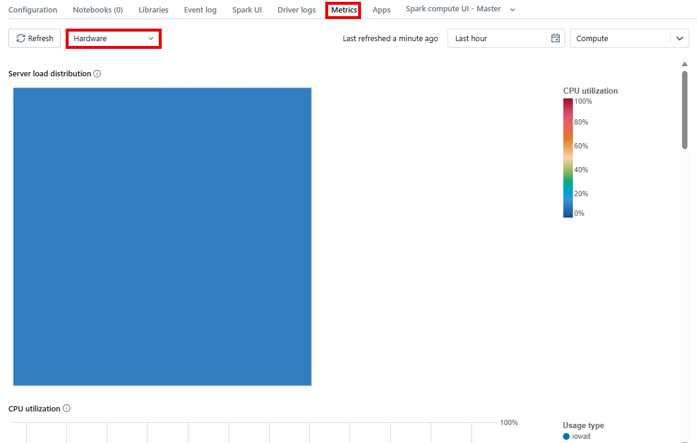

Optimizing Delta Lake for incremental processing in Azure Databricks involves several key strategies that enhance data ingestion, processing speed, and query performance. Delta Lake is an open-source storage layer that brings ACID transactions to Apache Spark and big data workloads. This capability allows for efficient and reliable incremental data processing. It allows data engineers and scientists who need to manage and process large volumes of data continuously.

## Data partitioning

One of the first steps in optimizing Delta Lake for incremental processing is to properly partition the data. Partitioning helps by organizing data into distinct subsets, which can significantly speed up query performance by allowing Spark to skip irrelevant data. When partitioning, it's crucial to choose columns that have a high degree of cardinality and are commonly used in query filters. This approach minimizes the amount of data that needs to be scanned and processed, improving performance.

## Z-Ordering

In addition to partitioning, using Z-Ordering can further optimize query performance. Z-Ordering is a technique that maps multidimensional data to a single dimension while preserving locality of the data points. By Z-Ordering the data on frequently queried columns, it ensures that related data is physically colocated, reducing the amount of data read during query execution. This approach can be effective when combined with partitioning, as it allows for efficient pruning of both partitions and data files within those partitions.

>[!Note]
> 
> Z-ordering aims to produce evenly balanced data files with respect to the number of tuples, but not necessarily data size on disk. The two measures are most often correlated, but there can be situations when that is not the case, leading to skew in optimize task times.
> 
> **Example Scenario:**
> 
> If your ZORDER BY date and your most recent records are all much wider (e.g., longer arrays or string values) than the ones in the past, it is expected that the OPTIMIZE job’s task durations will be skewed, as well as the resulting file sizes.
> 
> **Impact:**
> 
> This is, however, only a problem for the OPTIMIZE command itself; it should not have any negative impact on subsequent queries.

## Structured streaming

Efficient data ingestion is another critical aspect of optimizing Delta Lake for incremental processing. Implementing a structured streaming approach allows for real-time data ingestion and processing. This process involves setting up a continuous stream of data input, which Delta Lake handles with its built-in support for exactly once processing semantics. Configuring  appropriate trigger intervals and managing stateful aggregations can ensure that data is processed efficiently and with minimal latency.

## Regular compaction and redistribution

Compaction and data layout optimization are also essential practices. Over time, as data is continuously ingested, small files can accumulate, leading to inefficient query performance. Delta Lake provides the OPTIMIZE command, which compacts small files into larger ones, thus reducing the overhead during query execution. Additionally, regularly running vacuum operations helps remove old and obsolete files, keeping the storage layer clean and efficient.

## Monitoring schema drift

Managing schema evolution is crucial in incremental processing scenarios where data formats and structures can change over time. Delta Lake's schema enforcement and evolution capabilities ensure that changes to the schema are managed seamlessly, allowing for backward compatibility and preventing data corruption. By managing schema changes, one can maintain data consistency and reliability across incremental processing jobs.

## Built-in tooling

Lastly, monitoring and tuning the performance of Delta Lake workloads is an ongoing process. Azure Databricks provides several tools and features, such as the Databricks Runtime, which offers optimized versions of Apache Spark with built-in performance enhancements. Using these tools, along with Spark's built-in metrics and logs, one can identify performance bottlenecks and make necessary adjustments to the configuration and resource allocation, ensuring optimal performance for incremental data processing tasks.

Data engineers and scientists can optimize Delta Lake for incremental processing in Azure Databricks, achieving faster data ingestion, processing, and querying while maintaining data consistency and reliability. 