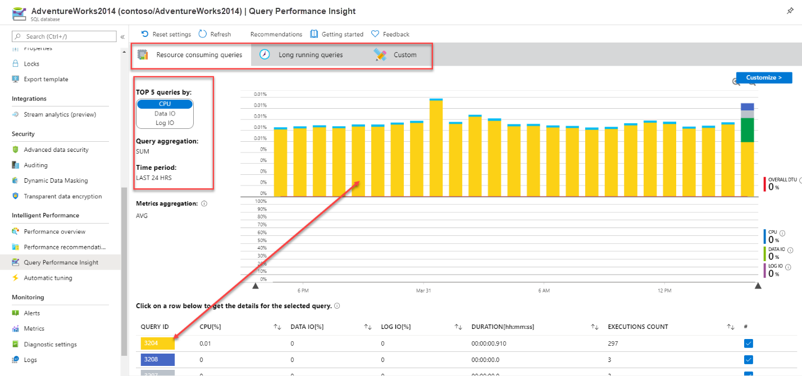

A major portion of the troubleshooting techniques you would use for troubleshooting database performance remains the same in Azure SQL.

All the tools that are typically used for monitoring and troubleshooting SQL Server are also applicable to SQL Server running on Azure Virtual Machine, including tools like Performance Monitor. However, due to the nature of Platform as a Service (PaaS), Azure SQL Database and Azure SQL Managed Instance provide a different set of tools. Next, we'll explore the specific tools for Azure's PaaS offerings and their functionalities.

## Compare performance results with your baseline

The process of establishing a baseline typically begins well in advance of the actual database migration. This involves collecting a comprehensive set of data measurements that reflect the standard performance of the database in its original environment. These measurements may include, but aren't limited to, CPU usage, response times, transaction rates, and error rates. 

This baseline serves as a reference point against which the performance of the migrated database can be compared. However, the evaluation or comparison of this baseline data with the performance metrics of the migrated database only takes place after the migration has been completed.

Post-migration, the performance of the new database environment is monitored and measured. These post-migration metrics are then compared with the pre-migration baseline to identify any discrepancies or performance issues. This comparison helps in understanding whether the migration has had any adverse effects on database performance or if there are areas that require optimization for improved performance.

## Automatic tuning

[Automatic tuning](/azure/azure-sql/database/automatic-tuning-overview) is a feature that continuously learns from your workload, identifies potential issues and improvements, and offers recommendations based on Query Store data. It adapts to changes in execution plans caused by schema or index modifications, or data updates. 

You can either manually apply tuning recommendations using the Azure portal, or you can let automatic tuning autonomously apply tuning recommendations for you. In Azure SQL Database, it can also enhance query performance by tuning indexes.

### Automatic plan correction

With the help of the Query Store, the database engine can detect when query execution plans have regressed in performance. While you can manually identify a regressed plan through the user interface, the Query Store also provides the option to notify you automatically.

:::image type="content" source="../media/5-automatic-tuning-view.png" alt-text="Screenshot of the Query Store view for regressed plan correction." lightbox="../media/5-automatic-tuning-view.png":::

In the given example, a check mark appears next to **Plan ID 1**, indicating that the plan is forced. 

Once you [enable automatic tuning](/azure/azure-sql/database/automatic-tuning-enable), the database engine will automatically enforce any suggested query execution plan under the following conditions:

- The error rate of the previous plan exceeds that of the recommended plan
- The estimated CPU gain surpasses 10 seconds
- The forced plan outperforms the previous one

When automatic plan forcing occurs, the database engine applies the last good plan and monitors its performance. If the forced plan doesn't perform better than the previous plan, it's unforced and a new plan is compiled. If it outperforms the previous plan, it stays forced until a recompile happens.

Use the following T-SQL query to enable automatic plan correction.

```SQL
ALTER DATABASE [WideWorldImporters] SET AUTOMATIC_TUNING (FORCE_LAST_GOOD_PLAN = ON);
```

You can view automatic tuning recommendations via the dynamic management view, `sys.dm_db_tuning_recommendations`. This DMV provides recommendation details, types, and states. To verify if automatic tuning is enabled for a database, refer to the view `sys.database_automatic_tuning_options`.

Automatic tuning for Azure SQL Managed Instance only supports `FORCE LAST GOOD PLAN`.

To enable notifications for automatic tuning, see [Email notifications for automatic tuning](/azure/azure-sql/database/automatic-tuning-email-notifications-configure)

### Automatic index management

Azure SQL Database supports automatic index tuning. This means that over time, the database has the capability to learn about existing workloads and provide recommendations on adding or removing indexes in order to provide better performance. Like forcing improved query plans, the database can be configured to allow for automatic index creation or removal depending on existing index performance.

:::image type="content" source="../media/5-automatic-tuning-options.png" alt-text="Screenshot of Automatic tuning Options for Azure SQL Database.":::

Alternatively, use the following query to see the automatic tuning features enabled in your database.

```sql
SELECT name,
    desired_state_desc,
    actual_state_desc,
    reason_desc
FROM sys.database_automatic_tuning_options
```

Index creation is resource intensive, and its successful creation is critical to ensure no negative effect on your workloads.

Azure SQL Database monitors the resources needed to implement new indexes automatically to prevent performance degradation. The tuning action is delayed until resources become available, for instance, when resources needed for existing workloads prevent index creation.

## Explore Query Performance Insight

The initial phase of any database performance optimization task involves pinpointing the queries that are the most resource-intensive. In previous SQL Server versions, this required extensive tracing and a set of intricate SQL scripts, making the data collection process laborious.

### Identify problematic queries

Azure SQL Database offers a tool called [Query Performance Insight](/azure/azure-sql/database/query-performance-insight-use) that allows the administrator to quickly identity expensive queries. You find it in your Azure SQL Database’s main blade, under the **Intelligent Performance** section.

Query Performance Insight in Azure SQL Database provides three filtering options: for long-running queries, top resource-consuming queries (which is the default), or a custom filter. It displays the top five queries sorted by a chosen resource, such as CPU, Data IO, or Log IO. You can drill into individual queries by selecting the row within the lower grid. Each row is marked with a distinct color that matches the color in the bar graph.

[](../media/5-performance-monitor.png#lightbox)

The custom tab offers more flexibility than the other options. It allows for a more tailored examination of performance data with several drop-down menus influencing data visualization. Key metrics include **CPU**, **Log IO**, **Data IO**, and **memory**, which are performance aspects capped by your Azure SQL Database's service tier and compute resources.

[](../media/5-performance-monitor-dashboard.png#lightbox)

If we drill into an individual query, we're able to see the query ID and the query itself, as well as the query aggregation type and associated time period. 

:::image type="content" source="../media/5-performance-monitor-details.png" alt-text="Screenshot of the details of Query ID 3204 in Query Performance Insight.":::

While Query Performance Insight doesn't show the query’s execution plan, you can quickly identify that query, and use the information to extract the plan from the Query Store in your database.

## Alerts

You can set up performance alerts for databases in Azure SQL Database using the Azure portal. These alerts can notify you via email or call a webhook when a certain metric (like database size or CPU usage) reaches a threshold. 

The process for setting up alerts is similar between SQL Database and SQL Managed Instance. To set up performance alerts for Azure SQL Database, navigate to the **Monitoring** section and select **Alerts**. From there, you need to establish a new alert rule, define a condition, and create an action group.

For more information on alerts for Azure SQL Managed Instance, you can visit [Create alerts for Azure SQL Managed Instance using the Azure portal](/azure/azure-sql/managed-instance/alerts-create). If you're interested in Azure SQL Database, see [Create alerts for Azure SQL Database and Azure Synapse Analytics using the Azure portal](/azure/azure-sql/database/alerts-insights-configure-portal).

## Azure SQL Insights

[Azure SQL Insights](/azure/azure-sql/database/sql-insights-overview) enhances your monitoring experience by providing interactive and ready-to-use visualizations. You can customize telemetry collection and frequency, and combine data from multiple sources into a single monitoring experience. It also retains a set of metrics over time, which allows you to investigate performance issues that you may have encountered in the past.

> [!IMPORTANT]
> We suggest setting up Azure SQL Insights only after the migrated database has been fully integrated into production. This prevents the tool from capturing noisy data during the migration and testing phase.

To get started with SQL Insights, you need a dedicated virtual machine that monitors and remotely collect data from your SQL servers. This dedicated virtual machine needs to have the following components installed:

- Azure Monitor agent
- Workload Insights extension

Additionally, the following components are required to set up SQL Insights.

**Monitoring profile –** group servers, instances or databases to monitor.

**Log Analytics workspace –** where to send the SQL monitoring data to.

**Collection settings –** you can customize the data collection for your profile. The default settings cover most monitoring scenarios and usually don't need to be changed.

## Extended events

[Extended Events](/sql/relational-databases/extended-events/extended-events) tool is a robust monitoring system that captures detailed server and database activity. Filters can be applied to reduce data collection overhead and focus on specific performance problems. All the Azure SQL offerings support Extended Events.

While the setup of Extended Events is similar on SQL Server, Azure SQL Database, and Azure SQL Managed Instance, this module focuses on their differences, not on teaching the setup process.

Here are some key differences when configuring extended events on Azure SQL Database:

1. **Transact-SQL**: When executing the `CREATE EVENT SESSION` command on SQL Server, you use the `ON SERVER` clause. But on Azure SQL Database, you use the `ON DATABASE` clause instead. The `ON DATABASE` clause also applies to the `ALTER EVENT SESSION` and `DROP EVENT SESSION` Transact-SQL commands. Azure SQL Database supports only database-scoped sessions.

3. **Database-scoped sessions**: Extended events are founded on the single-tenant isolation model in Azure SQL Database. An event session in one database can't access data or events from another database. You can't issue a `CREATE EVENT SESSION` statement in the context of the master database¹.

4. **Storage**: Since you don’t have access to the file system of the server where your database lives in Azure SQL Database, you can configure a storage account target to store your extended event sessions.
