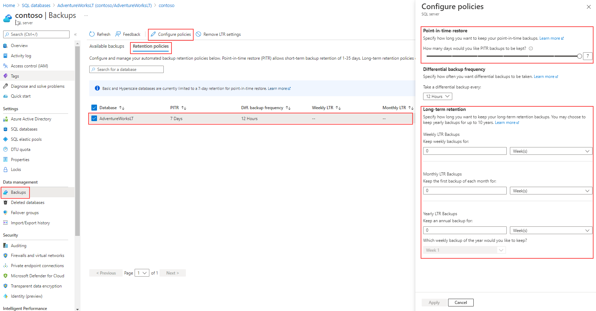

A major portion of configuring disaster recovery and high availability solutions in SQL Server remains the same in SQL Server running on Azure Virtual Machine. The high availability solution is designed to guarantee that no committed data is lost due to failures, that your workload remains unaffected by maintenance operations, and that the database doesn't become a single point of failure in your software architecture.

Most Azure SQL service tiers offer a range of [high availability options](/azure/azure-sql/database/high-availability-sla), from local redundancy to zone redundancy models.

Next, we'll explore the specific solutions for disaster recovery and high availability for Azure's PaaS offerings.

## Continuous backup

Azure SQL Database ensures regular and [continuous backups](/azure/azure-sql/database/automated-backups-overview) of databases, which are then replicated to a read-access geo-redundant storage (RA-GRS).

Weekly full backups, differential backups every 12 to 24 hours, and transaction log backups every 5 to 10 minutes are part of the automated backup strategy. For extended backup availability (up to 10 years), long-term retention (LTR) can be configured for both single and pooled databases.

### Long-term retention (LTR)

Azure offers a retention policy that you can set beyond the usual limits, which is useful for scenarios requiring [long-term retention](/azure/azure-sql/database/long-term-retention-overview). You can set a retention policy for up to 10 years, and this option is disabled by default.

> 

The image shows how to set up long-term retention policies on the Azure portal. After choosing the database, a panel will appear on the right side of the screen, where you can change the default settings.

For more information about long-term retention, see [Long-term retention - Azure SQL Database and Azure SQL Managed Instance](/azure/azure-sql/database/long-term-retention-overview).

## Geo-restore

Backups for SQL Database and SQL Managed Instance are geo-redundant by default. This allows you to easily restore databases to a different geographical region, a feature that is useful for less stringent disaster recovery scenarios.

Backup storage is billed apart from regular database files storage. However, when provisioning a SQL Database, the backup storage is created with the maximum size of the data tier selected for your database at no extra cost.

The duration of a geo-restore operation can be affected by several underlying components including the size of the database, the number of transaction logs involved in a restore operation, and the amount of simultaneous restore requests being processed in the target region.

## Point-in-time restore (PITR)

You can restore your databases to a specific point in time according to the retention defined, but PITR is only supported if you're restoring a database in the same server the backup was originated. You can use either Azure portal, Azure PowerShell, Azure CLI, or REST API to restore a SQL Database.

## Active geo-replication

One method to increase availability for Azure SQL Database is to use [active geo-replication](/azure/azure-sql/database/active-geo-replication-overview). Active geo-replication creates a secondary database replica in another region that is asynchronously kept up to date. 

This replica is readable, similar to an AlwaysOn availability group in SQL Server. Underneath the surface, Azure uses availability groups to maintain this functionality, which is why some of the terminologies are similar.

Active geo-replication provides business continuity by allowing customers to programmatically or manually failover primary databases to secondary regions during major disaster. However, it’s important to note that Azure SQL Managed Instance doesn't support active geo-replication. Instead, you must use auto-failover groups, a topic we'll explore later in this unit.

:::image type="content" source="../media/6-active-geo-replication.png" alt-text="Diagram of active geo-replication for Azure SQL Database.":::

All the databases involved in a geo-replication relationship are required to have the same service tier. Additionally, to prevent replication performance issues due to a heavy write workload, we recommend configuring the secondary replica with the same compute size as the primary.

:::image type="content" source="../media/6-create-replica.png" alt-text="Screenshot of the replica page for Azure SQL Database.":::

You can manually configure geo-replication for Azure SQL Database by accessing the blade for the database, in **Data management** section, selecting **Replicas**, and then **+ Create replica**. 

:::image type="content" source="../media/6-forced-failover.png" alt-text="Screenshot of Force Failover option on Azure portal." lightbox="../media/6-forced-failover.png":::

Once the secondary replica is established, you have the option to manually initiate a failover. In this process, the roles are reversed - the secondary replica assumes the role of the primary, while the original primary becomes the secondary.

## Cross-subscription geo-replication

In certain scenarios, you may need to configure a secondary replica on a different subscription than the primary database. This is where the feature of cross-subscription geo-replication comes into play. However, it's important to note that cross-subscription geo-replication is only available programmatically.

To learn more about the steps required to configure a cross-subscription geo-replication, see [Cross-subscription geo-replication](/azure/azure-sql/database/active-geo-replication-overview#cross-subscription-geo-replication).

## Auto failover groups

An [auto-failover group](/azure/azure-sql/database/auto-failover-group-sql-db) is a high availability feature supported by both Azure SQL Database and Azure SQL Managed Instance. Auto-failover groups let you manage how databases are replicated to another region, and how failover could happen. The name assigned to the auto-failover group must be unique within the **.database.windows.net* domain. 

An auto-failover group can include multiple databases. Both the primary and secondary have the same database size.

:::image type="content" source="../media/7-auto-failover-groups.png" alt-text="Architecture diagram of the auto-failover groups for Azure SQL Database and Azure SQL Managed Instance.":::

Auto-failover groups provide AG-like functionality called a listener, which allows both read-write and read-only activity. There are two different types of listeners: one for read-write and one for read-only traffic. Behind the scenes in a failover, DNS is updated so clients are able to point to the abstracted listener name and not need to know anything else. The database server containing the read-write copies is the primary, and the server that is receiving the transactions from the primary is a secondary.

There are two different policies for auto-failover groups.

| Policy Type | Description |
|-------------|-------------|
| **Automatic** | When a failure is detected, the system triggers a failover automatically by default. However, if needed, you can disable the automatic failover. |
| **Read-only** | During a failover, the engine disables the read-only listener by default to maintain the performance of the new primary when the secondary is down. However, you can change this behavior to allow both types of traffic after a failover. |

Failover is a process that can be manually initiated, even when automatic failover is enabled. However, the type of failover can influence whether data loss occurs. For instance, an unplanned failover might lead to data loss if it's forced and the secondary database hasn't fully synchronized with the primary.

The `GracePeriodWithDataLossHours` determines the duration Azure waits before initiating a failover, with the default value set to one hour. If your Recovery Point Objective (RPO) is stringent and data loss isn't an option, you can set this value higher. While this means Azure waits longer before initiating a failover, it could potentially reduce data loss as it provides more time for the secondary database to synchronize fully with the primary.

>[!NOTE]
> The secondary database is created automatically through a process known as seeding, which can take time depending on the database size. So, it's important to plan ahead, considering factors like network speed.

To learn more about high availability and disaster recovery for Azure SQL Database, see [Azure SQL Database high availability and disaster recovery checklist](/azure/azure-sql/database/high-availability-disaster-recovery-checklist).
