Once the creation of the Data Factory instance is complete, you can go to the resource where you can begin to create your data pipelines by selecting **Launch Studio** on the **Open Azure Data Factory Studio** tile. This opens up the following screen:

> [!div class="mx-imgBorder"]  
> 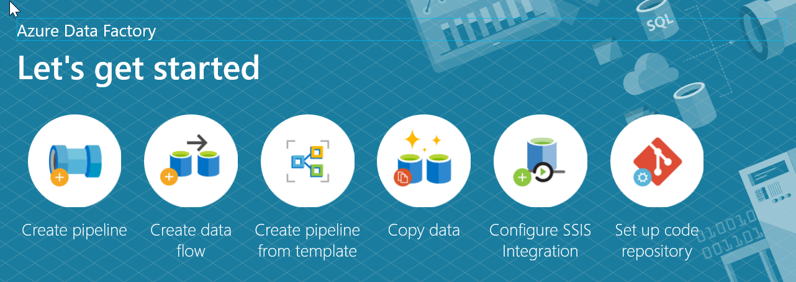 

The first step in your pipeline is creating a Copy Activity that copies data between the source and destination using the following steps. 

1. **Open the authoring canvas** by clicking on the **pencil icon** on the left sidebar or the create pipeline button to open the authoring canvas. 
    > [!div class="mx-imgBorder"]  
    > 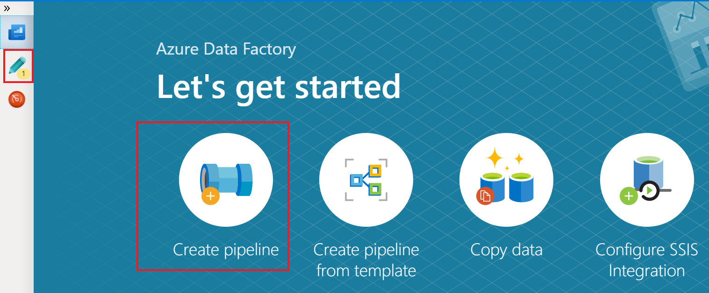

1. Create the **pipeline**. select the **+** button in the Factory Resources pane and select **Pipeline**.
    > [!div class="mx-imgBorder"]  
    > 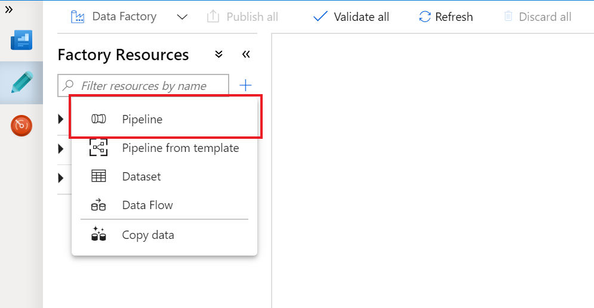

1. Add a **copy activity**. In the **Activities** pane, open the **Move and Transform** accordion and drag the **Copy Data** activity onto the pipeline canvas.
    > [!div class="mx-imgBorder"]  
    > 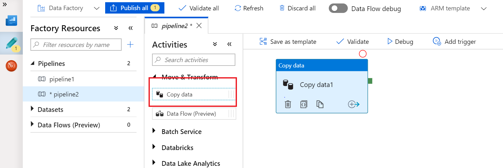

With the Copy Activity added, you then start to define the source data

1. In the **Source** tab of the Copy Activity settings, select **+ New** to select a data source.
    > [!div class="mx-imgBorder"]  
    > 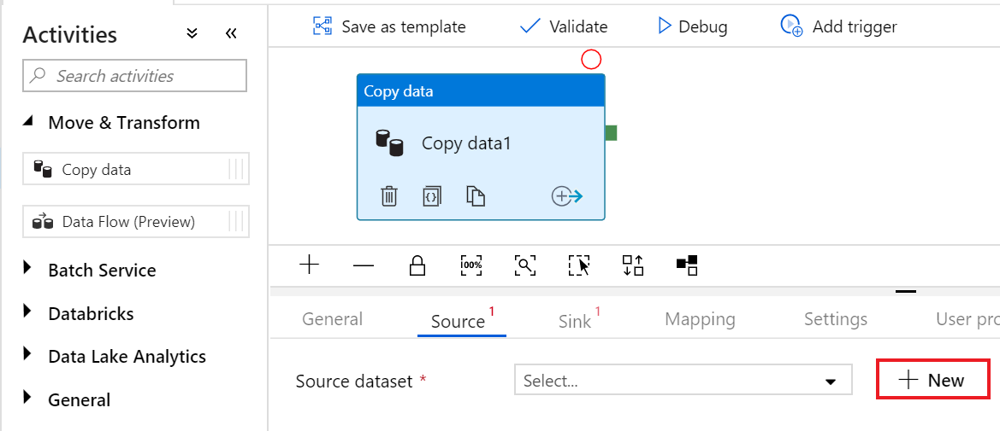

1. For example, In the data store list, select the **Amazon S3** tile and select **continue**
    > [!div class="mx-imgBorder"]  
    > 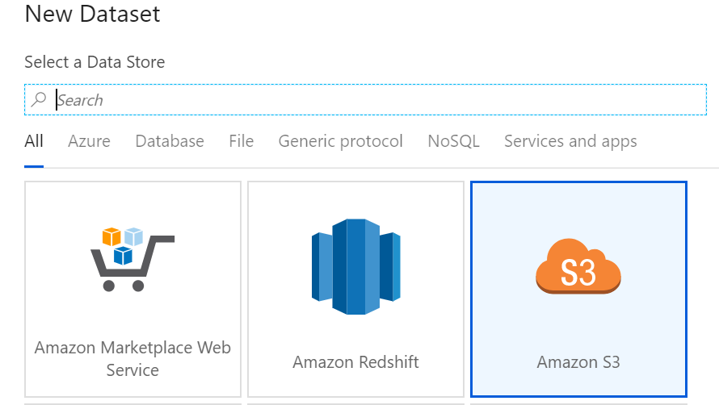

1. In the **file format list**, select the **DelimitedText** format tile and select **continue**
    > [!div class="mx-imgBorder"]
    > 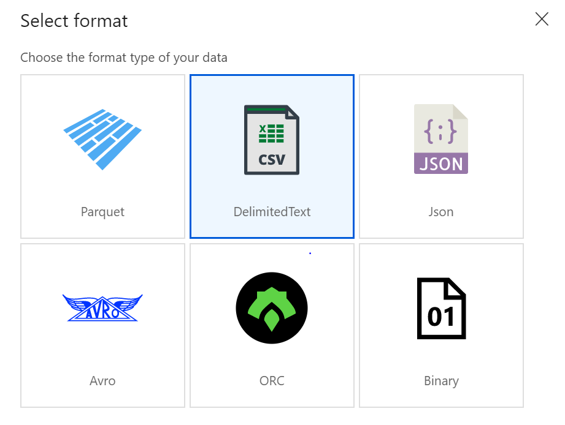

1. In **Set Properties** window, give your dataset an understandable **name** and select the **Linked Service dropdown**. If you haven't created your S3 Linked Service, select **New**. 
    > [!div class="mx-imgBorder"]  
    > 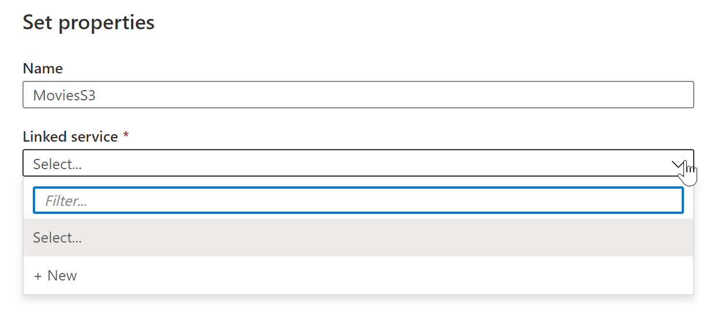

1. Specific to the S3 Linked Service configuration pane, specify your S3 **access key** and **secret key**. The Data Factory service encrypts credentials with certificates managed by Microsoft. For more information, see Data Movement Security Considerations. To verify your credentials are valid, select **Test Connection**. Select **Create** when finished. 
    > [!div class="mx-imgBorder"]  
    > 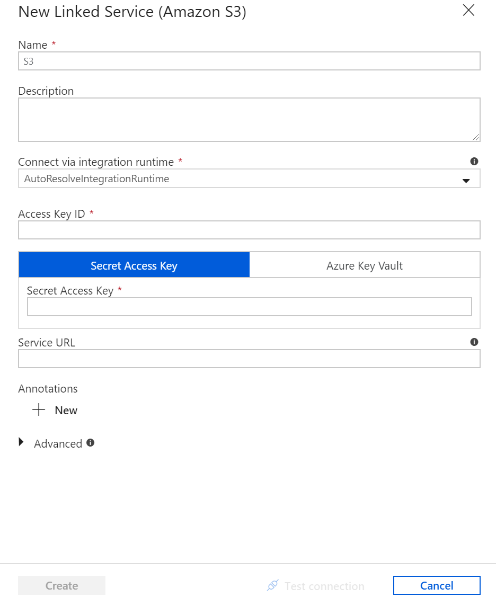

1. Once you have created and selected the linked service, specify the rest of your dataset settings. These settings specify how and where in your connection you want to pull the data. Select **Finish** once completed. 
    > [!div class="mx-imgBorder"]  
    > 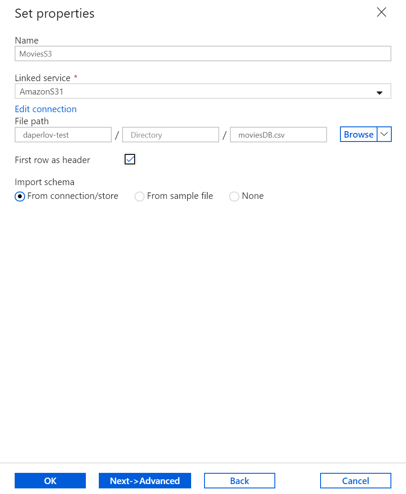

1. To verify your dataset is configured correctly, select **Preview Data** in the Source tab of the Copy Activity to get a small snapshot of your data. 
    > [!div class="mx-imgBorder"]
    > 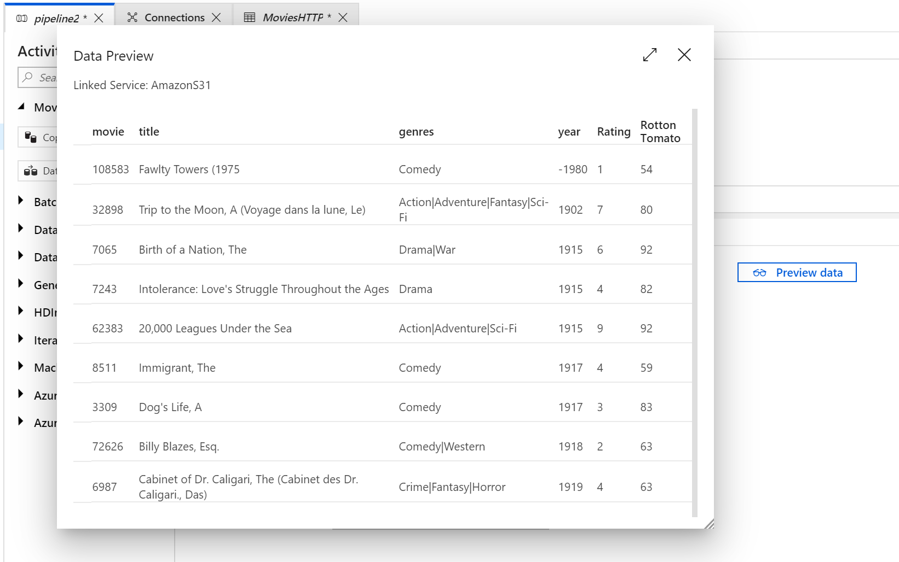

With the source data defined, then you'll define the sink into which the data will be loaded. In this example the sink will be Azure Data Lake Storage Gen2 by performing the following steps:

1. In the **Sink** tab, select **+ New**  
    > [!div class="mx-imgBorder"]  
    > 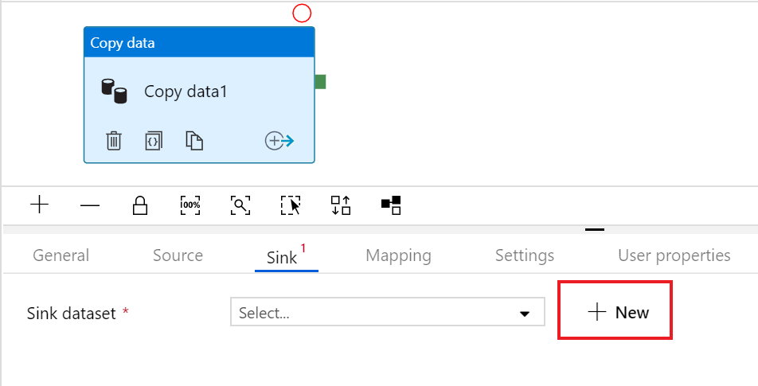

1. Select the **Azure Data lake Storage Gen2** tile and select **continue** 
    > [!div class="mx-imgBorder"]  
    > 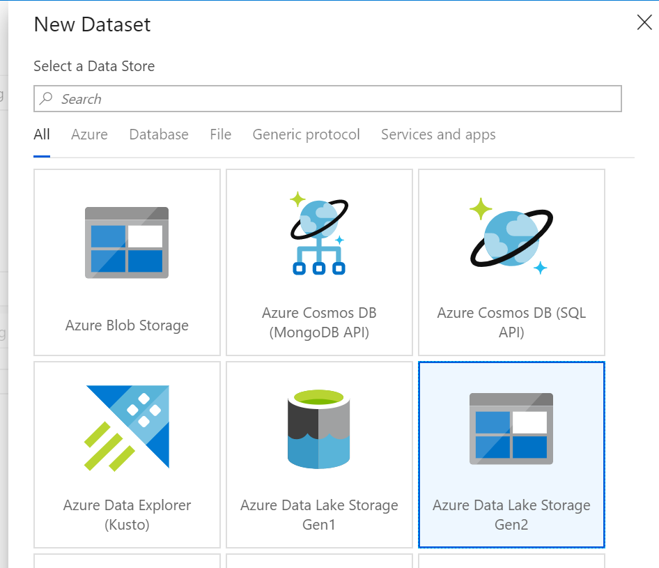

1. In **Set Properties** side nav, give your dataset an understandable **name** and select the **Linked Service dropdown**. If you haven't created your ADLS Linked Service, select **New**. 
    > [!div class="mx-imgBorder"]  
    > 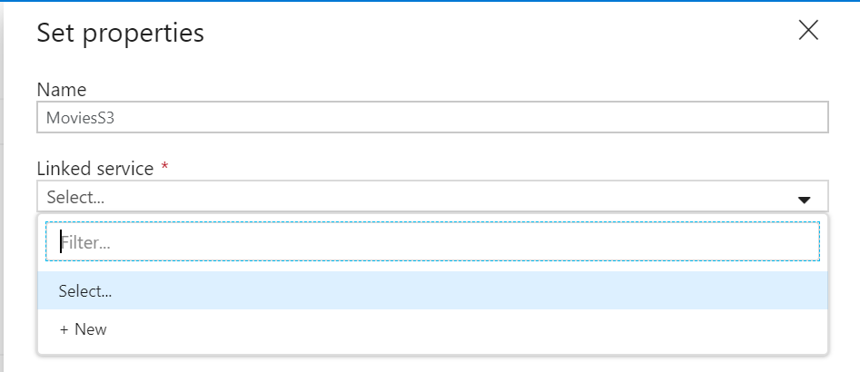

1. In the ADLS linked service configuration pane, select your **authentication method** and **enter your credentials**. In the example below, an account key and selected my storage account from the drop-down. 
    > [!div class="mx-imgBorder"]  
    > 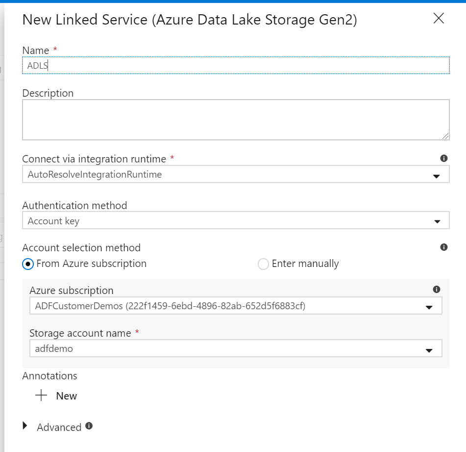

1. Once you have configured your linked service, enter in the **ADLS dataset configuration**. Select **finish** once completed. 
    > [!div class="mx-imgBorder"]  
    > 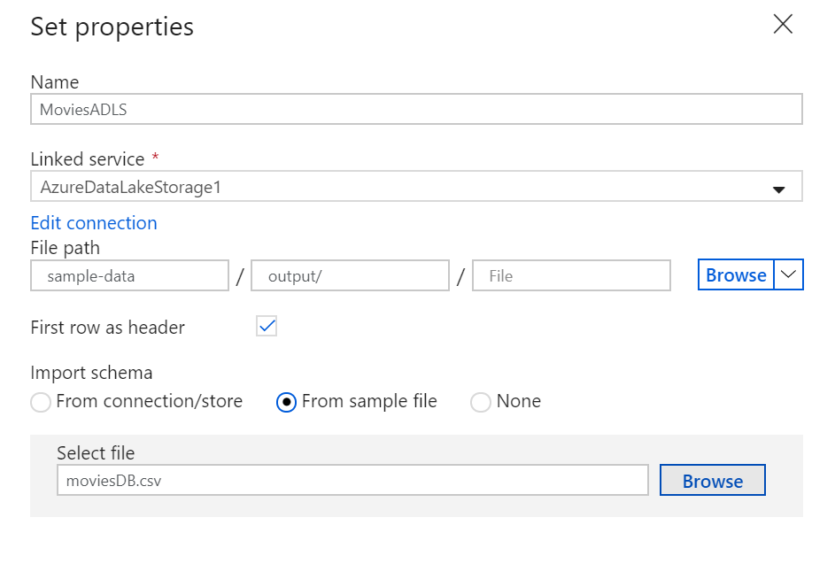

At this point, you have fully configured your copy activity. 

1. To test it out, select the **Debug** button at the top of the pipeline canvas. This starts a pipeline debug run.
    > [!div class="mx-imgBorder"]  
    > 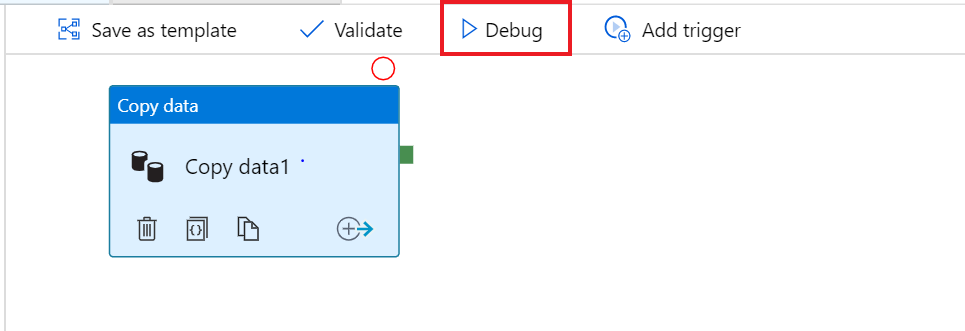

1. To monitor the progress of a pipeline debug run, select the Output tab of the pipeline
    > [!div class="mx-imgBorder"]  
    > 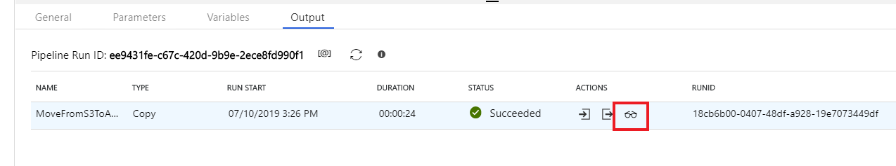

1. To view a more detailed description of the activity output, select the eyeglasses icon. This opens up the copy monitoring screen, which provides useful metrics such as Data read/written, throughput, and in-depth duration statistics.
    > [!div class="mx-imgBorder"]  
    > 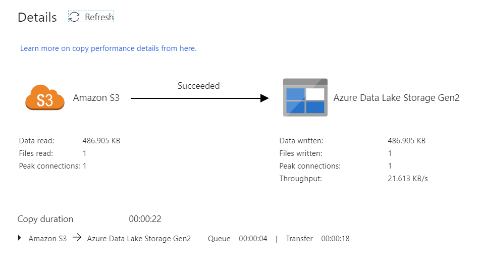

To verify the copy worked as expected, open up your ADLS gen2 storage account and check to see your file was written as expected
