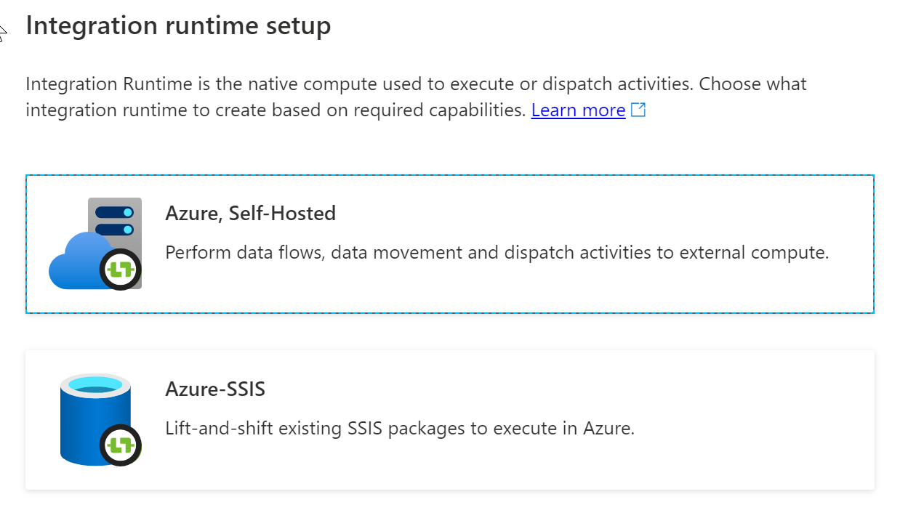
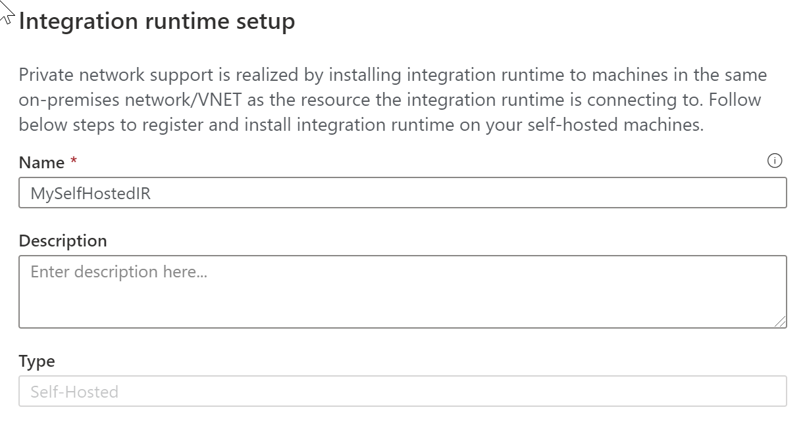
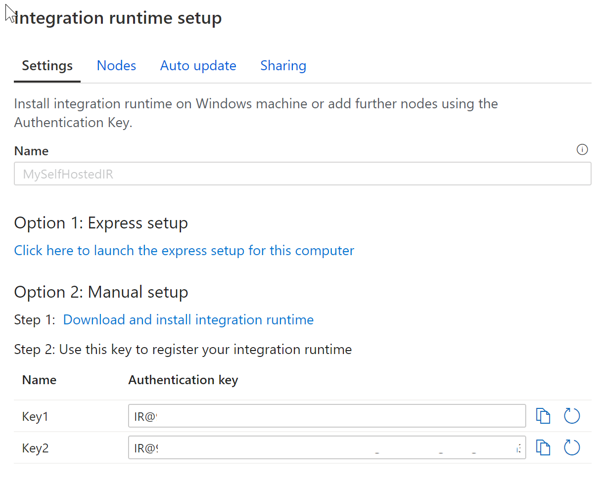

In Data Factory, an activity defines the action to be performed. A linked service defines a target data store or a compute service. An integration runtime provides the bridge between the activity and linked services. 

## Self-hosted integration runtime

A self-hosted integration runtime is capable of:

- Running copy activity between a cloud data stores and a data store in private network.
- Dispatching the following transform activities against compute resources in on-premises or Azure Virtual Network: 
    - HDInsight Hive activity (BYOC-Bring Your Own Cluster) 
    - HDInsight Pig activity (BYOC)
    - HDInsight MapReduce activity (BYOC) 
    - HDInsight Spark activity (BYOC)  
    - HDInsight Streaming activity (BYOC)
    - Machine Learning Batch Execution activity
    - Machine Learning Update Resource activities
    - Stored Procedure activity
    - Data Lake Analytics U-SQL activity
    - Custom activity (runs on Azure Batch)
    - Lookup activity
    - Get Metadata activity.

The self-hosted integration runtime is logically registered to the Azure Data Factory and the compute resource used to support its functionality as provided by you. Therefore there is no explicit location property for self-hosted IR. When used to perform data movement, the self-hosted IR extracts data from the source and writes into the destination.

## Create a self-hosted Integration Runtime within Azure Data Factory

1. On the Let's get started page of Azure Data Factory UI, select the Author tab on the leftmost pane.
    > [!div class="mx-imgBorder"]
    > 

1. Select Manage in the leftmost pane, and select Integration runtimes. Select +New.
    > [!div class="mx-imgBorder"]  
    > 

1. On the Integration runtime setup page, select Azure, Self-Hosted, and then select Continue.
    > [!div class="mx-imgBorder"]  
    > 

1. On the Integration runtime setup page, type in a name of MySelfHostedIR, and click Create 
    > [!div class="mx-imgBorder"]  
    > 

1. Copy and paste the authentication key. Select Download and install integration runtime.
    > [!div class="mx-imgBorder"]  
    > 

1. Download the self-hosted integration runtime on a local Windows machine. Run the installer.

1. On the Register Integration Runtime (Self-hosted) page, paste the key you saved earlier, and select Register.
    > [!div class="mx-imgBorder"]  
    > 

1. On the New Integration Runtime (Self-hosted) Node page, select Finish.

1. After the self-hosted integration runtime is registered successfully, you see the following window:
    > [!div class="mx-imgBorder"]  
    > 

## Automated deployments

You can also set up a self-hosted IR on an Azure VM via an Azure Resource Manager template, or by using PowerShell

1. Run the following command in PowerShell

    ```PowerShell
    Set-AzDataFactoryV2IntegrationRuntime -ResourceGroupName $resourceGroupName -DataFactoryName $dataFactoryName -Name $selfHostedIntegrationRuntimeName -Type SelfHosted -Description "selfhosted IR description"
    ```

2. Download and install the self-hosted integration runtime on a local machine.

3. Retrieve the authentication key and register the self-hosted integration runtime with the key. Here is a PowerShell example:

    ```PowerShell
    Get-AzDataFactoryV2IntegrationRuntimeKey -ResourceGroupName $resourceGroupName -DataFactoryName $dataFactoryName -Name $selfHostedIntegrationRuntimeName  
    ```