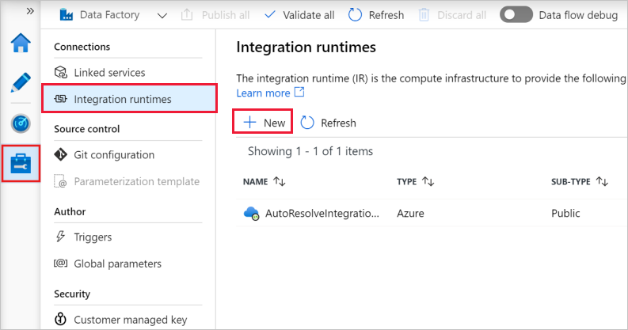
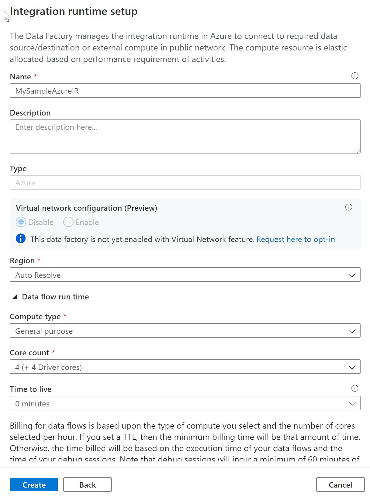

In Data Factory, an activity defines the action to be performed. A linked service defines a target data store or a compute service. An integration runtime provides the bridge between the activity and linked services. 


## Azure integration runtime

An Azure integration runtime is capable of:

- Running Data Flows in **Azure**
- Running Copy Activity **between cloud data stores**
- Dispatching the following transform activities in **public network**: Databricks Notebook/ Jar/ Python activity, HDInsight Hive activity, HDInsight Pig activity, HDInsight MapReduce activity, HDInsight Spark activity, HDInsight Streaming activity, Machine Learning Batch Execution activity, Machine Learning Update Resource activities, Stored Procedure activity, Data Lake Analytics U-SQL activity, .NET custom activity, Web activity, Lookup activity, and Get Metadata activity.

You can set a certain location of an Azure IR, in which case the data movement or activity dispatch will happen in that specific region. If you choose to use the auto-resolve Azure IR which is the default, ADF will make a best effort to automatically detect your sink and source data store to choose the best location either in the same region if available or the closest one in the same geography for the Copy Activity. For anything else, it will use the IR in the Data Factory region. Azure Integration Runtime also has support got virtual networks. 

## Create and configure Azure integration runtime

Use the following steps to create an Azure IR using Azure Data Factory UI.

1. On the Let's get started page of Azure Data Factory UI, select the Manage tab from the leftmost pane.

    

1. Select Integration runtimes on the left pane, and then select +New.

    

1. On the Integration runtime setup page, select Azure, Self-Hosted, and then select Continue.

1. On the following page, select Azure to create an Azure IR, and then select Continue. 

    

1. Enter a name for your Azure IR, and select Create. 

    > [!div class="mx-imgBorder"]
    > 

You'll see a pop-up notification when the creation completes. On the Integration runtimes page, make sure that you see the newly created IR in the list.

## Automated deployments

You can also set up Azure IR via an Azure Resource Manager template, or by using PowerShell

1. Run the following command in PowerShell

    ```PowerShell
    Set-AzDataFactoryV2IntegrationRuntime -DataFactoryName "SampleV2DataFactory1" -Name "MySampleAzureIR" -ResourceGroupName "ADFV2SampleRG" -Type Managed -Location "West Europe"
    ```

When Azure IR, the type must be set to Managed. You do not need to specify compute details because it is fully managed elastically in cloud.