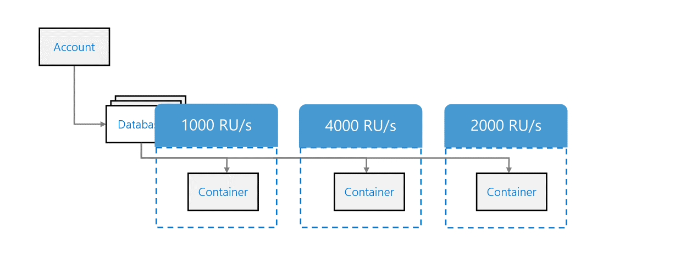
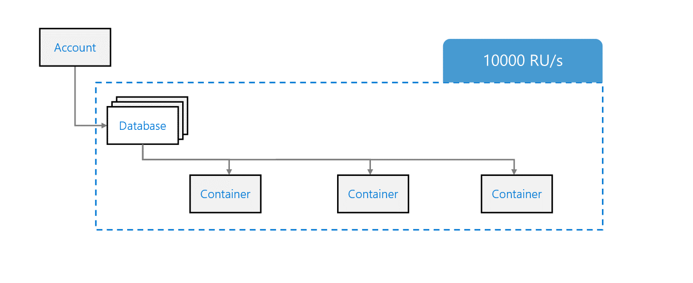
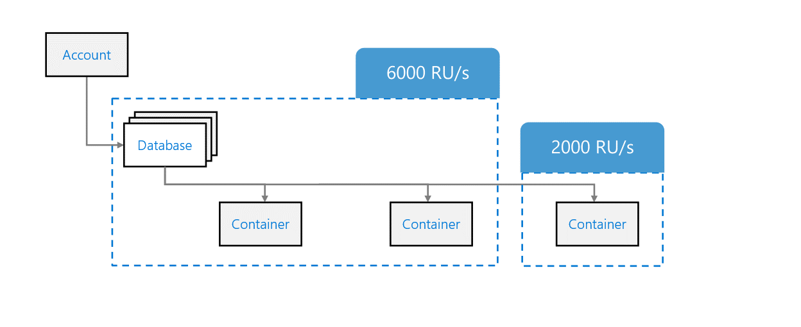

Referring to our basic hierarchy of resources, an Azure Cosmos DB SQL API database is a unit of management for a set of schema-agnostic containers. Each container is a unit of scalability for both **throughput** and **storage**.

Containers are partitioned horizontally across compute within an Azure region and distributed across all Azure Regions you configure in your Azure Cosmos DB SQL API account.

When configuring Azure Cosmos DB, you can provision throughput at either or both the database and container levels.

## Container-level throughput provisioning

Any throughput provisioned exclusively at the container level is reserved only for this container. This throughput is available only for this container all the time. This throughput is also financially backed by SLAs.

> [!NOTE]
> This is the most commonly used method of manual throughput provisioning.

## Database-level throughput provisioning

Throughput provisioned on a database is shared across all containers in the database. Because all containers share the throughput resources, you may not get predictable performance in a specific container within the database.

## Mixed-throughput provisioning

There may be situations where you may want to combine provisioning throughput at the database and container level. A container with provisioned throughput cannot be converted to a shared database container. Conversely, a shared database container cannot be converted to have dedicated throughput.
