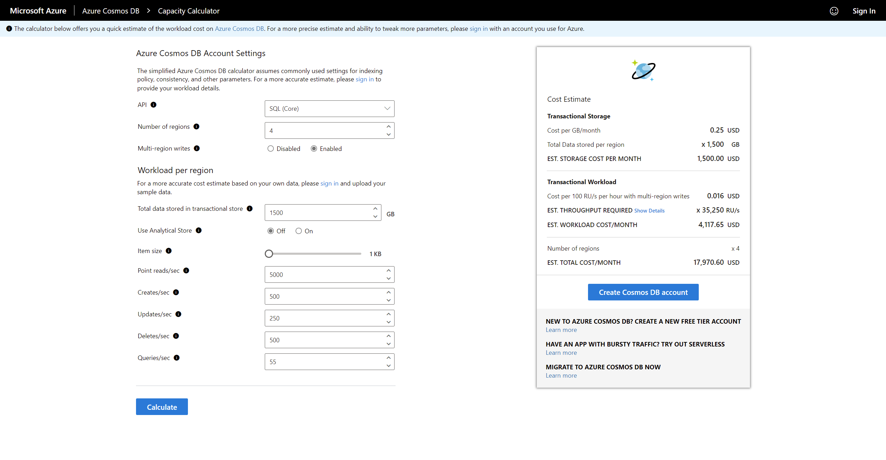

Planning for a new Azure Cosmos DB account is composed of two components; throughput and storage. While we have already discussed throughput, data in Azure Cosmos DB will also consume SSD storage billed per GB per month.

## Migrating existing transactional workloads

The Azure Cosmos DB Capacity Calculator is a calculator surfaced as an online form to plug in details about your existing data workload to help estimate your  application's storage and throughput requirements and translate it to a cost estimate in terms of Azure Cosmos DB.

> [!NOTE]
> The costs detailed in this example may not accurately reflect current storage costs or your current region.

The calculator will inquire about details such as:

- Total data stored
- Whether you expect to perform near real-time analytics
- The anticipated size of documents
- Point reads per second
- Queries per second

After your rough estimate and proof of concept, use the capacity calculator to refine your estimate further to a much more accurate cost to run your solution in Azure Cosmos DB.
