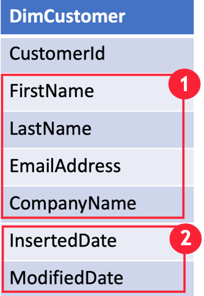

A **slowly changing dimension** (SCD) is one that appropriately manages the change of dimension members over time. It applies when the values of a business entity change over time, and not on a set schedule. A good example of an SCD is a customer dimension, specifically its contact detail columns like email address and phone number. In contrast, some dimensions are considered to be rapidly changing when a dimension attribute changes often, like a stock's market price. The common design approach in these instances is to store rapidly changing attribute values in a fact table measure. However, for slowly changing dimensions the changing members should remain in the dimension table. The design used for handling changes depends on the business requirements for the dimension table.

## Customer SCD example
Assume you are designing a customer dimension table as part of a star schema model for tracking sales transactions. This table would include attributes like company name and email address. If the company name or phone number changes, do you want to treat that as a new customer? Probably not. Instead, you need a way to update the existing record or to keep track of all historical changes to the values.

When handling data changes, the table design varies depending on if you choose to update values without history or to track each version of history. You will learn some common practices next, but to start with you need to identify if your dimension will be a slowly changing dimension (SCD). In other words, will you allow updates to records? When the answer is yes you should add additional date fields to your table. These date fields will help you track when the data was updated in your analytics database.

For example, a customer SCD will have a set of columns that can change (1) and a set of field to track when the record was added and modified (2).

