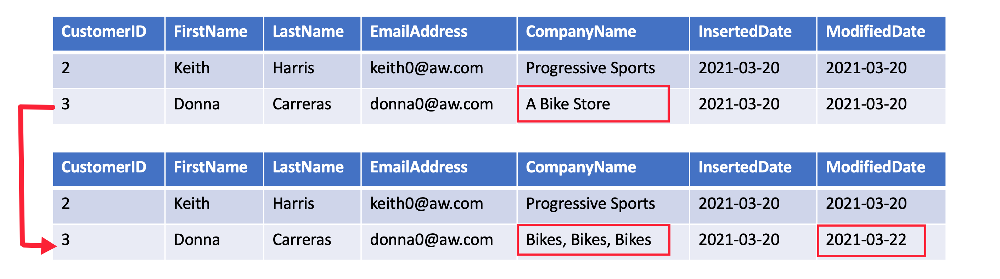
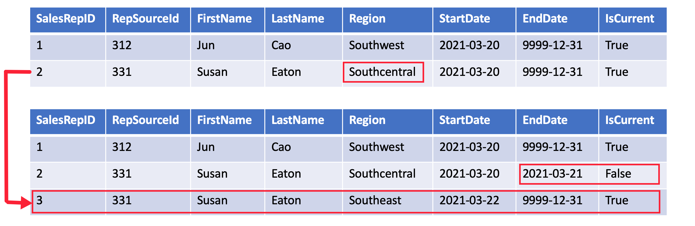
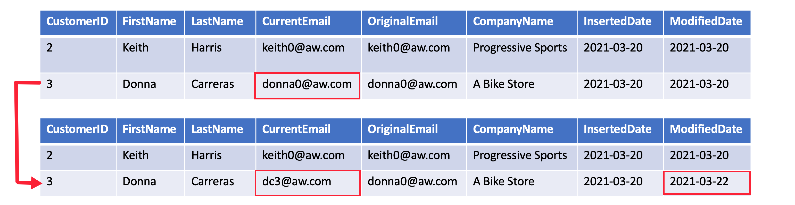
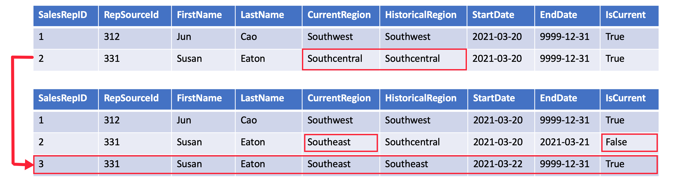

Star schema design theory refers to common SCD types. The most common are Type 1 and Type 2. In practice a dimension table may support a combination of history tracking methods, including Type 3 and Type 6. Let's get to know the difference in these SCD types.

## Type 1 SCD

A **Type 1 SCD** always reflects the latest values, and when changes in source data are detected, the dimension table data is overwritten. This design approach is common for columns that store supplementary values, like the email address or phone number of a customer. When a customer email address or phone number changes, the dimension table updates the customer row with the new values. It's as if the customer always had this contact information. The key field, such as CustomerID, would stay the same so the records in the fact table automatically link to the updated customer record.

## Type 2 SCD

A **Type 2 SCD** supports versioning of dimension members. Often the source system doesn't store versions, so the data warehouse load process detects and manages changes in a dimension table. In this case, the dimension table must use a surrogate key to provide a unique reference to a version of the dimension member. It also includes columns that define the date range validity of the version (for example, `StartDate` and `EndDate`) and possibly a flag column (for example, `IsCurrent`) to easily filter by current dimension members.

For example, Adventure Works assigns salespeople to a sales region. When a salesperson relocates region, a new version of the salesperson must be created to ensure that historical facts remain associated with the former region. To support accurate historic analysis of sales by salesperson, the dimension table must store versions of salespeople and their associated region(s). The table should also include start and end date values to define the time validity. Current versions may define an empty end date (or 12/31/9999), which indicates that the row is the current version. The table must also define a surrogate key because the business key (in this instance, employee ID) won't be unique.

It's important to understand that when the source data doesn't store versions, you must use an intermediate system (like a data warehouse) to detect and store changes. The table load process must preserve existing data and detect changes. When a change is detected, the table load process must expire the current version. It records these changes by updating the `EndDate` value and inserting a new version with the `StartDate` value commencing from the previous `EndDate` value. Also, related facts must use a time-based lookup to retrieve the dimension key value relevant to the fact date.

## Type 3 SCD

A **Type 3 SCD** supports storing two versions of a dimension member as separate columns. The table includes a column for the current value of a member plus either the original or previous value of the member. So Type 3 uses additional columns to track one key instance of history, rather than storing additional rows to track each change like in a Type 2 SCD.

This type of tracking may be used for one or two columns in a dimension table. It is not common to use it for many members of the same table. It is often used in combination with Type 1 or Type 2 members.

## Type 6 SCD

A **Type 6 SCD** combines Type 1, 2, and 3. When a change happens to a Type 2 member you create a new row with appropriate StartDate and EndDate. In Type 6 design you also store the current value in all versions of that entity so you can easily report on the current value or the historical value.

Using the sales region example, you split the Region column into `CurrentRegion` and `HistoricalRegion`. The `CurrentRegion` always shows the latest value and the `HistoricalRegion` shows the region that was valid between the `StartDate` and `EndDate`. So for the same salesperson, every record would have the latest region populated in `CurrentRegion` while `HistoricalRegion` works exactly like the region field in the Type 2 SCD example.

