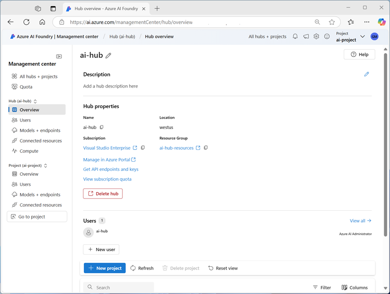
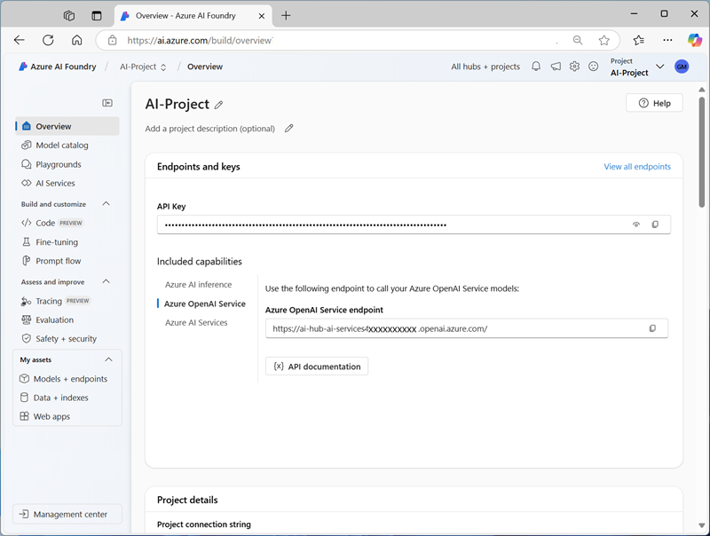

Azure AI Foundry is a platform for AI development on Microsoft Azure. While you *can* provision individual Azure AI services resources and build applications that consume them without it, the project organization, resource management, and AI development capabilities of Azure AI Foundry makes it the recommended way to build all but the most simple solutions.

Azure AI Foundry provides the *Azure AI Foundry portal*, a web-based visual interface for working with AI projects. It also provides the *Azure AI Foundry SDK*, which you can use to build AI solutions programmatically.

## Hubs and projects

In Azure AI Foundry, you manage the resources, assets, code, and other elements of the AI solution in hubs and projects. *Hubs* provide a top-level container for managing shared resources, data, connections and security configuration for AI application development. A hub can support multiple *projects*, in which developers collaborate on building a specific solution.

### Hubs

A hub provides a centrally managed collection of shared resources and management configuration for AI solution development. You need at least one hub to use all of the solution development features and capabilities of AI Foundry.

In a hub, you can define shared resources to be used across multiple projects. When you create a hub using the Azure AI Foundry portal, an Azure **Azure AI Hub** resource is created in a resource group associated with the hub. Additionally, the following resources are created for the hub:

- A multi-service **Azure AI services** resource to provide access to Azure OpenAI and other Azure AI services.
- A **Key vault** in which sensitive data such as connections and credentials can be stored securely.
- A **Storage account** for data used in the hub and its projects.
- Optionally, an **Azure AI Search** resource that can be used to index data and support grounding for generative AI prompts.

You can create more resources as required (for example, an **Azure AI Face** resource) and add it to the hub (or an individual project) by defining a **connected resource**. As you create more items in your hub, such as compute instances or endpoints, more resources will be created for them in the Azure resource group.

Access to the resources in a hub is governed by creating *users* and assigning them to *roles*. An IT administrator can manage access to the resources centrally at the hub level, and projects associated with the hub inherit the resources and role assignments; enabling development teams to use the resources they need without needing to request access on a project-by-project basis.

### Projects

A hub can support one or more projects, each of which is used to organize the resources and assets required for a particular AI development effort.  

Users can collaborate in a project, sharing data in project-specific storage containers and connected resources, and using the shared resources defined in the hub associated with the project. Azure AI Foundry provides tools and functionality within a project that developers can use to build AI solutions efficiently, including:

- A *model catalog* in which you can find and deploy machine learning models from multiple sources, including Azure OpenAI and the Hugging Face model library.
- *Playgrounds* in which you can test prompts with generative AI models.
- Access to *Azure AI services*, including visual interfaces to experiment with and configure services as well as endpoints and keys that you can use to connect to them from client applications.
- *Visual Studio Code* containers that define a hosted development environment in which you can write, test, and deploy code.
- *Fine-tuning* functionality for generative AI models that you need to customize based on custom training prompts and responses.
- *Prompt Flow*, a prompt orchestration tool that you can use to define the logic for a generative AI application's interaction with a model.
- Tools to assess, evaluate, and improve your AI applications, including *tracing*, *evaluations*, and *content safety and security* management.
- Management of project *assets*, including models and endpoints, data and indexes, and deployed web apps.

## Considerations for Azure AI Foundry

When planning an AI solution built on Azure AI Foundry, there are some additional considerations to those discussed previously in relation to Azure AI services.

### Hub and project organization

Plan your hub and project organization for the most effective management of resources and efficiency of administration. Use Hubs to centralize management of users and shared resources that are involved in related projects, and then add project-specific resources as necessary. For example, an organization might have separate software development teams for each area of the business, so it may make sense to create separate hubs for each business area (such as Marketing, HR, and so on) in which AI application development projects for each business area can be created. The shared resources in each hub will automatically be available in projects created in those hubs.

> [!TIP]
> For more information about hubs and projects, see **[Manage, collaborate, and organize with hubs](/azure/ai-studio/concepts/ai-resources?azure-portal=true)**.

### Connected resources

At the hub level, an IT administrator can create shared resource connections in a hub that will be used in downstream projects. Projects access the connected resources by proxy on behalf of project users, so users in those projects don't need direct access to those resources in order to use them within the context of the project. Connections in a hub are automatically available in new projects in the hub without further requests to the IT administrator. If an individual project needs access to a specific resource that other projects in the same hub don't use, you can create more connected resources at the project level.

As you plan your Azure AI Foundry hubs and projects, identify the shared connected resources you should add to each hub so that they're inherited by projects in that hub, while allowing for project-level exceptions.

> [!TIP]
> For more information about connected resources, see **[Connections in Azure AI Foundry portal](/azure/ai-studio/concepts/connections?azure-portal=true)**.

### Security and authorization

For each hub and project, identify the users who will need access and the roles to which they should be assigned.

Hub-level roles can perform infrastructure management tasks, such as creating hub-level connected resources or new projects. The default roles in a hub are:

- **Owner**: Full access to the hub, including the ability to manage and create new hubs and assign permissions. This role is automatically assigned to the hub creator
- **Contributor**: Full access to the hub, including the ability to create new hubs, but isn't able to manage hub permissions on the existing resource.
- **Azure AI Developer**: All permissions except create new hubs and manage the hub permissions.
- **Azure AI Inference Deployment Operator**: All permissions required to create a resource deployment within a resource group.
- **Reader**: Read only access to the hub. This role is automatically assigned to all project members within the hub.

Project-level roles determine the tasks that a user can perform within an individual project. The default roles in a project are:

- **Owner**: Full access to the project, including the ability to assign permissions to project users.
- **Contributor**: Full access to the project but can't assign permissions to project users.
- **Azure AI Developer**: Permissions to perform most actions, including create deployments, but can't assign permissions to project users.
- **Azure AI Inference Deployment Operator**: Permissions to perform all actions required to create a resource deployment within a resource group.
- **Reader**: Read only access to the project.

> [!TIP]
> For more information about managing roles in Azure AI Foundry hubs and projects, see **[Role-based access control in Azure AI Foundry portal](/azure/ai-studio/concepts/rbac-ai-studio?azure-portal=true)**.

### Regional availability

As with all Azure services, the availability of specific Azure AI Foundry capabilities can vary by region. As you plan your solution, determine regional availability for the capabilities you require.

> [!TIP]
> For more information about regional availability of Azure AI Foundry, see **[Azure AI Foundry feature availability across clouds regions](/azure/ai-studio/reference/region-support?azure-portal=true)**.

### Costs and quotas

In addition to the cost of the Azure AI services your solution uses, there are costs associated with Azure AI Foundry related to the resources that support hubs and projects as well as storage and compute for assets, development, and deployed solutions. You should consider these costs when planning to use Azure AI Foundry for AI solution development.

In addition to service consumption costs, you should consider the resource quotas you need to support the AI applications you intend to build. Quotas are used to limit utilization, and play a key role in cost management and managing Azure capacity. In some cases, you may need to request additional quota to increase rate limits for AI model operations or available compute for development and solution deployment.

> [!TIP]
> For more information about planning and managing costs for Azure AI Foundry, see **[Plan and manage costs for Azure AI Foundry](/azure/ai-studio/how-to/costs-plan-manage?azure-portal=true)**. For more information about managing quota for Azure AI Foundry, see **[Manage and increase quotas for resources with Azure AI Foundry](/azure/ai-studio/how-to/quota?azure-portal=true)**.