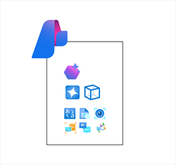
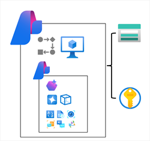

Azure AI Foundry is a platform for AI development on Microsoft Azure. While you *can* provision individual Azure AI services resources and build applications that consume them without it, the project organization, resource management, and AI development capabilities of Azure AI Foundry makes it the recommended way to build all but the most simple solutions.

Azure AI Foundry provides the *Azure AI Foundry portal*, a web-based visual interface for working with AI projects. It also provides the *Azure AI Foundry SDK*, which you can use to build AI solutions programmatically.

## Azure AI Foundry projects

In Azure AI Foundry, you manage the resource connections, data, code, and other elements of the AI solution in *projects*. There are two kinds of project:

### Foundry projects

*Foundry projects* are associated with an **Azure AI Foundry** resource in an Azure subscription. Foundry projects provide support for Azure AI Foundry models (including OpenAI models), Azure AI Foundry Agent Service, Azure AI services, and tools for evaluation and responsible AI development.

An Azure AI Foundry resource supports the most common AI development tasks to develop generative AI chat apps and agents. In most cases, using a Foundry project provides the right level of resource centralization and capabilities with a minimal amount of administrative resource management. You can use Azure AI Foundry portal to work in projects that are based in Azure AI Foundry resources, making it easy to add connected resources and manage model and agent deployments.

### Hub-based projects

*Hub-based projects* are associated with an **Azure AI hub** resource in an Azure subscription. Hub-based projects include an Azure AI Foundry resource, as well as managed compute, support for prompt Flow development, and connected **Azure storage** and **Azure key vault** resources for secure data storage.

Azure AI hub resources support advanced AI development scenarios, like developing Prompt Flow based applications or fine-tuning models. You can also use Azure AI hub resources in both Azure AI Foundry portal and Azure Machine learning portal, making it easier to work on collaborative projects that involve data scientists and machine learning specialists as well as developers and AI software engineers

> [!TIP]
> For more information about Azure AI Foundry project types, see **[What is Azure AI Foundry?](/azure/ai-foundry/what-is-azure-ai-foundry?azure-portal=true)**.
