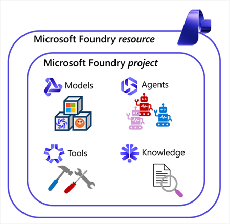

Microsoft Foundry is a platform for AI development on Microsoft Azure. While you *can* provision individual AI resources and build applications that consume them without it, the project organization, resource management, and AI development capabilities of Microsoft Foundry makes it the recommended way to build all but the most simple solutions.

Microsoft Foundry provides the *Microsoft Foundry portal*, a web-based visual interface for working with AI projects. It also provides the *Microsoft Foundry SDK*, which you can use to build AI solutions programmatically.

## Microsoft Foundry projects

In Microsoft Foundry, you manage the resource connections, data, code, and other elements of the AI solution in a *project*. Each project belongs to a single Microsoft Foundry *resource* in Azure, which provides compute, data storage, AI tools, and other services.

A Foundry resource can support one or more child projects, with one of them being designated the *default* project.

Developers use projects to manage the assets needed for an AI solution, including:

- **Models**: Large language model (LLM) deployments based on models available in Foundry Models - an comprehensive catalog of models from Microsoft OpenAI, and other providers. You can connect to and interact with these model through the project *endpoint* (using Foundry-specific APIs and SDKs) and the Azure OpenAI endpoint (using OpenAI APIs and SDKs).
- **Agents**: Named AI configurations that encapsulate an *LLM*, *instructions*, and *tools* to define an autonomous AI entity that can automate tasks and collaborate with users and other agents. Agents in Foundry are developed and consumed using the *Microsoft Foundry Agent service* through the project endpoint.
- **Tools**: The tools used by agents can be based on built-in functionality, such as web search or a code interpreter, or connections to custom and third-party tools through Model Context Protocol (MCP) connections. Additionally, Microsoft Foundry Tools includes a suite of AI services for common tasks such as text analysis, speech recognition and synthesis, translation, and content understanding that you can use in your Foundry-based AI solutions. Foundry Tools are hosted in the Foundry resource associated with your project(s).
- **Knowledge**: Agents can use tools to connect to knowledge stores, and use the data they contain to contextualize prompts. To simplify integration with multiple sources of knowledge, you can use *Foundry IQ* in a project to create a single, central MCP-based knowledge connection.

The separation of project-specific assets and cloud services in Microsoft Foundry resources supports the most common AI development tasks to develop generative AI chat apps and agents. Using a Foundry project provides the right level of resource centralization and capabilities with a minimal amount of administrative resource management.

## The Microsoft Foundry portal

You can use Microsoft Foundry portal to develop and manage projects that are based in Microsoft Foundry resources.

Most AI solution development projects begin in the Foundry project, where you can:

- Find, compare, deploy, and test models.
- Create and test agents.
- Create MCP connections to tools and Foundry IQ knowledge sources.
- Explore and test Microsoft Foundry tools.
- Manage resource configuration and user access.
- Find the endpoints and keys you need to access assets from client applications.

To automate Foundry project operations, you can also use the [Microsoft Foundry SDK](/azure/foundry/how-to/develop/sdk-overview?azure-portal=true) - enabling you to create and manage assets using scripts or automated CI/CD actions in DevOps pipelines.

> [!NOTE]
> This module focuses on the latest Microsoft Foundry project architecture. Older (*classic*) Foundry projects may use a hub-based architecture. Additionally, the Microsoft Foundry portal is transitioning to the "new" interface shown in this module. Some tasks may not yet be supported in the new portal. For more information about Foundry *classic* projects, see [What is Microsoft Foundry? (classic)](/azure/foundry-classic/what-is-foundry?azure-portal=true)
