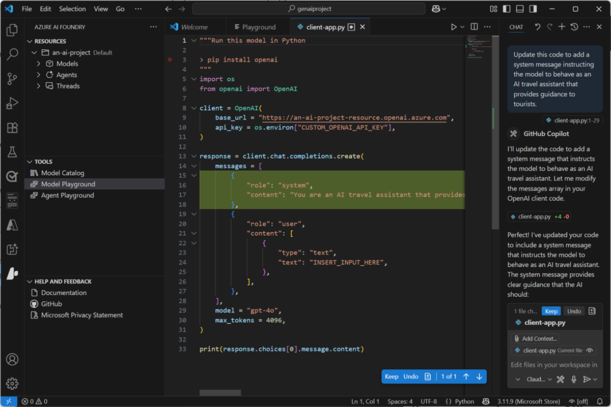

While you can perform many of the tasks needed to develop an AI solution directly in the Azure AI Foundry portal, developers also need to write, test, and deploy code.

## Development tools and environments

There are many development tools and environments available, and developers should choose one that supports the languages, SDKs, and APIs they need to work with and with which they're most comfortable. For example, a developer who focuses strongly on building applications for Windows using the .NET Framework might prefer to work in an integrated development environment (IDE) like Microsoft Visual Studio. Conversely, a web application developer who works with a wide range of open-source languages and libraries might prefer to use a code editor like Visual Studio Code (VS Code). Both of these products are suitable for developing AI applications on Azure.

### The Azure AI Foundry for Visual Studio Code extension

When developing Azure AI Foundry based generative AI applications in Visual Studio Code, you can use the Azure AI Foundry for Visual Studio Code extension to simplify key tasks in the workflow, including:

- Creating a project.
- Selecting and deploying a model.
- Testing a model in the playground.
- Creating an agent.

> [!TIP]
> For more information about using the Azure AI Foundry for Visual Studio Code extension, see **[Work with the Azure AI Foundry for Visual Studio Code extension](/azure/ai-foundry/how-to/develop/get-started-projects-vs-code?azure-portal=true)**.

### GitHub and GitHub Copilot

GitHub is the world's most popular platform for source control and DevOps management, and can be a critical element of any team development effort. Visual Studio and VS Code both provide native integration with GitHub, and access to GitHub Copilot; an AI assistant that can significantly improve developer productivity and effectiveness.

> [!TIP]
> For more information about using GitHub Copilot in Visual Studio Code, see **[GitHub Copilot in VS Code](https://code.visualstudio.com/docs/copilot/overview?azure-portal=true)**.

## Programming languages, APIs, and SDKs

You can develop AI applications using many common programming languages and frameworks, including Microsoft C#, Python, Node, TypeScript, Java, and others. When building AI solutions on Azure, some common SDKs you should plan to install and use include:

- The **[Azure AI Foundry SDK](/azure/ai-studio/how-to/develop/sdk-overview?azure-portal=true)**, which enables you to write code to connect to Azure AI Foundry projects and access resource connections, which you can then work with using service-specific SDKs.
- The **[Azure AI Foundry Models API](/rest/api/aifoundry/modelinference/)**, which provides an interface for working with generative AI model endpoints hosted in Azure AI Foundry.
- The **[Azure OpenAI in Azure AI Foundry Models API](/azure/ai-services/openai/reference)**, which enables you to build chat applications based on OpenAI models hosted in Azure AI Foundry.
- **[Azure AI Services SDKs](/azure/ai-services/reference/sdk-package-resources?azure-portal=true)** - AI service-specific libraries for multiple programming languages and frameworks that enable you to consume Azure AI Services resources in your subscription. You can also use Azure AI Services through their [REST APIs](/azure/ai-services/reference/rest-api-resources).
- The **[Azure AI Foundry Agent Service](/azure/ai-services/agents/overview?azure-portal=true)**, which is accessed through the Azure AI Foundry SDK and can be integrated with frameworks like [Semantic Kernel](/semantic-kernel/overview?azure-portal=true) to build comprehensive AI agent solutions.
