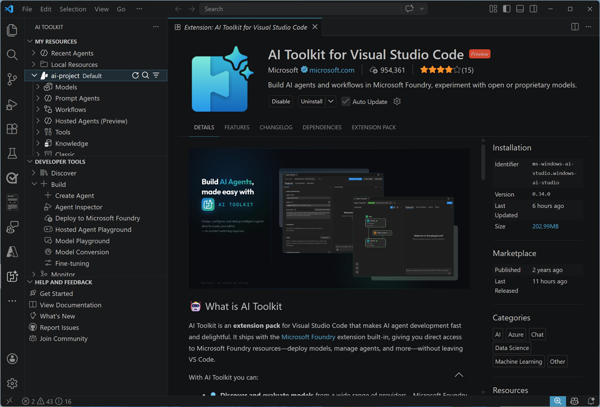
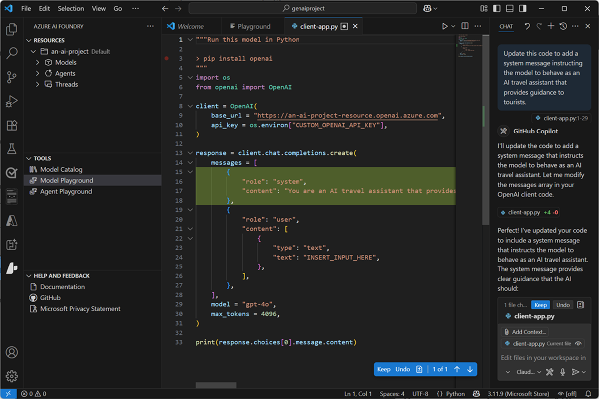

While you can perform many of the tasks needed to develop an AI solution directly in the Microsoft Foundry portal, developers also need to write, test, and deploy code.

## Development tools and environments

There are many development tools and environments available, and developers should choose one that supports the languages, SDKs, and APIs they need to work with and with which they're most comfortable. For example, a developer who focuses strongly on building applications for Windows using the .NET Framework might prefer to work in an integrated development environment (IDE) like Microsoft Visual Studio. Conversely, a web application developer who works with a wide range of open-source languages and libraries might prefer to use a code editor like Visual Studio Code (VS Code). Both of these products are suitable for developing AI applications on Azure.

### The Foundry Toolkit extension for Visual Studio Code

When developing Microsoft Foundry based generative AI applications in Visual Studio Code, you can use the Foundry Toolkit extension for Visual Studio Code to simplify key tasks in the workflow, including:

- Browsing and managing project resources, including deployed models, agents, connections, and vector stores.
- Deploying models from the model catalog.
- Testing models and agents in integrated playgrounds.
- Configuring declarative and hosted agents using a visual designer and YAML files.
- Generating integration code to connect agents with your applications.

> [!TIP]
> For more information about using the Foundry Toolkit extension for Visual Studio Code, see **[Foundry Toolkit for Visual Studio Code](https://code.visualstudio.com/docs/intelligentapps/overview?azure-portal=true)**.

### GitHub and GitHub Copilot

GitHub is the world's most popular platform for source control and DevOps management, and can be a critical element of any team development effort. Visual Studio and VS Code both provide native integration with GitHub, and access to GitHub Copilot; an AI assistant that can significantly improve developer productivity and effectiveness.

> [!TIP]
> For more information about using GitHub Copilot in Visual Studio Code, see **[GitHub Copilot in VS Code](https://code.visualstudio.com/docs/copilot/overview?azure-portal=true)**.

## Programming languages, APIs, and SDKs

You can develop AI applications using many common programming languages and frameworks, including Microsoft C#, Python, Node, TypeScript, Java, and others. When building AI solutions on Azure, some common APIs and SDKs you should plan to use include:

- The **[Microsoft Foundry SDK](/azure/foundry/how-to/develop/sdk-overview?azure-portal=true)**, which enables you to write code to connect to Microsoft Foundry projects and access Foundry-specific assets, like agents and Foundry IQ knowledge stores.
- The **[The OpenAI API](/azure/foundry/openai/latest?azure-portal=true)**, which enables you to use OpenAI SDKs to build chat applications based on Foundry models that support OpenAI syntax.
- **[Foundry Tools SDKs](/azure/ai-services/reference/sdk-package-resources?azure-portal=true)** - AI service-specific libraries for multiple programming languages and frameworks that enable you to consume Foundry Tools resources in your subscription. You can also use Foundry Tools through their [REST APIs](/azure/ai-services/reference/rest-api-resources?azure-portal=true).
