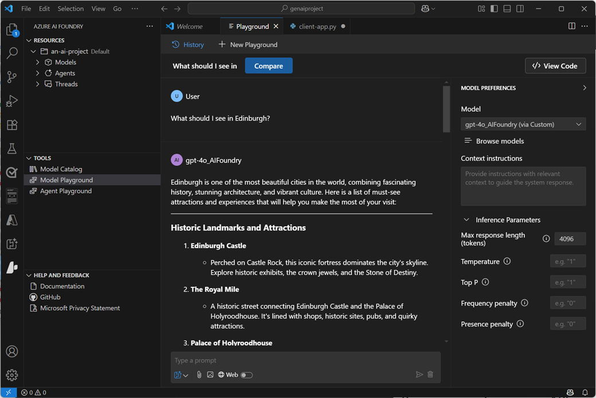

While you can perform many of the tasks needed to develop an AI solution directly in the Azure AI Foundry portal, developers also need to write, test, and deploy code.

## Development tools and environments

There are many development tools and environments available, and developers should choose one that supports the languages, SDKs, and APIs they need to work with and with which they're most comfortable. For example, a developer who focuses strongly on building applications for Windows using the .NET Framework might prefer to work in an integrated development environment (IDE) like Microsoft Visual Studio. Conversely, a web application developer who works with a wide range of open-source languages and libraries might prefer to use a code editor like Visual Studio Code (VS Code). Both of these products are suitable for developing AI applications on Azure.

### The Azure AI Foundry VS Code container image

As an alternative to installing and configuring your own development environment, within Azure AI Foundry portal, you can create compute and use it to host a container image for VS Code (installed locally or as a hosted web application in a browser). The benefit of using the container image is that it includes the latest versions of the SDK packages you're most likely to work with when building AI applications with Azure AI Foundry.

> [!TIP]
> For more information about using the VS Code container image in Azure AI Foundry portal, see **[Get started with Azure AI Foundry projects in VS Code](/azure/ai-studio/how-to/develop/vscode?azure-portal=true)**.

> [!IMPORTANT]
> When planning to use the VS Code container image in Azure AI Foundry, consider the cost of the compute required to host it and the quota you have available to support developers using it.

### GitHub and GitHub Copilot

GitHub is the world's most popular platform for source control and DevOps management, and can be a critical element of any team development effort. Visual Studio and VS Code (including the Azure AI Foundry VS Code container image) both provide native integration with GitHub, and access to GitHub Copilot; an AI assistant that can significantly improve developer productivity and effectiveness.

## Programming languages, APIs, and SDKs

You can develop AI applications using many common programming languages and frameworks, including Microsoft C#, Python, Node, TypeScript, Java, and others. When building AI solutions on Azure, some common SDKs you should plan to install and use include:

- The **[Azure AI Foundry SDK](/azure/ai-studio/how-to/develop/sdk-overview?azure-portal=true)**, which enables you to write code to connect to Azure AI Foundry projects and access resource connections, which you can then work with using service-specific SDKs.
- **[Azure AI Services SDKs](/azure/ai-services/reference/sdk-package-resources?azure-portal=true)** - AI service-specific libraries for multiple programming languages and frameworks that enable you to consume Azure AI Services resources in your subscription. You can also use Azure AI Services through their [REST APIs](/azure/ai-services/reference/rest-api-resources).
- The **[Azure AI Agent Service](/azure/ai-services/agents/overview?azure-portal=true)**, which is accessed through the Azure AI Foundry SDK and can be integrated with frameworks like [AutoGen](https://microsoft.github.io/autogen/0.2/docs/Getting-Started?azure-portal=true) and [Semantic Kernel](/semantic-kernel/overview?azure-portal=true) to build comprehensive AI agent solutions.
- The **[Prompt Flow](https://microsoft.github.io/promptflow/index.html?azure-portal=true)** SDK, which you can use to implement orchestration logic to manage prompt interactions with generative AI models.
