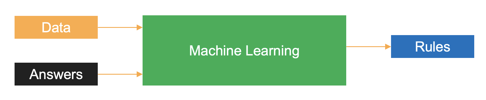

Machine learning is a data science technique used to extract patterns from data allowing computers to identify related data, forecast future outcomes, behaviors, and trends.

## Machine learning as the new programming paradigm

### Traditional programming

In traditional programming, the inputs of hard-coded rules and data are used to arrive at the output of answers.

You provide the traditional program with rules and data, and in return, it gives your results or answers.

### Machine learning

The result of training a machine learning algorithm is that the algorithm has learned the rules to map the input data to answers.

In machine learning, you train the algorithm with data and answers, also known as labels, and the algorithm learns the rules to map the data to their respective labels.
