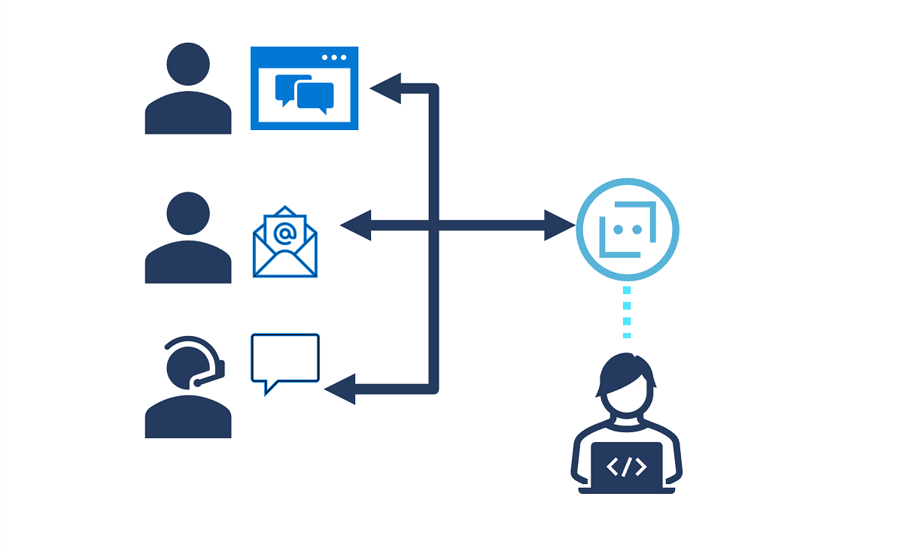

*Bots* are AI-powered software agents that can engage in conversational interactions. For example, a web site may include a *chat bot* interface in which users can submit questions using natural language and receive conversational responses, or an organization might use a bot to answer incoming phone calls and gather initial information before forwarding the call to the appropriate operator.

The **Azure Bot Service** is an Applied AI service for developing and delivering bot solutions that support conversational interactions across multiple *channels*, such as web chat, email, Microsoft Teams, and others.

AI engineers can develop Bots by writing code, using the classes available in the *Bot Framework SDK*. Alternatively, you can use the *Bot Framework Composer* to develop complex bots using a visual design interface.

> [!NOTE]
> For more information about bots, see [the Azure Bot Service page](https://azure.microsoft.com/services/bot-services/).
