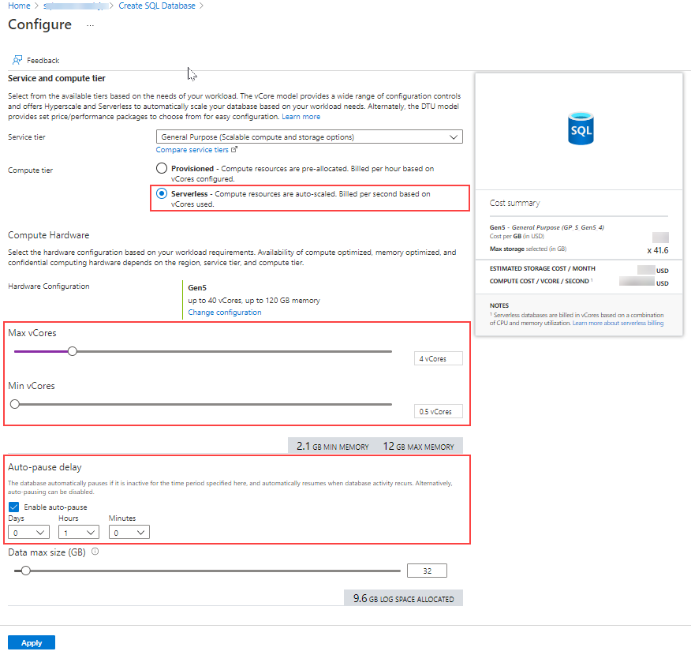
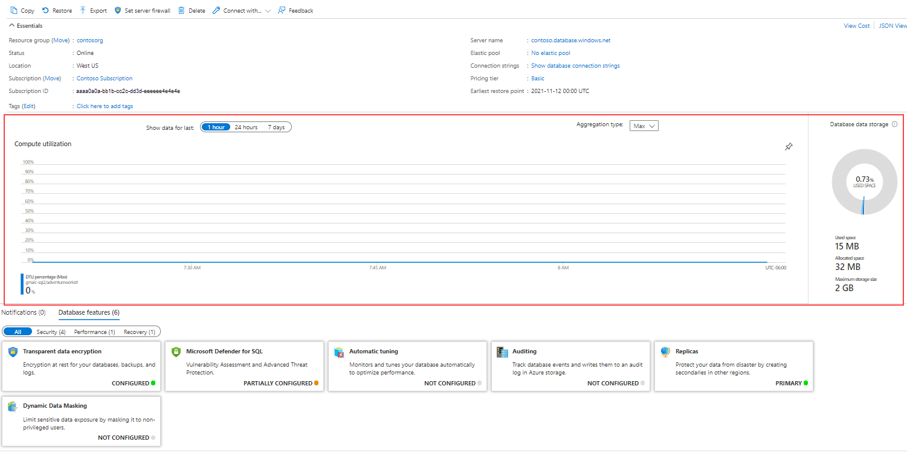

Azure SQL Database is a Platform as a Service (PaaS) that provides high scalability capabilities, and it can be a great solution for certain workloads, and requires minimal maintenance efforts.

Azure SQL Database is aimed at new application development as it gives developers a great deal of flexibility in building new application services, and granular deployment options at scale. SQL Database offers a low maintenance solution that can be a great option for certain workloads.

## Purchasing model

SQL Database comes in two main purchasing models: vCore-based model and DTU-based model. Each purchasing model offers the following service tiers:

### vCore-based

In this purchasing model, compute and storage resources are decoupled. It means you can scale storage and compute resources independently from one another. Here are listed the service tiers available:

| Service tier | Capability |
|------------|-------------|
| General Purpose | This service tier is designed for less intensive operations, and offers budget oriented balanced compute and storage options. It provides both provisioned compute tier and serverless compute tier.
|Business Critical | This service tier supports In-Memory OLTP, and built-in read-only replica. It also includes more memory per core, and uses local SSD storage, which is designed for performance-sensitive workloads. |
| Hyperscale | Hyperscale introduces horizontal scaling features that use advanced techniques to add compute nodes as the data sizes grow. It is only supported on single SQL database. Hyperscale allows you to scale storage and compute resources significantly over the limits available for the General Purpose and Business Critical service tiers. |

### DTU-based

In the DTU model, there are three service tiers available: Basic, Standard, and Premium. Compute and storage resources are dependent on the DTU level, and they provide a range of performance capabilities at a fixed storage limit, backup retention, and cost.

For example, if your database grows to the point it reaches the maximum storage limit, you would need to increase your DTU capacity, even if the compute utilization is low.

The scaling operation on SQL Database may incur in a brief connection interruption at the end of the scaling operation. There are two main changes that trigger this behavior:

- Once you initiate a scaling operation that requires an internal failover.
- When adding or removing databases to the elastic pool.

You can use a proper [retry logic](/azure/azure-sql/database/troubleshoot-common-connectivity-issues) in your application to handle connection errors.

> [!NOTE]
> Azure SQL Managed Instance doesn't support DTU-based purchasing model.

## Serverless compute tier

Despite its name, the serverless compute tier does require you to have a server with your database. The serverless option can best be thought of as an autoscaling and auto-pause solution for SQL Database. It is effective for lowering the costs in development and testing environments. For example, you can set up a minimum and a maximum vCores configuration for your database, where it will scale dynamically based on your workload.

The auto-pause delay feature allows you to define the period of time the database will be inactive before it is automatically paused. The auto-pause delay feature can be set up from 1 hour to seven days. Alternatively, auto-pause delay feature can be disabled.

The resume operation is triggered when the next attempt to access the database occurs, and only storage charges are applicable when the database is paused.

> 

The image above shows where you can change the autoscaling and auto-pause properties for serverless compute tier.

## Deployment model

There are two main deployment models when deploying SQL Database on Azure: **single database** and **elastic pool**. Elastic pools share resources with other databases part of the same pool, while single databases resources are managed independently.

SQL Database, like virtual machines, can be deployed using Azure Resource Manager templates, PowerShell, Azure CLI, or the Azure portal.

### Single database

Single database is the simplest deployment model of Azure SQL Database. You manage each of your databases individually from scale and data size perspectives. Each database deployed in this model has its own dedicated resources, even if deployed to the same logical server.

You can monitor database resources utilization through Azure portal. This feature allows you to easily identify how the database is performing, as shown in the image below:

> 

### Elastic pool

Elastic pools allow you to allocate storage and compute resources to a group of databases, rather than having to manage resources for each database individually. Additionally, elastic pools are easier to scale than single databases, where scaling individual databases is no longer needed due to changes made to the elastic pool.

Elastic pools provide a cost-effective solution for software as a service application model, since resources are shared between all databases. You can configure resources based either on the DTU-based purchasing model or the vCore-based purchasing model.

Due to the nature of this feature, it is recommended to monitor your resources continually to identify concurrent performance spikes that could affect other databases part of the same elastic pool. Often, you may need to revisit your allocation strategy to make sure there's enough resource available for all databases sharing the same elastic pool.

Elastic pool is a good fit for multi-tenant architecture with low average utilization, where each tenant has its own copy of the database.

## Network options

Azure SQL Database by default has a public internet endpoint. Access to this endpoint can be controlled via firewall rules, or limited to specific Azure networks, using features like Virtual Network endpoints or Private Link.

## Backup and restore

Azure provides seamless backup and restore capabilities for SQL Database and SQL Managed Instance. Let's learn about some of the most important features.

### Continuous backup

With SQL Database, you can increase administration efficiency by knowing that databases are backed up regularly, and that they are continuously copied to a read-access geo-redundant storage (RA-GRS).

Full backups are performed every week, differential backups every 12 to 24 hours, and transaction log backups every 5 to 10 minutes.

### Geo-restore

As backups are geo-redundant by default for SQL Database and SQL Managed Instance, you can easily restore databases to a different geographical region, which is especially useful for less strict disaster recovery scenarios.

Backup storage is billed apart from regular database files storage. However, when provisioning a SQL Database, the backup storage is created with the maximum size of the data tier selected for your database at no extra cost.

The duration of a geo-restore operation can be affected by several underlying components including the size of the database, the number of transaction logs involved in a restore operation, and the amount of simultaneous restore requests being processed in the target region.

> [!NOTE]
> Geo-restore is available when the backup storage redundancy property is set to ***geo-redundant backup storage***.

### Point-in-time restore (PITR)

You can configure a specific point in time retention policy for each database running on a SQL Database offering. SQL Database retention period can be set from 1 up to 35 days. In fact, if not specified, the default configuration is seven days.

You can restore your databases to a specific point in time according to the retention defined, but PITR is only supported if you are restoring a database in the same server the backup was originated. You can use either Azure portal, Azure PowerShell, Azure CLI, or REST API to restore a SQL Database.

### Long-term retention (LTR)

Long-term retention is useful for scenarios that require you to set the retention policy beyond what is offered by Azure. You can set a retention policy for up to 10 years, and this option is disabled by default.

> 

In the image above, you can configure long-term retention policies through Azure portal. Once the database is selected, a new panel will open on the right side of the screen, where you can override the default properties.

For more information about automated backups, see [Automated backups - Azure SQL Database & Azure SQL Managed Instance](/azure/azure-sql/database/automated-backups-overview?tabs=single-database).

## Automatic Tuning

Automatic tuning is a built-in feature that relies on machine learning regression capabilities, and automatically identify tuning opportunities based on your query performance.

Automatic tuning currently includes the following features:

- Identify Expensive Queries
- Forcing Last Good Execution Plan
- Adding Indexes
- Removing Indexes

The Azure services use a combination of built-in advanced features to determine the best indexes for your query pattern. Initially, these indexes are tested on a copy of your database, and finally applied to your database.

All databases inherit configuration from their parent server, and you can easily disable this feature at any time.

## Elastic query (preview)

Elastic query allows you to run T-SQL queries that bridge multiple databases in SQL Database. This feature is particularly useful for applications using three- and four-part names that cannot be changed. It also increases portability as it allows for migration.

Elastic queries support the following partitioning strategies:

| Service tier | Capability |
|------------|-------------|
| Vertical partitioning | Also called cross-database queries. The data is partitioned vertically between many databases. Schemas are different for each database. For example, you may have a database used for customer data, and a different one used for payment information. With the help of vertical partitioning, you can now run a cross-database query between both databases.
|Horizontal Partitioning | Also called sharding. The data is partitioned horizontally to distribute rows across several scaled-out databases. In this topology, the schema remains the same among all sharding databases. It supports either single-tenant model or multiple tenant models. |

> [!NOTE]
> Azure SQL Managed Instance doesn't support elastic queries.

## Elastic job (preview)

The elastic job feature is the SQL Server Agent replacement for Azure SQL Database. To some extent, elastic job is equivalent to the Multi Server Administration feature available on an on-premises SQL Server instance.

You can execute T-SQL commands across several target deployments like SQL Databases, SQL Database elastic pools, and SQL Databases in shard maps. Database resources can run on different Azure subscriptions, and/or regions. The execution runs in parallel, which is useful when automating database maintenance tasks.

> [!NOTE]
> Azure SQL Managed Instance doesn't support elastic jobs.

## SQL Data Sync

The Data Sync feature allows you to incrementally synchronize data across multiple databases running on SQL Database or on-premises SQL Server. Similarly, Data Sync is a good option if you need to offload intensive workloads in production with a separate database that can be used for analytics and/or ad hoc operations.

Data Sync is based on a hub topology, where you define one of the databases in the sync group to work as a hub database. The sync group can have multiple members, and you can only synchronize changes between the hub database and individual databases. Data Sync tracks changes using insert, update, and delete triggers through a historical table created on the user database.

When you create a sync group, it will ask you to provide a database responsible to store the sync group metadata. The metadata location can be either a new database or an existing database as long it resides in the same region as your sync group.

> 

In the image above, you can specify sync group properties like the schedule synchronization, the conflict resolution option, and the use of a private link if needed.

> [!NOTE]
> Azure SQL Managed Instance doesn't support Data Sync feature.

 For more information about how to configure SQL Data Sync, see [Tutorial: Set up SQL Data Sync between databases in Azure SQL Database and SQL Server](/azure/azure-sql/database/sql-data-sync-sql-server-configure).
