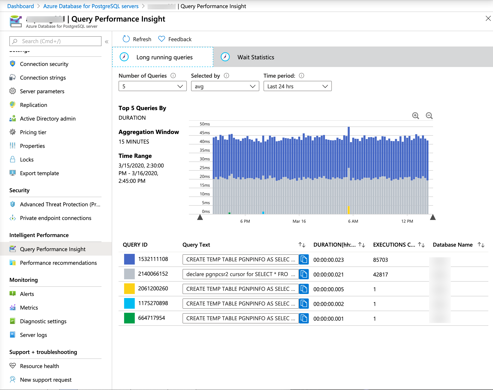

Microsoft offers the most popular open-source SQL database platforms on Azure, such as MySQL, MariaDB, and PostgreSQL. The architecture and features are similar to that of the Azure SQL Database, but running different database engines. An extra benefit of these solutions is that they also integrate with other services like Azure Web Apps.
 
## MySQL and Postgres network connectivity

Similar to SQL Database, there is a firewall that can be set for specific IP address or range of IP addresses, or you can configure a virtual network endpoint to allow connections from an Azure Virtual Network.

## Query Store on Postgres

The query store feature is available for PostgreSQL running on Azure platform, and is similar to the query store feature on SQL Database and SQL Managed Instance. The query store keeps track of both query execution statistics and wait stats, although implementation is slightly different compared to SQL Database. The query store data is located in the azure_sys database on your Postgres server, and in the query_store schema.

> 

The image above shows the Query Performance Insight dashboard in the Azure portal, offering a quick way to identify expensive queries for your database.