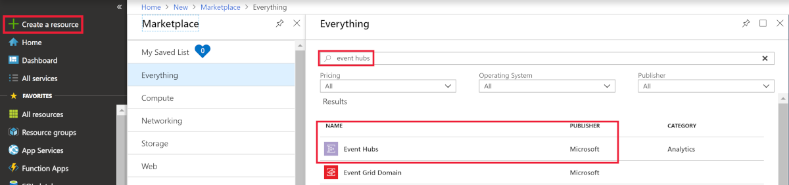
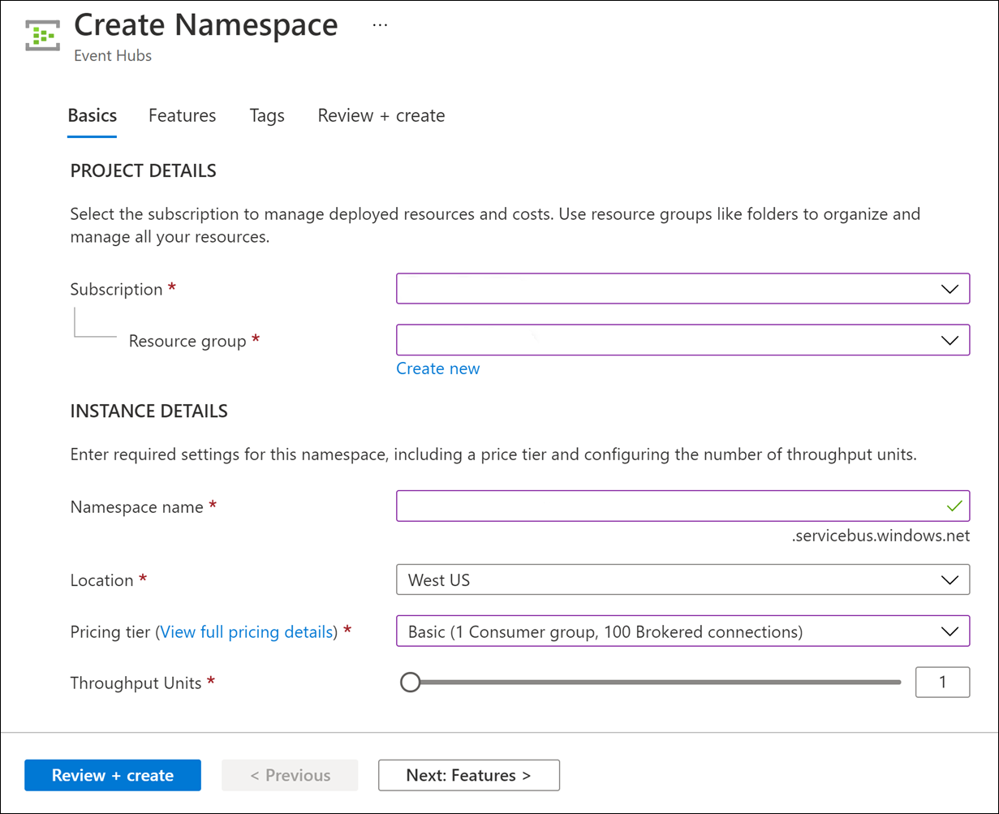
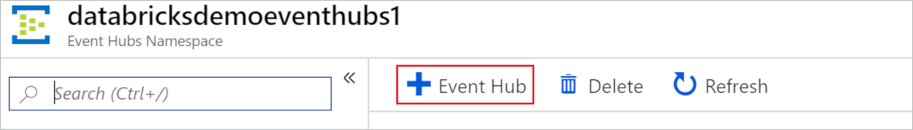
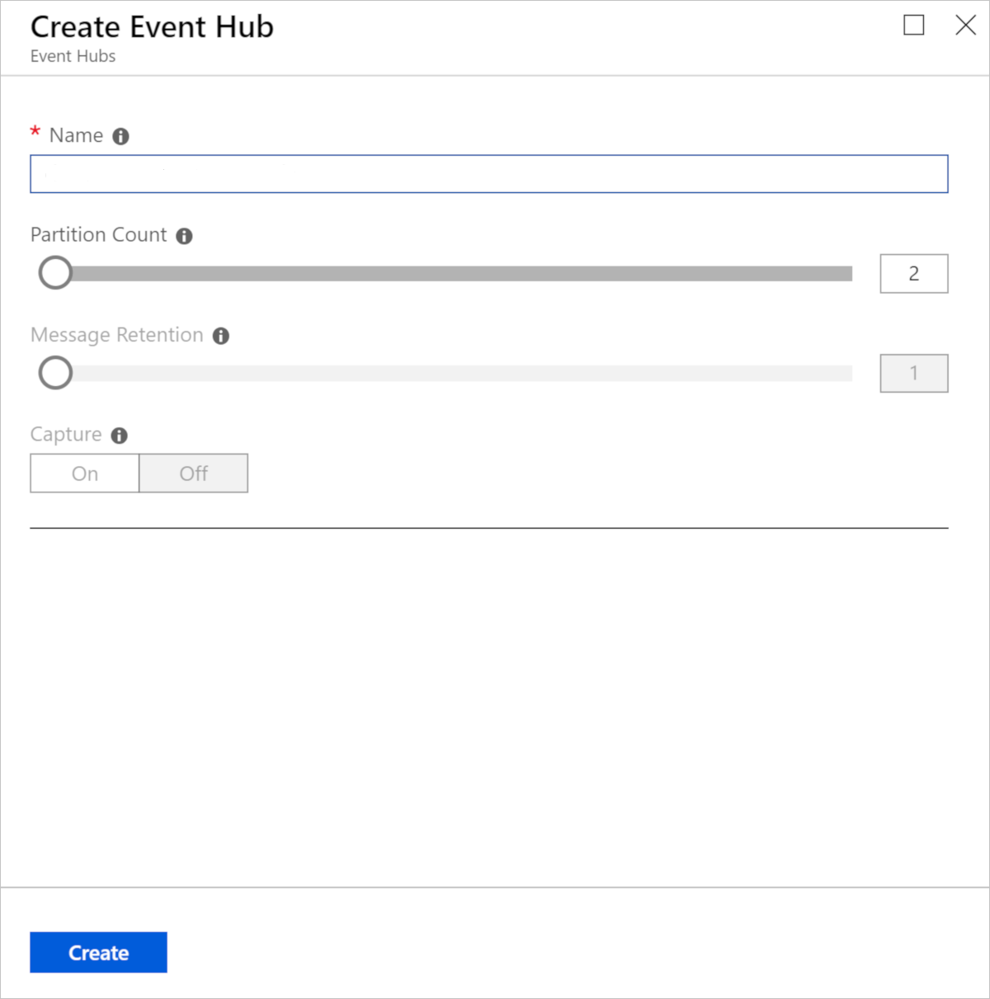
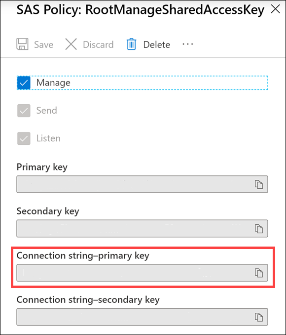

In this unit, you need to complete the exercises within a Databricks Notebook. To begin, you need to have access to an Azure Databricks workspace. You also need an Azure Event Hubs instance in your Azure subscription.

If you are using a pre-provisioned environment, you can skip to the bottom of the page to [Clone the Databricks archive](#clone-the-databricks-archive).

## Unit Pre-requisites

**Microsoft Azure Account**: You will need a valid and active Azure account for the Azure labs. If you do not have one, you can sign up for a [free trial](https://azure.microsoft.com/free/)

- If you are a Visual Studio Active Subscriber, you are entitled to Azure credits per month. You can refer to this [link](https://azure.microsoft.com/pricing/member-offers/msdn-benefits-details/) to find out more including how to activate and start using your monthly Azure credit.

- If you are not a Visual Studio Subscriber, you can sign up for the FREE [Visual Studio Dev Essentials](https://www.visualstudio.com/dev-essentials/) program to create Azure free account.

The first step toward using Spark Structured Streaming is setting up Azure Event Hubs in your Azure subscription.

## Create an Event Hubs namespace

1. In the Azure portal, select **+ Create a resource**. Enter **event hubs** into the **Search the Marketplace** box, select **Event Hubs** from the results, and then select **Create**.

    

1. In the **Create Namespace** pane, enter the following information:

   - **Name**: Enter a unique name, such as **databricksdemoeventhubs**. Uniqueness will be indicated by a green check mark.
   - **Pricing tier**: Select **Basic**.
   - **Subscription**: Select the subscription group you're using for this module.
   - **Resource group**: Choose your module resource group.
   - **Location**: Select the location you're using for this module.
   
   Select **Create**.

   

## Create an event hub

1. After your Event Hubs namespace is provisioned, browse to it and add a new event hub by selecting the **+ Event Hub** button on the toolbar.
 
   

1. On the **Create Event Hub** pane, enter:

   - **Name**: Enter **databricks-demo-eventhub**.
   - **Partition Count**: Enter **2**.
    
   Select **Create**.

   

## Copy the connection string primary key for the shared access policy

1. On the left-hand menu in your Event Hubs namespace, select **Shared access policies** under **Settings**, then select the **RootManageSharedAccessKey** policy.

   

2. Copy the connection string for the primary key by selecting the copy button.

   

3. Save the copied primary key to Notepad.exe or another text editor for later reference.

## Deploy an Azure Databricks workspace

1. Click the following button to open the Azure Resources Manager template in the Azure portal.
   [Deploy Databricks from the Azure Resource Manager Template](https://portal.azure.com/#create/Microsoft.Template/uri/https%3A%2F%2Fraw.githubusercontent.com%2FAzure%2Fazure-quickstart-templates%2Fmaster%2F101-databricks-workspace%2Fazuredeploy.json)

1. Provide the required values to create your Azure Databricks workspace:

   - **Subscription**: Choose the Azure Subscription in which to deploy the workspace.
   - **Resource Group**: Leave at Create new and provide a name for the new resource group.
   - **Location**: Select a location near you for deployment. For the list of regions supported by Azure Databricks, see [Azure services available by region](https://azure.microsoft.com/regions/services/).
   - **Workspace Name**: Provide a name for your workspace.
   - **Pricing Tier**: Ensure `premium` is selected.

1. Accept the terms and conditions.
1. Select Purchase.
1. The workspace creation takes a few minutes. During workspace creation, the portal displays the Submitting deployment for Azure Databricks tile on the right side. You may need to scroll right on your dashboard to see the tile. There is also a progress bar displayed near the top of the screen. You can watch either area for progress.

## Create a cluster

1. When your Azure Databricks workspace creation is complete, select the link to go to the resource.

1. Select **Launch Workspace** to open your Databricks workspace in a new tab.

1. In the left-hand menu of your Databricks workspace, select **Clusters**.

1. Select **Create Cluster** to add a new cluster.

    

1. Enter a name for your cluster. Use your name or initials to easily differentiate your cluster from your coworkers.

1. Select the **Cluster Mode**: **Single Node**.

1. Select the **Databricks RuntimeVersion**: **Runtime: 7.3 LTS (Scala 2.12, Spark 3.0.1)**.

1. Under **Autopilot Options**, leave the box **checked** and in the text box enter `45`.

1. Select the **Node Type**: **Standard_DS3_v2**.

1. Select **Create Cluster**.

## Clone the Databricks archive

1. If you do not currently have your Azure Databricks workspace open: in the Azure portal, navigate to your deployed Azure Databricks workspace and select **Launch Workspace**.
1. In the left pane, select **Workspace** > **Users**, and select your username (the entry with the house icon).
1. In the pane that appears, select the arrow next to your name, and select **Import**.

    

1. In the **Import Notebooks** dialog box, select the URL and paste in the following URL:

    ```
    https://github.com/MicrosoftDocs/mslearn_databricks/blob/main/streaming/1.1.0/Labs.dbc?raw=true
    ```

5. Select **Import**.
6. Select the **streaming** folder that appears.

## Complete the following notebook

Open the **1.Structured-Streaming-Concepts** notebook. Make sure you attach your cluster to the notebook before following the instructions and running the cells within.

Within the notebook, you will:

- Stream data from a file and write it out to a distributed file system
- List active streams
- Stop active streams

After you've completed the notebook, return to this screen, and continue to the next step.
