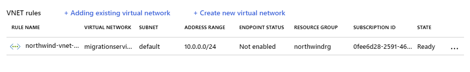
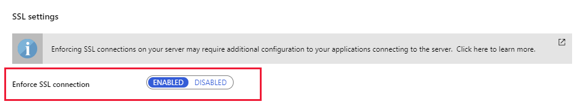
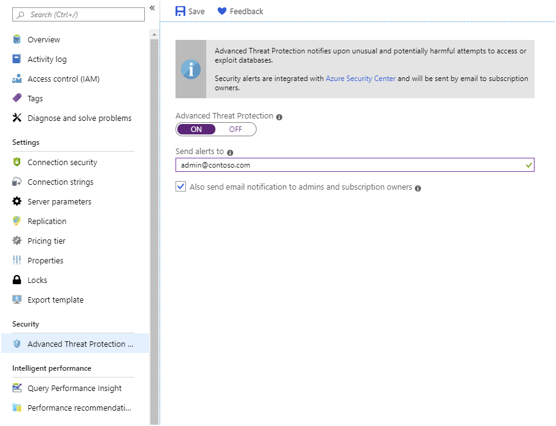
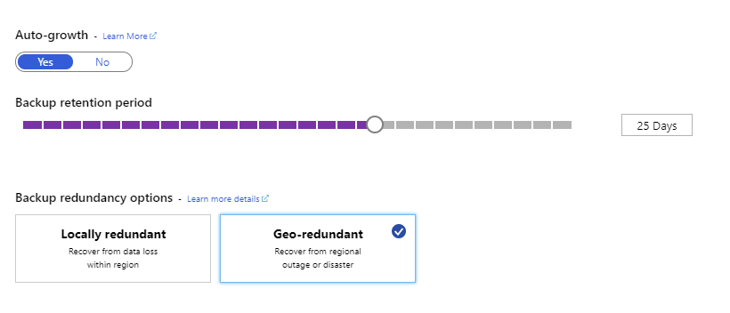

Database authentication and authorization are how you traditionally would secure your open-source database. Hosting that database in Azure gives you the chance to increase that protection. 

As the database developer for Adventureworks, you'd like to improve the protection of your companies Azure Database for PostgreSQL.

In this unit, you'll see what additional protection is possible now that you've migrated your on-premises PostgreSQL database to Azure.

## Protect your data

PostgreSQL and MySQL have their own authentication and authorization mechanisms that control which users are allowed to access databases, and the privileges they have over items in those databases. You should continue to manage users and privileges in much the same way that you did before migration. Remember that you can use administrative tools, such as pgAdmin and MySQL Workbench, to connect to servers hosted by Azure.

However, Azure provides additional protection to your servers. This protection operates at three levels:

1. It controls access to the server, filtering traffic from unknown or untrusted sources.
2. It protects traffic, ensuring that it can't be manipulated or intercepted as it flows from a client to the server and back again.
3. It protects the server itself from common external threats.

The following sections discuss these items in more detail.

### Filter traffic with firewall rules

Azure Database for MySQL or PostgreSQL runs inside a firewall managed by Microsoft. By default, nothing can pass through this firewall. You add firewall rules to enable traffic from designated blocks of IP addresses, as described in the previous modules. It's recommended that you actively review the IP addresses that are allowed to send traffic at frequent intervals, and remove the IP addresses for clients that are no longer required.

If you're running other Azure services that need to use your databases, you must open the firewall to these services. In the Azure portal, on the **Connection security** page for your Azure Database for MySQL or PostgreSQL service, select the **Allow access to Azure services** action setting so that it's **ON**.


> [!NOTE]
> It can take up to five minutes for any changes you make to the firewall to become active.

In some situations, opening up your server to all Azure services might be too excessive. If you're running the General Purpose or Memory Optimized versions of Azure Database for MySQL or PostgreSQL, you filter traffic at the virtual network level using Azure virtual network rules. A virtual network rule enables you to allow traffic that originates from your own virtual networks to access the server. Traffic from other networks will be blocked.



If you need to script firewall maintenance tasks, you use the Azure CLI. The following examples, which add, delete, and display firewall rules, use the `az mysql` command that does operations against Azure Database for MySQL. If you're running a PostgreSQL command, use the corresponding `az postgres` commands instead—the parameters are the same:

## Allow access to clients in the range 13.83.152.0 to 13.83.152.15
```azurecli
az mysql server firewall-rule create \
    --resource-group [resource group name] \
    --server-name [Azure Database for MySQL server name] \
    --name FirewallRule1 \
    --start-ip-address 13.83.152.0 \
    --end-ip-address 13.83.152.15
```

## List all firewall rules
```azurecli
az mysql server firewall-rule list \
    --resource-group [resource group name] \
    --server-name [Azure Database for MySQL server name]
```

## Display the details of FirewallRule1
```azurecli
az mysql server firewall-rule show \
    --resource-group [resource group name] \
    --server-name [Azure Database for MySQL server name] \
    --name FirewallRule1
```

## Remove FirewallRule1. Clients in the address range for this rule will be denied access
```azurecli
az mysql server firewall-rule delete \
    --resource-group [resource group name] \
    --server-name [Azure Database for MySQL server name] \
    --name FirewallRule1
```

To enable access to Azure services, create a firewall rule with a `start-ip-address` and `end-ip-address` value of `0.0.0.0`.

You create and manage virtual network rules in a similar manner, using the `az msysql server vnet-rule` commands.

### Protect traffic using SSL

SSL protection for Azure Database for MySQL or PostgreSQL is enabled by default. You can disable and re-enable SSL using the **Enforce SSL connection** setting on the **Connection security** page for your Azure Database for MySQL or PostgreSQL service in the Azure portal:



### Protect the server using Azure Advanced Threat Protection

Advanced Threat Protection is an additional layer of security provided by Azure. Advanced Threat Protection monitors access to your server and looks for patterns of unusual or potentially malicious behavior. When such behavior is detected, you arrange for an alert to be sent to specified email addresses.

The patterns of unusual activity detected include:

- Access from an unexpected or unusual location.
- Access from an unusual Azure data center.
- Access from an application that might be harmful, such as a recognized attack tool.
- A large number of failed logins in quick succession, indicating a possible brute-force attack.

You can enable Advanced Threat Protection from the **Advanced Threat Protection** page for your service in the Azure portal:



## Back up and restore a server

The Azure Database for MySQL or PostgreSQL service automatically backs up your server according to the following schedule:

- A full backup is taken weekly with the first full backup occurring as soon as the server is created.
- A differential backup is taken twice a day.
- A transaction log backup is taken every five minutes.

The entire server is backed up. You can't back up individual databases, and you can't manually force a backup.

### Set backup options

You use these backups to restore to any point in time for which you have retained the backup files. By default, backups are held for seven days, but you can keep them for up to 35 days. You also specify how the backups are stored—locally redundant backups are held within the same region as the server, and geo-redundant backups are copied to data centers in other regions. The geo-redundant option is only available to servers in the General Purpose and Memory Optimized pricing tiers. You set the backup options on the **Pricing Tiers** page for your server in the Azure portal:



### Restore a server

Azure Database for MySQL or PostgreSQL supports two types of server restore operations—point-in-time, and geo-restore. In both cases, the restore action creates a new server. The original server remains available. If you want applications to use the restored data, you must reconfigure them to use the new server. Additionally, you must remember to open the firewall of the new server to allow clients and services to connect.

> [!IMPORTANT]
> You can't restore a server that has been deleted. When you delete a server, you also delete the backups associated with it.

#### Point-in-time restore

A point-in-time restore creates a new server using the backups from your original server, and rolls the server forward to the specified time. You initiate a restore operation using the **Restore** command in the toolbar on the **Overview** page for your server in the Azure portal. You'll be prompted for the name of a new server, and a point in time. 


The Azure CLI supports the `az mysql/postgres server restore`commands if you prefer to perform restore operations from the command line. For example:

```azurecli
az mysql server restore \
    --resource-group [resource group name] \
    --name [new Azure Database for MySQL server name] \
    --source-server [original Azure Database for MySQL server name] \
    --restore-point-in-time "2019-10-23T02:10:00+08:00"
```

#### Geo-restore

A geo-restore is a complete restoration of a server, using a backup held in geo-redundant storage. When you create a new server using the Azure portal, you specify a geo-redundant backup as the data source. When the new server is created, it will be populated with the databases in this backup.


The Azure CLI provides the `az mysql/postgres server georestore` commands to do a geo-restore from the command line.

It might take up to an hour to replicate a geo-redundant backup to another region. This could result in the loss of up to an hour's worth of data if you need to do a geo-restore from a different region.
