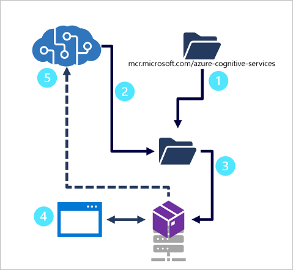

So far we've considered the use of the Language Understanding service by consuming a prediction resource endpoint in your Azure subscription.

Like many other cognitive services, the Language Understanding service can also be deployed as a container, running in a local Docker host, an Azure Container Instance (ACI), or in an Azure Kubernetes Service (AKS) cluster.

The following diagram shows the steps you need to perform to use a Language understanding app in a container.



1. Download the container image
2. Export the model for a container
3. Run the container with required parameters:
    - Prediction endpoint for billing
    - Prediction key
    - EULA acceptance
    - Mount points (input for exported model, output for logs)
4. Use the container to predict intents for client apps
5. The container sends usage metrics to your prediction resource for billing


The easiest way to manage the deployment of a Language Understanding container is to use the Docker command line tool.

## Downloading the container image

The first step in using Language Understanding in a container is to use the **docker** command line tool to download the Language Understanding container image, like this:

```
docker pull mcr.microsoft.com/azure-cognitive-services/language/luis:latest
```

## Export the Language Understanding app

Before you can deploy your Language Understanding app in a container, you need to export it in the appropriate packaged format. You can export a model from the Language Understanding portal by selecting the **Export for container** option, or you can export a published app directly from its endpoint using an HTTP GET request, like this:

```
GET /luis/api/v2.0/package/{APP_ID}/slot/{SLOT_NAME}/gzip HTTP/1.1
Host: {AZURE_REGION}.api.cognitive.microsoft.com
Ocp-Apim-Subscription-Key: {AUTHORING_KEY}
```

The exported package is in *.gz (GZIP) format, which is what the container image expects.

## Run the container

To run the container, use the **docker run** command. This example runs the container in a local Docker instance:

```
docker run --rm -it -p 5000:5000 ^
--memory 4g ^
--cpus 2 ^
--mount type=bind,src=c:\input,target=/input ^
--mount type=bind,src=c:\output\,target=/output ^
mcr.microsoft.com/azure-cognitive-services/language/luis ^
Eula=accept ^
Billing={ENDPOINT_URI} ^
ApiKey={API_KEY}
```

Note the following options when using docker run:

- The **mount** parameters enable the container to access local folders. Specifically, the **input** mount must reference the folder containing your exported Language Understanding app package, and the **output** folder is where the service will write logs (including Language Understanding query logs that you can use for active learning).
- The **Eula**, **Billing**, and **ApiKey** parameters are used the same way they are for any Cognitive Services container - specifying acceptance of the license agreement, the prediction endpoint to which usage data should be sent for billing, and a valid subscription key for your prediction resource.

> [!NOTE]
> To learn more about using a Language Understanding container, see the [Language Understanding documentation](/azure/cognitive-services/luis/luis-container-howto).
