We are going to work with two new containers named Customer and SalesOrder. They contain Adventure Works datasets related to customer profile records and sales order records. 

Each data set is stored in two different Azure Cosmos DB accounts. The customer profile data resides in a SQL API account. The sales order data resides in an Azure Cosmos DB API for MongoDB account. 

Given that this data comes for separate systems, Adventure Works wants to use their available operational data to get insight into:

- What amount of revenue is coming from customers without completed profile data (no address details provided)

- How sales order volume and revenue are distributed by city for those customers where they do have address details. 


To query the Azure Cosmos DB analytical store, perform the following steps:

1.	Connect to an Azure Synapse Workspace that has an Azure Synapse SQL Serverless instance, and an Azure Synapse Spark Pool.

    [](../media/azure-synapse-studio.png#lightbox)

2.	In the left-hand menu, select **Data (A)**
3.	Click on the **Linked tab** in the explorer view **(B)**
4.	Expand the **AdventureWorksSQL** linked service to expose the **Customer** container
5.	Expand the **AdventureWorksMongoDB** linked service to expose the **SalesOrder** container.

    [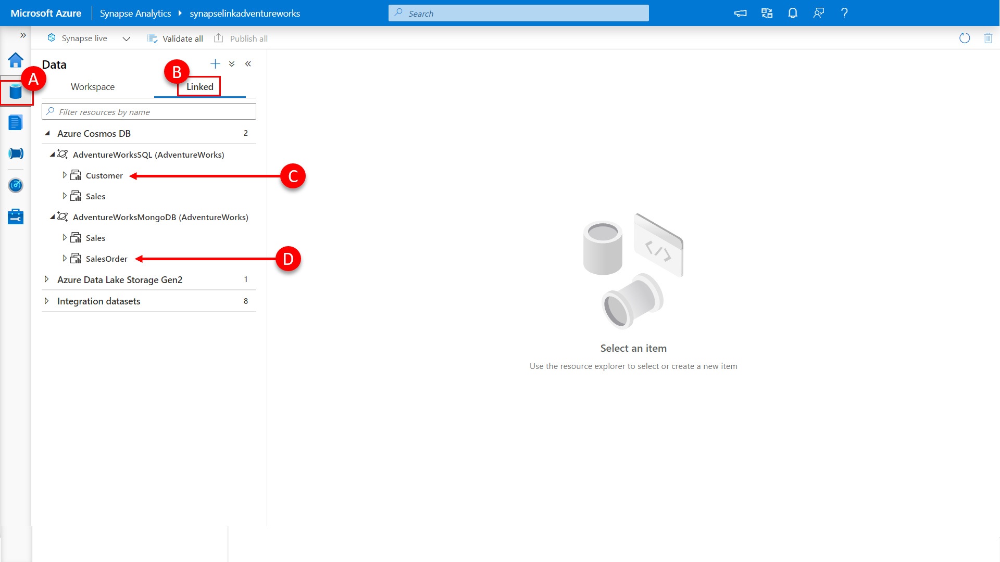](../media/view-linked-services.png#lightbox)

    Here you can see that an additional two containers are now visible in the data explorer view, under the previously created linked service to our Azure Cosmos DB accounts. The first, **Customer (C)**, has been created in the AdventureWorks database within the Azure Cosmos DB SQL API account and contains customer profile information. The second, **SalesOrder (D)**, has been created the AdventureWorks database within the Azure Cosmos DB API for MongoDB account and contains sales order information.

    Let’s open a new notebook to explore what is in these containers with Spark.

    [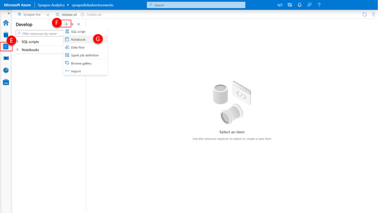](../media/open-notebook-synapse-studio.png#lightbox)

6.	In the left-hand menu, select **develop (E)**

7.	Then click the **“+” (F)** to add a resource.

8.	And then select **Notebook (G)** to create a new notebook. A new notebook will immediately be created within the Synapse Workspace.

    [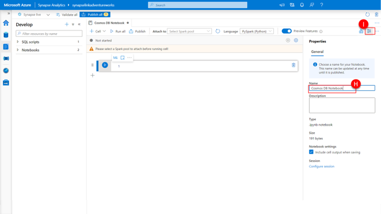](../media/view-notebook-synapse-studio.png#lightbox)

9.	Within the notebook properties, provide an appropriate name, such as **“Cosmos DB Notebook” (H)**.

10.	And then click the **properties icon (I)** to close the properties.

    [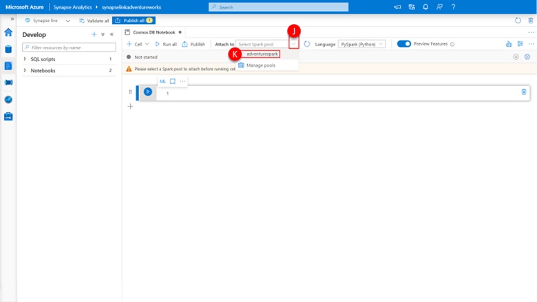](../media/name-notebook-synapse-studio.png#lightbox)

    Before we can run any spark jobs, we need to select the spark pool we wish to connect to execute our jobs. 

11.	Click the **attach to** dropdown at the top of the **notebook (J)** and select adventurespark, our previously deployed spark pool.

    There is a language dropdown at the top of the notebook, this designates the default language for the notebook. We will be using both PySpark and Spark SQL, our default language will be PySpark and we will use the “%%sql” magic to change to Spark SQL when appropriate. 

    Synapse Apache Spark allows you to analyze data in your Azure Cosmos DB containers that are enabled with Azure Synapse Link. The following two options are available to query the Azure Cosmos DB analytical store from Spark:

    - Load to Spark DataFrame
    - Create Spark table

    Let’s start by creating a DataFrame for each of our two containers and perform a read of the content of the analytical store. 

    [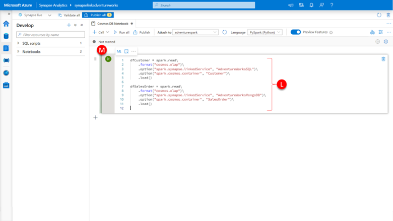](../media/create-dataframe-in-notebook.png#lightbox)

12.	Click into the first cell of the **notebook (M)**

13.	Paste the following python statements defining the two DataFrames we are going to use and the options for reading the data into them from the respective analytical stores:

    ```python
    dfCustomer = spark.read\
        .format("cosmos.olap")\
        .option("spark.synapse.linkedService", "AdventureWorksSQL")\
        .option("spark.cosmos.container", "Customer")\
        .load()

    dfSalesOrder = spark.read\
        .format("cosmos.olap")\
        .option("spark.synapse.linkedService", "AdventureWorksMongoDB")\
        .option("spark.cosmos.container", "SalesOrder")\
        .load()
    ```

    There are several parameters that need to be specified on the **spark.read** method to facilitate a read from Azure Cosmos DB analytical store:

    -	The format in the spark.read.format parameter needs to be specified as **cosmos.olap** to indicate that we are wanting to read from Azure Cosmos DB analytical store.
    -	An option should be set for **spark.synapse.linkedService** with the name of the previously create linked service.
    -	An option should be set for **spark.cosmos.container** specifying the name of the container that we wish to read.
    -	Optionally the **spark.cosmos.preferredRegions** option can be set to a list of preferred regions to use if you are using a Cosmos DB account with multiple regions configured. 

14.	Click the **run cell** button and within a couple of seconds the data from the respective analytical stores will be loaded into the two DataFrames we have defined. 

    Let’s explore what data is contained in these DataFrames.

15.	Click the **"+" (N)** at the bottom of notebook and select **Code Cell** to add an additional code cell.

    [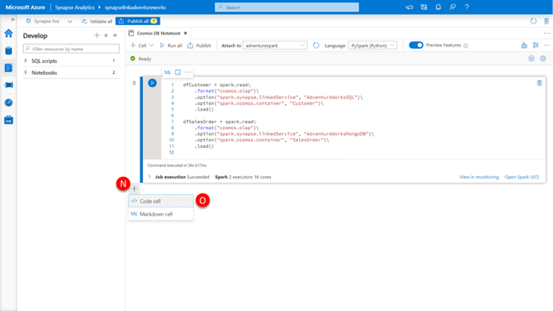](../media/create-new-cell-in-notebook.png#lightbox)

16.	Click into the new cell and paste the following.

    ```python
    display(dfCustomer.limit(10))
    ```

    [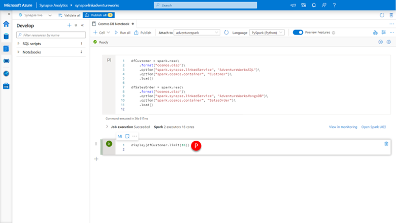](../media/entere-code-in-notebook.png#lightbox)

17.	Click the **run cell** button.

    [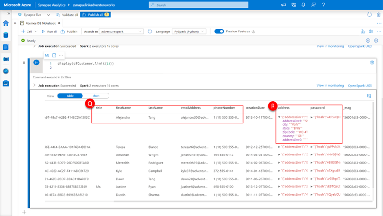](../media/view-results-in-notebook.png#lightbox)

    You will be presented with a result set of the first 10 rows of a row-based representation of the documents contained within the Customer container’s analytical store. The results are from an Azure Cosmos Core (SQL) API account, so that data will be represented using the well-defined schema representation by default. 

    You will note that the top-level properties of the document are represented as columns with the associated property values as the value of the column. In the case that these values are primitive data types (“string”, “integer”, “float” etc.) the column will be **typed (Q)**, if these properties are embedded arrays or objects within the document, the column value will be a structure of these **embedded values (R)**. 

    In the case of our example, the title, firstName, lastName, emailAddress, and phoneNumber properties are primitive strings and assigned to their own **columns (Q)**, the address and password properties are **both embedded objects (R)**.

18.	Run a similar statement for the dfSalesOrder DataFrame, by creating a new cell, pasting the below and clicking the “run cell” button:

    ```python
    display(dfSalesOrder.limit(10))
    ```

    [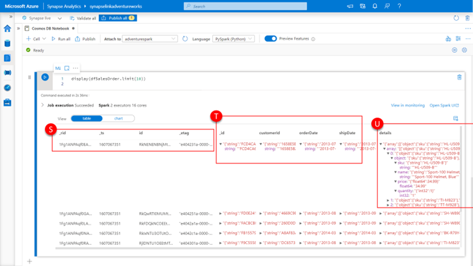](../media/explore-cosmos-db-results.png#lightbox)

    You will now be presented with a result set of the first 10 rows of a row-based representation of the documents contained within the SalesOrder container’s analytical store. This is an Azure Cosmos Core API account for MongoDB, so that data will be represented using the full fidelity schema representation by default. 

    You will note that all top-level properties of the document are represented as columns with the associated property values as the value of the column. All properties are represented as a structure of the type of values assigned to the properties and the values themselves, (T) and (U). For complex types such as objects and arrays, these remain embedded within the structure but similarly expanded to include type encapsulation of each of their property values. 

    In this example the _id, customerId, orderDate, and shipDate are all stings and have a type of encapsulation of “string” (T). The details property is an embedded array (U), we can expand the structure within the column to reveal the three elements of the array [0],[1],[3] and in turn the embedded properties sku, name, price, and quantity of each array element object. 

    You will also note the presence of several Azure Cosmos DB system document properties (S). Azure Cosmos DB automatically has system properties such as _ts, _self, _attachments, _rid, and _etag associated with every document. These system document properties are seldom useful for analytical store query purposes and are easily removed by running the following PySpark code:

    ```python
    system_document_properties = {'_attachments','_etag','_rid','_self','_ts'}
    customer_columns = list(set(dfCustomer.columns) - system_document_properties)
    dfCustomer = dfCustomer.select(customer_columns)

    display(dfCustomer.limit(10))
    ```

19.	Paste the above code, click the **run cell** button.

    This code defines the set of system property columns we wish to remove from the DataFrame, subtracts these from the list of all columns, and then selects just this subset of columns back into the DataFrame itself. If we display the resultant DataFrame, we see the **resultset (R)** no longer contains these columns.
    Similar code to remove system property columns from the dfSalesOrder DataFrame is as follows:

    ```python
    system_document_properties = {'_attachments','_etag','_rid','_self','_ts','id'}
    salesorder_columns = list(set(dfSalesOrder.columns) - system_document_properties)
    dfSalesOrder = dfSalesOrder.select(salesorder_columns)

    display(dfSalesOrder.limit(10))
    ```

    [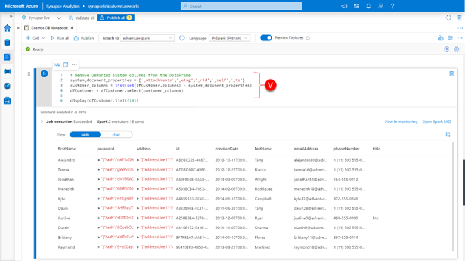](../media/remove-system-property-columns-from-resultset.png#lightbox)

20.	Paste the above code (X), click the **run cell** button.

    [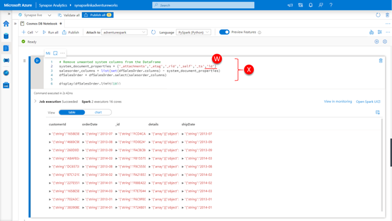](../media/add-id-to-resultset.png#lightbox)

    You will note that for this DataFrame we have additionally included the **ID column (W)**, for Azure Cosmos DB API for MonogDB accounts, the ID column can be considered a system document property and should not be confused with the _id property of the original document. 

    To get a more visual representation of the DataFrame schema, you can use the printSchema() method on the DataFrame.

21.	Paste the code into a new cell (Y), and click the **run cell** button.

    ```python
    dfSalesOrder.printSchema()
    ```

    It prints out the schema in an easy-to-read **tree format (Y)**. and you can easily see the structure of the address object within the dfCustomer DataFrame. 

    [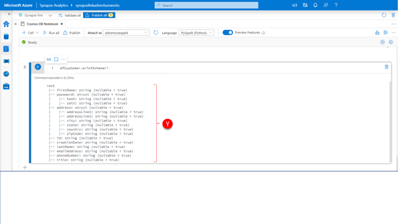](../media/tree-format-results.png#lightbox)

    And the following will do a similar thing for the dfSalesOrder DataFrame

    ```python
    dfSalesOrder.printSchema()
    ```
22.	Paste the above code into a **new cell (Z)**, click the **run cell** button.

    Here you can see the type of encapsulation (underlined) of each property value and the embedding of the details array within the SaleOrder document that contains the sales order line items with the sku, price, quantity etc. for each sales order, again encapsulated within the type of structure.

    [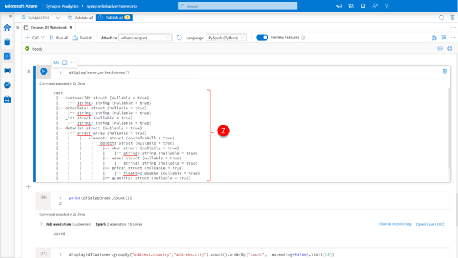](../media/embedded-tree-resuls.png#lightbox) 