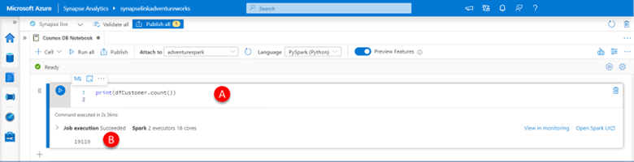
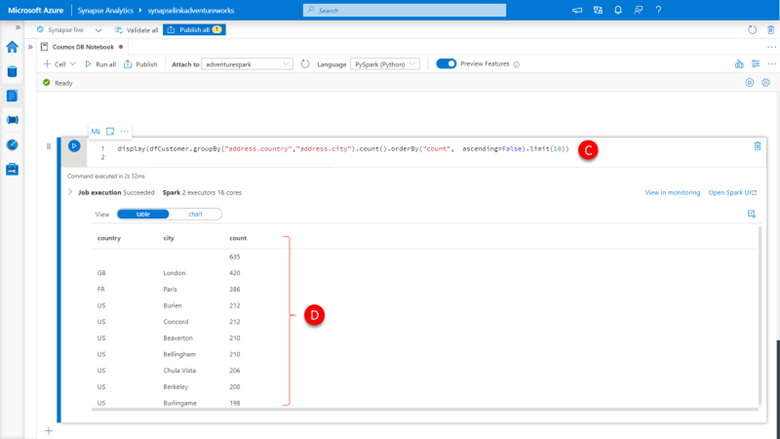
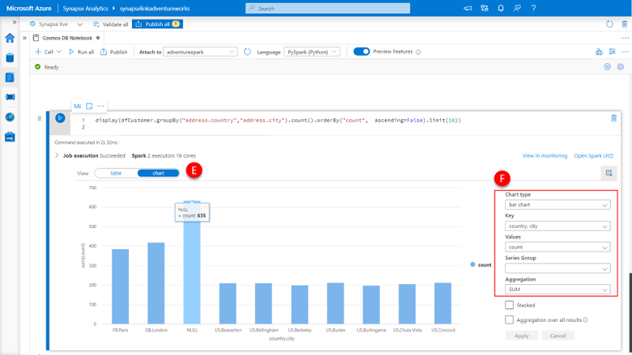
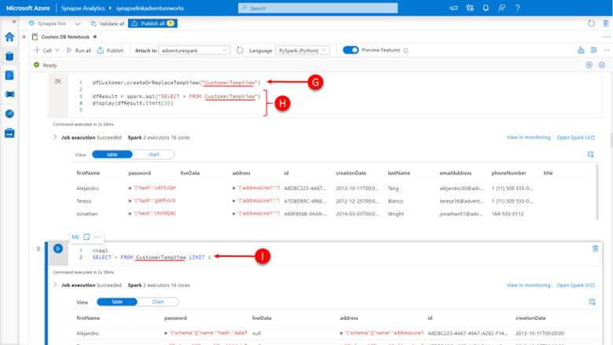

Now that we have explored the basic structure of the analytical store, lets dig a little deeper into what this data can tell us about the Adventure Works business. 

Let’s start by exploring some basic statistics, the simplest being the number of sales orders we have.

1.	Paste the below code into a **new cell (A)**, click the **run cell** button.

    ```python
    print(dfCustomer.count())
    ```

    [](../media/perform-count-of-records.png#lightbox)

    You will see that there are **19119 customers (B)**

    Let’s break this down by country and city by customers, where we have the address information; and see how many customers there are where we don’t have the address information captured on their customer profile.

2.	Paste the below code into a **new cell (C)**, click the **run cell** button.

    ```python
    display(dfCustomer.groupBy("address.country","address.city").count().orderBy("count",  ascending=False).limit(10))
    ```

    You will see a breakdown of the top 10 country, city combinations having the most customers, right at the top of the list you will see that there are 615 customers for which Adventure Works has no country or city information within the customer profile.

    [](../media/use-order-by-query.png#lightbox)

    Remember that we can always use the built-in chart capabilities of the Synapse Analytics notebooks to visualize our data more easily directly within the notebook.

    [](../media/visualize-results-in-notebook.png#lightbox)

3.	Click the **Chart button (E)**

4.	Set the **chart properties (F)**:
    - Chart type = bar graph
    - Key = country and city
    - Values = count
    - Aggregation = SUM 

    
    As mentioned earlier, we are going to use both PySpark and Spark SQL, which we will include going forward.  However, to be able to use both interchangeably within the same notebook, it is often useful to be able to work on the same data sets. 

    To save a PySpark DataFrame  as a temporary view there is a DataFrame method.createOrReplaceView, which does just that. Temporary Views can also be queried from Spark SQL. Temporary views in Spark SQL are session scoped and will disappear if the session that creates it terminates.
    
    To load data into a DataFrame using a Spark SQL query, you can use the **spark.sql()** method to run a query and return a DataFrame as a result. 
    
    Let’s create a temporary view from our dfCustomer DataFrame and the query it back into a different DataFrame and display the result set. 

5.	Paste the code below into a new cell, click the **run cell** button, **(G) and (H)**.

    ```python
    dfCustomer.createOrReplaceTempView("CustomerTempView")

    dfResult = spark.sql("SELECT * FROM CustomerTempView")
    display(dfResult.limit(10))
    ```

    [](../media/create-temporary-view.png#lightbox)

    You will see that the result set returned is the same as what was originally in our dfCustomer DataFrame and made the journey to temporary view and back unscathed. 
    
    If we query this same temporary view using Spark SQL by 

6.	Paste the below code into a new cell (I), click the “run cell” button.

    ```sql
    %%sql
    SELECT * FROM CustomerTempView LIMIT 10
    ```

    You will again see the same result set, now delivered directly by running a Spark SQL query. 
    We have specified the %%sql construct to inform the notebook that this cell contains Spark SQL code, not the default PySpark code it would otherwise be expecting. 


