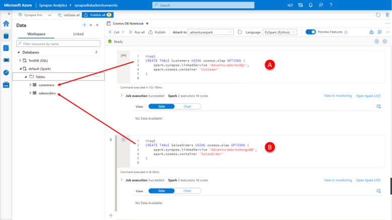
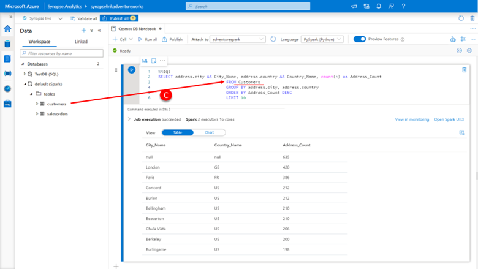
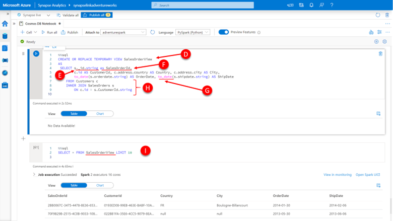
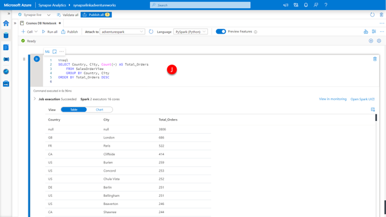

Let’s explore the Adventure Works data in more detail, and see what additional insights we can get by combining the data that is stored in the Azure Cosmos DB Core (SQL) API, and the Azure Cosmos DB API for MongoDB. 

We are primarily going to use Spark SQL to explore this data, so most code with start with **%%sql** construct.

To begin, the two options available for querying the Azure Cosmos DB analytical store from Spark include:

-	Loading to Spark DataFrame
-	Creating Spark table

We have so far used loading the data into a DataFrame as the approach, lets create a Spark table to access our analytical store data by

[](../media/input-spark-sql-queries-into-notebook.png#lightbox)

1.	Paste the code below into a **new cell (A)**, click the **run cell** button.

    ```sql
    %%sql
    CREATE TABLE Customers USING cosmos.olap OPTIONS (
        spark.synapse.linkedService 'AdventureWorksSQL',
        spark.cosmos.container 'Customer'
    )
    ```

2.	Paste the code below into a **new cell (B)**, click the **run cell** button.

    ```sql
    %%sql
    CREATE TABLE SalesOrders USING cosmos.olap OPTIONS (
        spark.synapse.linkedService 'AdventureWorksMongoDB',
        spark.cosmos.container 'SalesOrder'
    )
    ```

3.	In the left-side menu, click **Data**.

4.	Click **workspace**.

5.	Expand the **Databases**, **default (Spark)** and **tables** container.

    You now have two Spark tables customers and sales orders that are connected to the Azure Cosmos DB analytical stores in a manner like how we read data into our DataFrames. 

    The **CREATE TABLE** statement contains a **USING** clause that specifies the data source as **cosmos.olap**, specifying the Cosmos DB analytical store and has an OPTIONS clause that sets:
    -	**spark.synapse.linkedService** to the name of our previously create linked service.
    -	**spark.cosmos.container** specifying the name of the container.

    You can also optionally set the **spark.cosmos.preferredRegions** option to a list of preferred regions to use if you are using a Cosmos DB account with multiple regions configured.

    Additionally, you can override the default behavior of the table, which is to have a stable schema based on the analytical store schema as at the time of creation, by setting the spark.cosmos.autoSchemaMerge option to true. Set the spark.cosmos.autoSchemaMerge to true if you wish for the schema changes made to the Cosmos DB container and associated analytical store to be immediately reflected in the table. 

    So, lets query these tables now using Spark SQL. 

6.	Paste the below code into a **new cell (C)**, click the **run cell** button.

    ```sql
    %%sql
    SELECT address.city AS City_Name, address.country AS Country_Name, count(*) as Address_Count 
                                FROM Customers 
                                GROUP BY address.city, address.country 
                                ORDER BY Address_Count DESC 
                                LIMIT 10
    ```

    [](../media/query-customers-container.png#lightbox)

    You will notice that the query is using the customer's table we have created to return a result set identical to the one we created using the PySpark example earlier. 

    Given the power of Spark SQL lets join the data from the Azure Cosmos DB Core (SQL) API, in the customers table, with the data that is contained in the Azure Cosmos DB API for MongoDB, in the sales order table. 

7.	Paste the below code into a new cell, click the **run cell** button.

    ```sql
    %%sql
    CREATE OR REPLACE TEMPORARY VIEW SalesOrderView
    AS
    SELECT s._id.string as SalesOrderId, 
            c.id AS CustomerId, c.address.country AS Country, c.address.city AS City, 
            to_date(s.orderdate.string) AS OrderDate, to_date(s.shipdate.string) AS ShipDate
        FROM Customers c 
        INNER JOIN SalesOrders s
            ON c.id = s.CustomerId.string
    ```

    [](../media/perform-join-query.png#lightbox)

    We’re doing a lot here so let’s break it down. 
    
    We are now using Spark SQL to create a temporary view called **SalesOrderView (D)**.
    
    Within which we are **renaming the _id column from the SalesOrders table to SalesOrderId (F)**, as the _id property is the ID of all Adventure Works sales order records. We have also **accessed the string values for this column by specifying _id.string (E)**. In a similar manner, we are accessing the address.country and address.city properties embedded in the address of the Customer table. 
    
    We are converting the data type of the ship date and order date properties to the date data type using the Spark SQL to_date() function, remembering to access the string values using the shipdate.string and orderdate.string respectively from the **SalesOrder table (G)**. 
    
    And lastly, we are joining the Customers table with the SalesOrders table using the customer ID (in the case of Customers, this is stored in the column ID, and in the case of SalesOrder, the CustomerId column, remembering to access the string values using CustomerId.string. 
    
    As the Adventure Works sales order records are stored in Azure Cosmos DB API for MongoDB account, and these accounts use full fidelity schema representation by default, we need to include the type of suffix to access the property values for the SalesOrders table. The Adventure Works customer profile records are store in Azure Cosmos DB Core (SQL) API account and these accounts use well-defined schema representation, so we do not need to include the type suffix to access the property values. 

    If we want to see the result set from our newly created view, perform the following steps:

 1.	Paste the below code into a **new cell (I)**, click the **run cell** button.

    ```sql
    %%sql
    SELECT * FROM SalesOrderView LIMIT 10
    ```

    We can now see we have a well-shaped sales order result set that includes the customer county and city values. We can use this to get some additional insights into the number of sales orders per country and city. 

2.	 Paste the below code into a **new cell (J)**, click the **run cell** button.

        ```sql
        %%sql
        SELECT Country, City, Count(*) AS Total_Orders
            FROM SalesOrderView
            GROUP BY Country, City 
        ORDER BY Total_Orders DESC
        ```
        
        [](../media/query-view.png#lightbox)
        
        That’s about as much insight as we can get from the sales order record without using the information contained in the details column and given that this data is an embedded array, we need to explore ways to surface this data in a more row-friendly format.