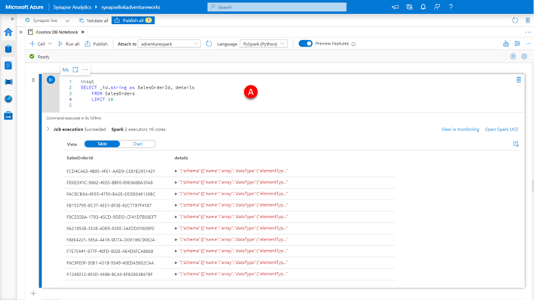
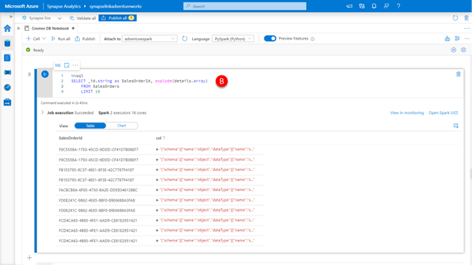
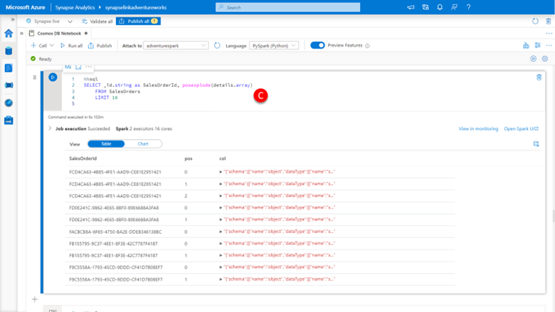
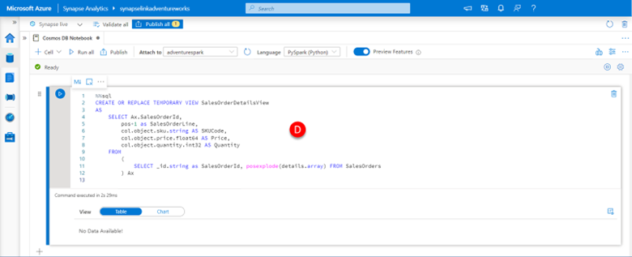
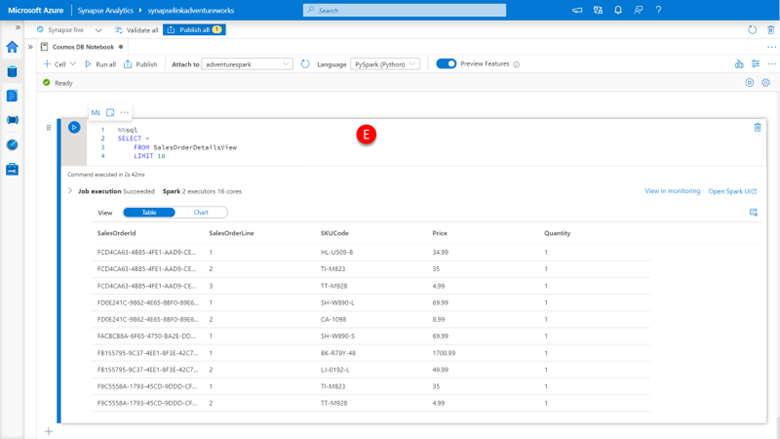
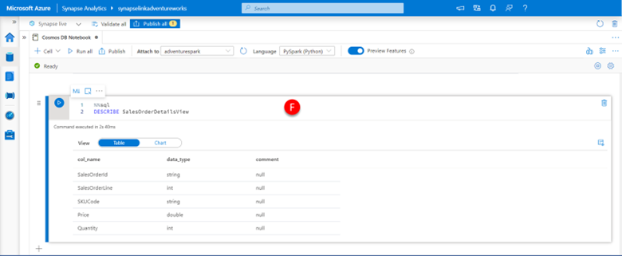

We now need to unpack the sales order line-item data that is contained within an array embedded in the detail’s column of our SalesOrders table to access the unit and revenue information that it contains. Luckily, Spark SQL has two functions designed to assist us with this problem:

-	explode(), which separates the elements of array into multiple rows and uses the default column name col for elements of the array.
-	posexplode(), which separates the elements of array into multiple rows with positions and uses the column name pos for position, col for elements of the array.

> [!Note]
> There are similar explode() and posexplode() functions in PySpark.

Firstly, lets remind ourselves what the data we are interested in looks like in the current SalesOrders table by 

1.	Pasting the below code into a **new cell (A)**, click the **run cell** button.

    ```sql
    %%sql
    SELECT _id.string as SalesOrderId, details
        FROM SalesOrders
        LIMIT 10
    ```

    [](../media/explore-data-in-notebook.png#lightbox)

    Here we can see our details column contains array data that needs to be expanded. Each element of the embedded array represents an individual line item of the sales order parent record the ID of which is contained in the _id column of the SalesOrders table. 

    If we expand this array using the explode() function, by:

2.	Pasting the below code into a **new cell (B)**, click the **run cell** button.

    ```sql
    %%sql
    SELECT _id.string as SalesOrderId, explode(details.array)
        FROM SalesOrders
        LIMIT 10
    ```

    [](../media/explode-data-in-notebook.png#lightbox)

    We see that we get a new row for each element of the array, so each SalesOrderId in the SalesOrders table is now represented by one or more rows of line item detail, however we are unable to identify the line item row uniquely (without making some assumptions about other properties of the document, always dangerous).

    So, let’s try using the posexplode() function, by performing the following step

3.	Pasting the below code into a **new cell (C)**, click the **run cell** button.

    ```sql
    %%sql
    SELECT _id.string as SalesOrderId, posexplode(details.array) 
        FROM SalesOrders
        LIMIT 10
    ```

    [](../media/posexplode-data-in-notebook.png#lightbox)

    We see that we again get back a new row for each element of the array, so each SalesOrderId in the SalesOrders table is now represented by one or more rows of line item detail. However, the pos column now uniquely identifies the item detail and the order in which it appears in the array. We also note that the pos value is 0 based, and Adventure Works by convention numbers its line items starting at 1, so we will need to fix that as we use this data. 

    Let’s create a SaleOrderDetailsView that encapsulates this sales order line item information for future use by:

4.	Pasting the below code into a **new cell (D)**, click the **run cell** button.  

    ```sql
    %%sql
    CREATE OR REPLACE TEMPORARY VIEW SalesOrderDetailsView
    AS
        SELECT Ax.SalesOrderId,
            pos+1 as SalesOrderLine,
            col.object.sku.string AS SKUCode,
            col.object.price.float64 AS Price, 
            col.object.quantity.int32 AS Quantity
        FROM 
            (
                SELECT _id.string as SalesOrderId, posexplode(details.array) FROM SalesOrders 
            ) Ax

    ```

    [](../media/create-salesorderdetailsview-temporary-view.png#lightbox)

    In this view, we have wrapped the inner subquery that uses the posexplode() function to extract the content of the array with some additional projection specifically projecting the col.object.sku.string, col.object.price.float64 and col.object.quantity.int32 values as SKUCode, Price and Quantity respectively, remembering to include their respective data type suffixes when accessing their values. 

    We have also incremented to the pos value by 1 before projecting it into the SalesOrderLine column of the result set to consider the Adventure Works uses order line numbers starting at 1 by convention. 

    If we want to see the result of this view, we can:

5.	Paste the below code into a **new cell (E)**, click the **run cell** button.

    ```sql
    SELECT * 
    FROM SalesOrderDetailsView
    LIMIT 10
    ```

    [](../media/query-salesorderdetailsview-temporary-view.png#lightbox)

    And as you can see, we now get back a result set with each sales order line individually represented in a row with the SalesOrderId and SalesOrderLine uniquely identifying it along with the associated SKUCode, price, and quantity information.

    If we want to validate the schema of the SalesOrderDetailsView, we can

5.	Paste the below code into a **new cell (F)**, click the **run cell** button.

    ```sql
    DESCRIBE SalesOrderDetailsView
    ```

    [](../media/use-describe-spark-sql-function.png#lightbox)

    As you can see the data types for the SKUCode, Price and Quantity where automatically mapped back to the underlying data types contained within the array without the need to manually infer data types for these columns. 

    Now that we have our sales order details information in an easy-to-use format, we should easily be able to extract the insights Adventure Works setout to gather. This is the subject of the next unit. 
