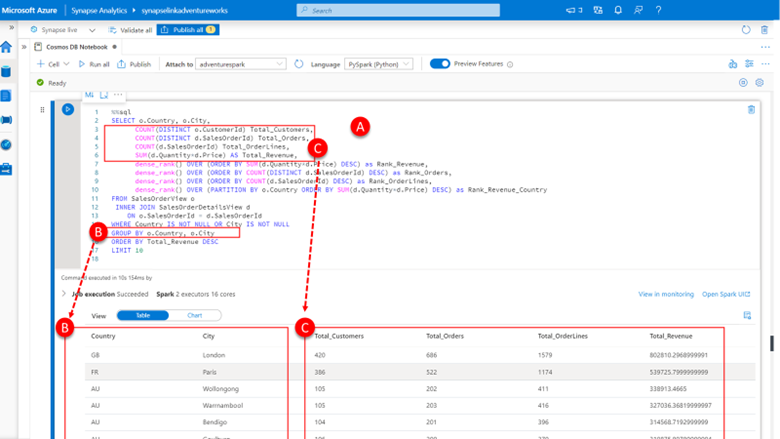
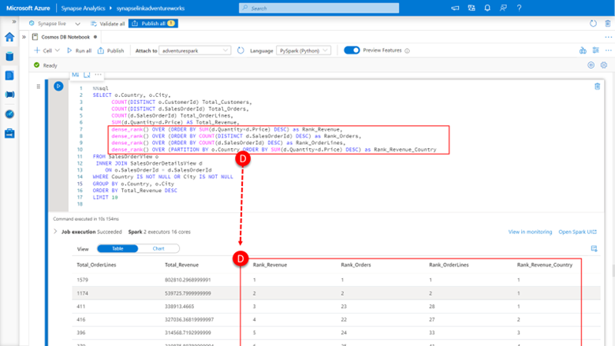
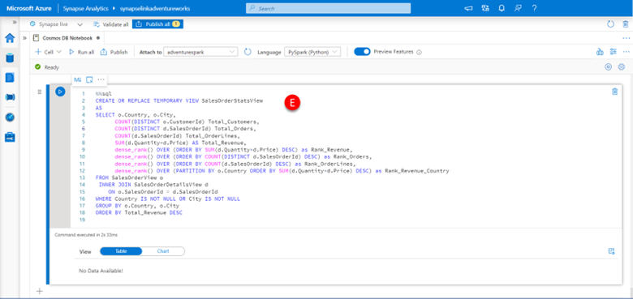

Adventure Works wants to be able to understand how the sales order volume and revenue is distributed by city for those customers where they have address details. In the previous units, we prepared a SalesOrderView that contains a row for every customer sales order with the country and city information for that customer where that information was available and a SalesOrderDetailsView that contains a row for every sale order line with information on the price and quantity associated with the product sold. Together these views contain all the raw data we need to answer these questions by:

1.	Paste the code below into a **new cell (A)**, click the **run cell** button.

    ```sql
    %%sql
    SELECT o.Country, o.City,
        COUNT(DISTINCT o.CustomerId) Total_Customers,
        COUNT(DISTINCT d.SalesOrderId) Total_Orders,
        COUNT(d.SalesOrderId) Total_OrderLines,
        SUM(d.Quantity*d.Price) AS Total_Revenue,
        dense_rank() OVER (ORDER BY SUM(d.Quantity*d.Price) DESC) as Rank_Revenue,
        dense_rank() OVER (ORDER BY COUNT(DISTINCT d.SalesOrderId) DESC) as Rank_Orders,
        dense_rank() OVER (ORDER BY COUNT(d.SalesOrderId) DESC) as Rank_OrderLines,
        dense_rank() OVER (PARTITION BY o.Country ORDER BY SUM(d.Quantity*d.Price) DESC) as Rank_Revenue_Country
    FROM SalesOrderView o
    INNER JOIN SalesOrderDetailsView d
        ON o.SalesOrderId = d.SalesOrderId
    WHERE Country IS NOT NULL OR City IS NOT NULL
    GROUP BY o.Country, o.City
    ORDER BY Total_Revenue DESC
    LIMIT 10

    ```

    [](../media/use-spark-sql-windowing-function-in-notebook.png#lightbox)

    This query answers the questions being asked through traditional aggregation, as we are mostly interested in understanding the number (COUNT) or total (SUM) of values a GROUP BY clause that covers both **Country and City (B)** can answer most of the questions with **absolute values for the total number of customers, orders and order lines and the sum of revenue by City (C)**.

    To answer the ranking part of the question, we use window functions. In essence a window function calculate a result for every row of a table based on a group of rows, called the frame. Every row can have a unique frame associated with it for that window function allowing you to concisely express and solve ranking, analytic, and aggregation problems in powerful yet simple a manner no other approach does. 

    Here we use the **dense_rank() function to calculate the rank of each city by revenue, number of orders and total order lines (D)**.

    As well as the rank of each city within each country, by partitioning the dense_rank() window function by the country. 

    [](../media/use-dense-rank-windowing-function-in-notebook.png#lightbox)

    Given the usefulness of these results we can encapsulate them in a temporary view for future use by:

2.	Paste the code below into a **new cell (E)**, click the **run cell** button.

    ```sql
    CREATE OR REPLACE TEMPORARY VIEW SalesOrderStatsView
    AS
    SELECT o.Country, o.City,
        COUNT(DISTINCT o.CustomerId) Total_Customers,
        COUNT(DISTINCT d.SalesOrderId) Total_Orders,
        COUNT(d.SalesOrderId) Total_OrderLines,
        SUM(d.Quantity*d.Price) AS Total_Revenue,
        dense_rank() OVER (ORDER BY SUM(d.Quantity*d.Price) DESC) as Rank_Revenue,
        dense_rank() OVER (ORDER BY COUNT(DISTINCT d.SalesOrderId) DESC) as Rank_Orders,
        dense_rank() OVER (ORDER BY COUNT(d.SalesOrderId) DESC) as Rank_OrderLines,
        dense_rank() OVER (PARTITION BY o.Country ORDER BY SUM(d.Quantity*d.Price) DESC) as Rank_Revenue_Country
    FROM SalesOrderView o
    INNER JOIN SalesOrderDetailsView d
        ON o.SalesOrderId = d.SalesOrderId
    WHERE Country IS NOT NULL OR City IS NOT NULL
    GROUP BY o.Country, o.City
    ORDER BY Total_Revenue DESC
    ```

     [](../media/encapsulate-dense-rank-windowing-function.png#lightbox)
   