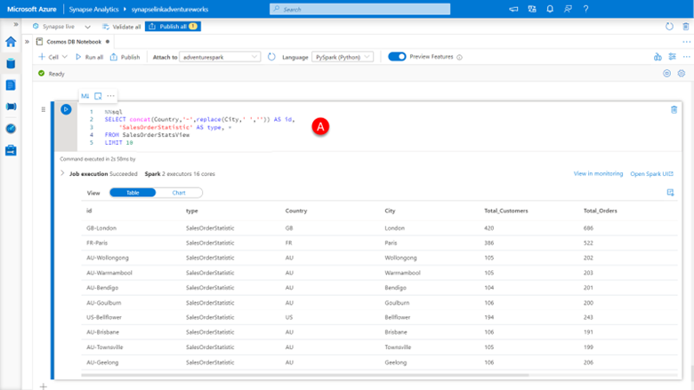
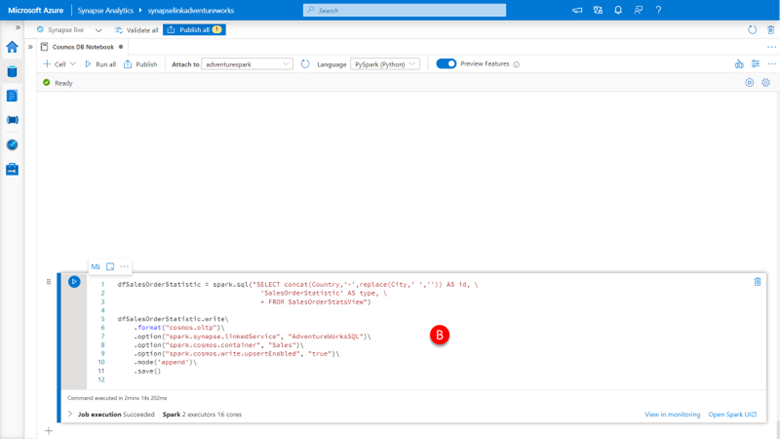
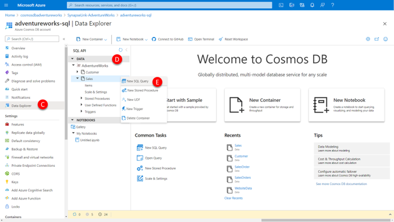
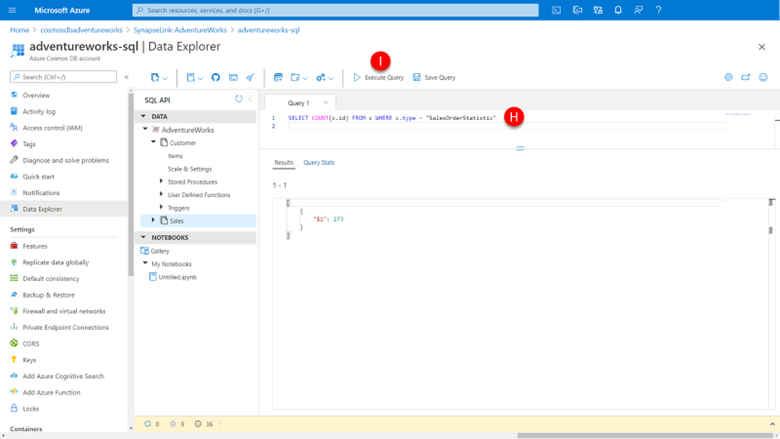

Whist the analytical insights that Adventure Works was able to gather from joining together operational data that was previously siloed in disconnected and hard to correlate data stores was useful, they have decided that making this information to every user across the organization though their existing application is the right way to achieve ongoing visibility of these key statistics. To do that we need to write this data back to the Azure Cosmos DB transactional stores. 

As with all applications the process starts by appropriately modeling the data. Some of the things to consider as we write this data back to Azure Cosmos DB: 

-	Does the document have an appropriate partition key, such that it will evenly distribute items and queries across all partitions as the data grows.
-	Can we provide an appropriate and usable primary key (ID or _id, in the case of Core (SQL) API and API for MongoDB respectively) such that when used together with the partition key can uniquely identify an item for point operations (CRUD)
-	Where we have modeled containers to support multiple entity types that we identify the new data with the appropriate entity type. 

For our example, where we are wanting to write the limited number of statistic rows back to the transactional store, we choose to create a new compound ID value that will allow client applications to look up the latest statistics for their city easily by concatenating the country code and city name together to uniquely identify each document. Given that we will be storing this in a container with other entity types we uniquely identify it type as “SalesOrderStatistic” data. 

1.	Paste the code below into a **new cell (A)**, click the **run cell** button.

    ```sql
    %%sql
    SELECT concat(Country,'-',replace(City,' ','')) AS id, 
        'SalesOrderStatistic' AS type, *
    FROM SalesOrderStatsView
    LIMIT 10
    ```
 
    [](../media/query-salesorderstatsview.png#lightbox)

    As you can see, we now an appropriately shaped result set ready to write back to the transactional store, by

2.	Paste the code below into a **new cell (B)**, click the **run cell** button.

    ```sql
    dfSalesOrderStatistic = spark.sql("SELECT concat(Country,'-',replace(City,' ','')) AS id, \
                                        'SalesOrderStatistic' AS type, \
                                        * FROM SalesOrderStatsView")

    dfSalesOrderStatistic.write\
        .format("cosmos.oltp")\
        .option("spark.synapse.linkedService", "AdventureWorksSQL")\
        .option("spark.cosmos.container", "Sales")\
        .option("spark.cosmos.write.upsertEnabled", "true")\
        .mode('append')\
        .save()
    ```

    [](../media/write-back-to-transactional-store.png#lightbox)


    Within a couple of minutes the DataFrame write operation should have finished writing our statistics back to the transactional store.   

    [](../media/create-sql-query-in-synapse-studio.png#lightbox)

    Let’s validate that these records are now visible in our Cosmos DB container by. 

3.	Navigate to the Azure portal (https://portal.azure.com) and select the **Azure Cosmos DB account**.

4.	Navigate to your previously created **Azure Cosmos DB Core (SQL) API account**.


5.	Select **Data Explorer** in the **left-hand menu (C)**.

6.	Navigate to the **Sales container** we created earlier by **(D)**:
    - Expanding AdventureWorks database 
    - Expanding the Sales Container 

7.	Clicking on the **…** and selecting **New SQL Query** from the menu **(E)**

8.	Paste the below code into the query pane **(F)**, click the **Execute** button **(G)**.

    ```sql
    SELECT * FROM c WHERE c.type = "SalesOrderStatistic"
    ```

    This will immediately return items containing the statistics we inserted from Synapse Analytics. 

    [](../media/view-query-results.png#lightbox)

    We can validate that all the expected 273 items have been inserted by

9.	Paste the code below into the query pane **(F)**, click the **Execute** button **(G)**.

    ```sql
    SELECT COUNT(c.id) FROM c WHERE c.type = 'SalesOrderStatistic’
    ```

    [](../media/perform-query-in-transactional-store.png#lightbox)

    And should immediacy return a value of 273 as the result. 

    We have successfully updated the Azure Cosmos DB transactional store from Synapse Analytics with the results of our analytical processing done over data that was sourced from Azure Cosmos DB analytical store.
