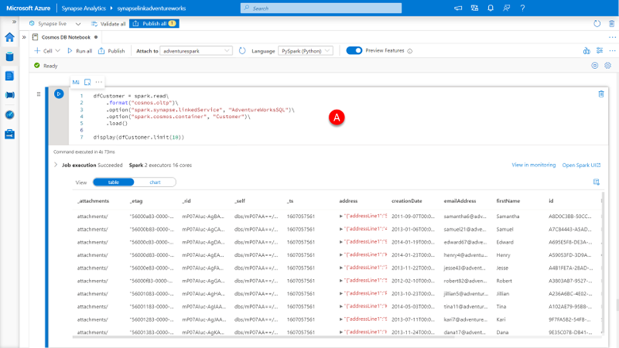
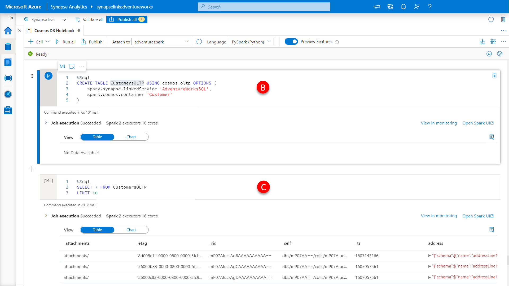

There may be scenarios where you may need to read data from the Azure Cosmos DB transactional store, for example,  in where you cannot tolerate the near-real-time latency constraints of the analytical store to surface specific information or where schema inference rules have made data unavailable in the analytical store. 

When connecting to the transactional store any queries, you run will consume Azure Cosmos DB request units and could impact workloads running against the transactional store. For most analytical type queries from Spark the analytical store is going to be your best choice from both a performance and cost perspective. 

Now that you are familiar with reading from analytical store into a DataFrame reading from the transactional store will be simple as it requires only a single change to the query. For the transactional store, the format parameter is specified as **cosmos.oltp** instead of the cosmos.olap used to access the analytical store. 

1.	Paste the code below into a **new cell (A)**, click the **run cell** button.

    ```python
    dfCustomer = spark.read\
        .format("cosmos.oltp")\
        .option("spark.synapse.linkedService", "AdventureWorksSQL")\
        .option("spark.cosmos.container", "Customer")\
        .load()

    display(dfCustomer.limit(10))
    ```

    [](../media/connect-to-transactional-store.png#lightbox)

    And a similar approach applies to the creating a Spark SQL table to access the transactional store, the USING clause is changed to specify cosmos.oltp as the source.

2.	Paste the code below into a **new cell (B)**, click the **run cell** button.

    ```sql
    %%sql
    CREATE TABLE CustomersOLTP USING cosmos.oltp OPTIONS (
        spark.synapse.linkedService 'AdventureWorksSQL',
        spark.cosmos.container 'Customer'
    )
    ```

    To validate the table is working as expected by

3.	Using the code below into a **new cell (C)**, click the **run cell** button.

    ```sql
    %%sql
    SELECT * FROM CustomersOLTP
    LIMIT 10
    ```
    As you can see the result is the content of the Azure Cosmos DB transactional store.

    [](../media/view-results-in-transactional-store.png#lightbox)