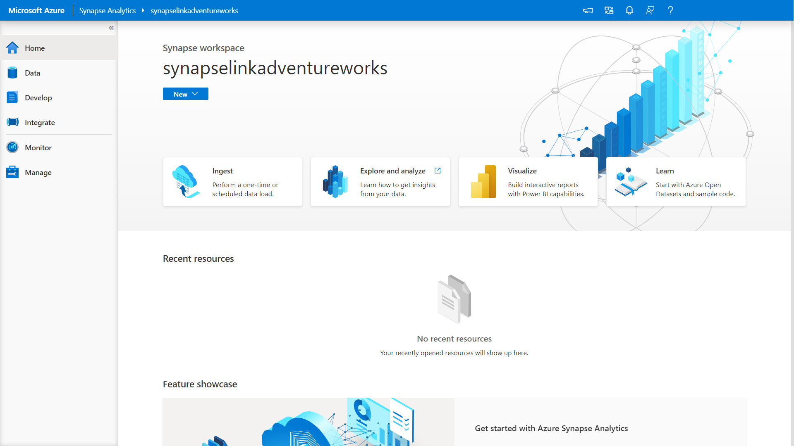
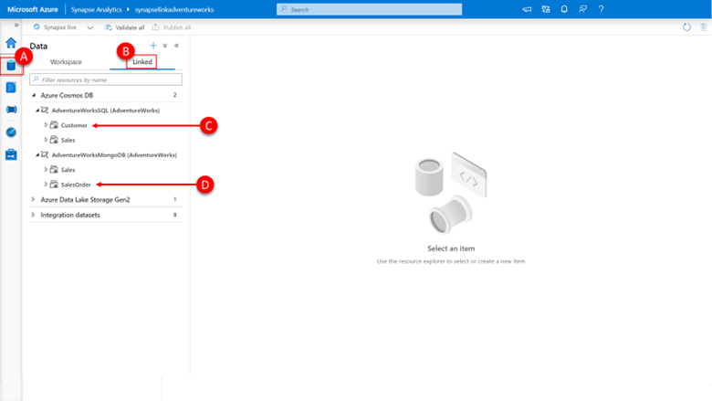
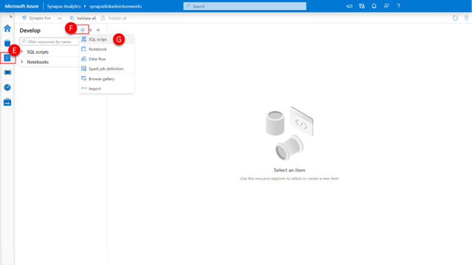
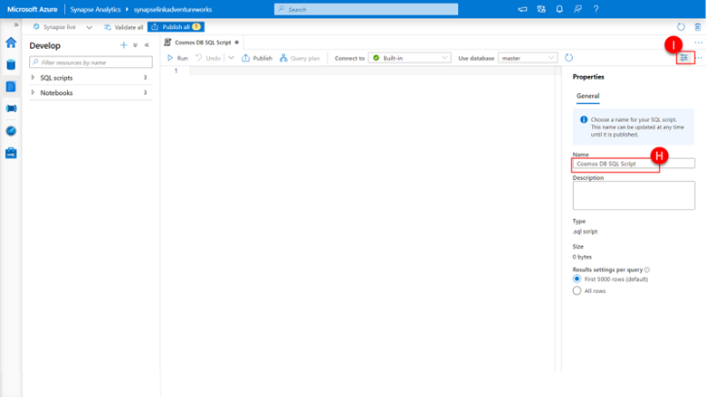
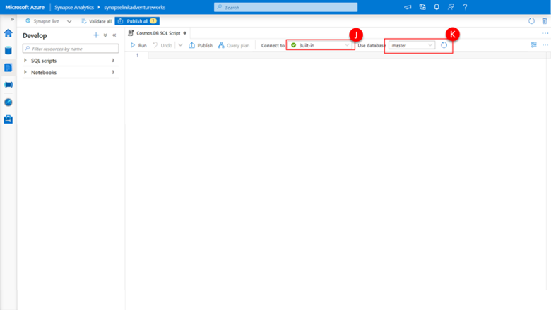
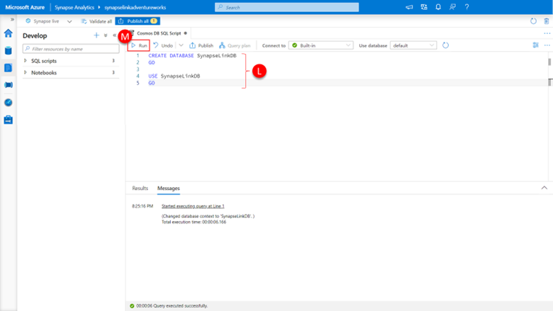
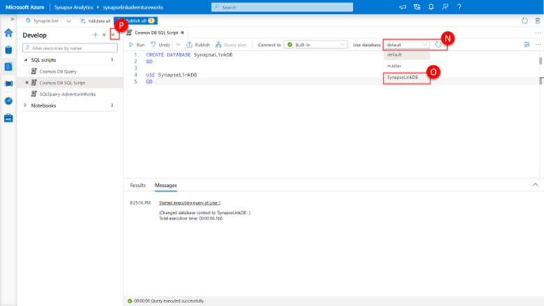
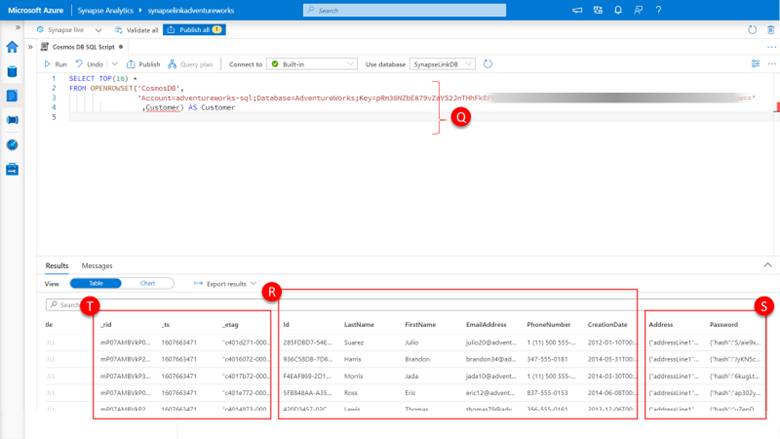
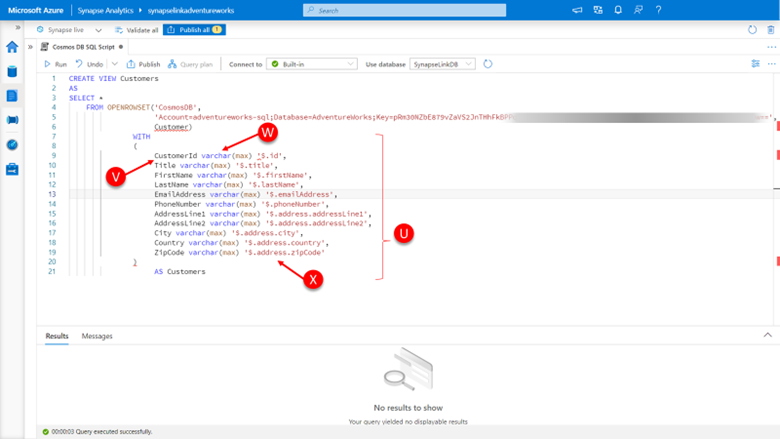
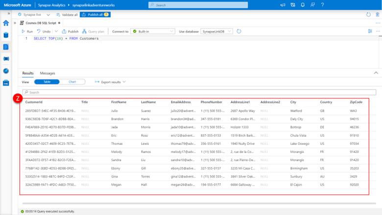

We are going to be working the same two new containers (Customer and SalesOrder) we did in the previous module. The Customer and SalesOrder containers each contain example Adventure Works datasets of related customer profile records and sales order records respectively. These data sets reside in different Azure Cosmos DB accounts: the customer profile data resides in an Azure Cosmos DB Core (SQL) API account and the sales order data resides in Azure Cosmos DB API for MongoDB account, given that this data comes for distinct source systems. Adventure Works wants to use their available operational data to get insight into:

-	What amount of revenue is coming from customers without completed profile data (no address details provided)
-	How sales order volume and revenue are distributed by city for those customers where they do have address details. 

1.	Connect to an Azure Synapse Workspace that has an Azure Synapse SQL Serverless instance, and an Azure Synapse Spark Pool.

    [](../media/azure-synapse-studio.png#lightbox)

2.	In the left-hand menu, select **Data (A)**
3.	Click on the **Linked tab** in the explorer view **(B)**
4.	Expand the **AdventureWorksSQL** linked service to expose the **Customer** container
5.	Expand the **AdventureWorksMongoDB** linked service to expose the **SalesOrder** container.

    [](../media/view-linked-services.png#lightbox)

    Here you can see additional two containers now visible in the data explorer view under the previously created linked service to our Azure Cosmos DB accounts (these containers already have Adventure Works data loaded into them) . The first, **Customer (C)**, has been created in the AdventureWorks database within the Azure Cosmos DB SQL API account and contains customer profile information. The second, **SalesOrder (D)**, has been created the AdventureWorks database within the Azure Cosmos DB API for MongoDB account and contains sales order information.

    Lets run some queries to explore what is in the Customer container.

    For reference here is a sample of a customer profile JSON document from the Customer container:

    ```json
    {
    "id": "3E6A563E-9F01-46EA-BDE2-7C38FD02BE29",
    "title": "",
    "firstName": "Ruben",
    "lastName": "Madan",
    "emailAddress": "ruben8@adventure-works.com",
    "phoneNumber": "1 (11) 500 555-0167",
    "creationDate": "2013-12-20T00:00:00",
    "address": {
        "addressLine1": "59, boulevard Tremblay",
        "addressLine2": "",
        "city": "Paris",
        "state": "75 ",
        "country": "FR",
        "zipCode": "75008"
    },
    "password": {
        "hash": "L6rgOSf0NMOhruu/t/+tzWBzO0VNcyUL9qQf3GVW+9A=",
        "salt": "76E5DBEB"
    },
    "_rid": "mP07AMBVkP0DAAAAAAAAAA==",
    "_self": "dbs/mP07AA==/colls/mP07AMBVkP0=/docs/mP07AMBVkP0DAAAAAAAAAA==/",
    "_etag": "\"c401ba71-0000-0800-0000-5fd2ff6e0000\"",
    "_attachments": "attachments/",
    "_ts": 1607663471
    }    
    ```

    [](../media/open-sql-script-synapse-studio.png#lightbox)

6.	In the left-hand menu, select **develop (E)**

7.	Then click the **“+” (F)** to add a resource.

8.	And then select **SQL Script (G)** to create a new SQL script. A new SQL Script will immediately be created within the Synapse Workspace.

9.	Within the SQL script properties, provide an appropriate name **Cosmos DB SQL Script (H)**

10.	And then click the **properties icon (I)** to close the properties blade.

    [](../media/view-sql-script-synapse-studio.png#lightbox)

    Because we are going to utilize the built-in SQL Serverless pool, you can choose **built-in** from the **connect to:** drop down at the top of the query pane (J). You will see that the default database is now **master**.

    [](../media/connect-to-sql-serverless.png#lightbox)

    Lets create a database in which we will store the objects we are going to query.

11.	 Paste the following Transact-SQL code into the **query pane (L)** and click the **run button at the top of the query pane (M)**. 

        ```sql
        CREATE DATABASE SynapseLinkDB
        GO

        USE SynapseLinkDB
        GO
        ```

        [](../media/execute-sql-script-synapse-studio.png#lightbox)

        This will create a database named **SynapseLinkDB** and the select it for use within the subsequent session. 

        An alternative method of selecting this database for use is to click on the **Use database (N)** drop-down and selecting the database you wish to use, in our case **SynapseLinkDB (O)**.

        [](../media/select-database-context-synapse-studio.png#lightbox)

        Let’s also create a little more display real-estate by minimizing the explorer blade by:

12.	clicking **<<** in the top right of the **blade (P)**.

    We are now going to perform a SELECT operation against the Azure Cosmos DB analytical store using the OPENROWSET() function by:

13.	Paste the following SQL into the query pane, making sure to **delete the previous SQL (Q)**.

    ```sql
    SELECT TOP(10) * 
    FROM OPENROWSET('CosmosDB',
                    'Account=adventurework-sql;
    Database=AdventureWorks;
    Key=pRm30NZbE879vZa…Euw=='
                    ,Customer) AS Customer
    ```

    [](../media/execute-query-synapse-studio.png#lightbox)

14.	And then click **run**.

    This will return the top (10) rows from the connected Azure Cosmos DB analytical store via Synapse Link

    There are several parameters that need to be provided to the OPENROWSET function.

    - The **provider name**: which in the case of the Cosmos DB analytical store is **CosmosDB**. 
    - The **provider string**: which the case of the Cosmos DB analytical store is a connection string including the Azure Cosmos DB account name, the Database specifying the Azure Cosmos DB you wish to use and the Key for the account.
    - The **table name**: which in the case of the Cosmos DB analytical store the container we wish to work use.

    You will now be presented with a result set of the first 10 rows of a row-based representation of the documents contained within the Customer container’s analytical store. This is held within an Azure Cosmos Core (SQL) API account, so that data will be represented using the well-defined schema representation by default. 

    The top-level properties of the document are represented as columns with the associated property values as the value of the column. In the case that these values are primitive data types (“string”, “integer”, “float” etc.), the column will be apparently **typed (R)**, if these properties are embedded arrays or objects within the document, the column value will be a structure of these **embedded values (S)**. 

    In the case of our example the title, firstName, lastName, emailAddress, and phoneNumber propertied are primitive strings and **assigned to their own columns (R)**, the address and password properties are both **embedded objects (S)**.

    There is also the presence of **several Azure Cosmos DB system document properties (T)**. Azure Cosmos DB automatically has system properties such as _ts, _self, _attachments, _rid, and _etag associated with every document. These system document properties are seldom useful for analytical store query purposes, and will be ignored going forward.

Let us now create a view of our customers that we can use in our SQL queries in future.

1. Paste the following SQL into the query pane, making sure to delete the previous SQL statement.

    ```sql
    CREATE VIEW Customers
    AS
    SELECT *
        FROM OPENROWSET('CosmosDB',
                        'Account=adventureworks-sql;
    Database=AdventureWorks;
    Key=NZbE879vZa…Euw==',
                        Customer) 
                WITH 
                (
                        CustomerId varchar(max) '$.id',
                        Title varchar(max) '$.title',
                        FirstName varchar(max) '$.firstName',
                        LastName varchar(max) '$.lastName',
                        EmailAddress varchar(max) '$.emailAddress',
                        PhoneNumber varchar(max) '$.phoneNumber',
                        AddressLine1 varchar(max) '$.address.addressLine1',
                        AddressLine2 varchar(max) '$.address.addressLine2',
                        City varchar(max) '$.address.city',
                        Country varchar(max) '$.address.country',
                        ZipCode varchar(max) '$.address.zipCode'
                )
                        AS Customers
    ```

    [](../media/create-view-synapse-studio.png#lightbox)

    Here you will note that we have expanded the functionality of OPENROWSET function of the CREATE VIEW statement to include a **WITH clause (U)** that allows us to:

    -	Specify an alias for the column name (V), for example renaming the ID attribute to CustomerId in our example
    -	Specify the datatype of the underlying column store (W)
    -	Specify the JSON path of the property, the value of which to return in the specified column, this includes returning property values within embedded objects within the JSON. (X), for example “$.address.zipCode” to access the zipCode property contained within the embedded address object.

2. Now query the view that you have just created

    ```sql
    SELECT TOP(10) * FROM Customers
    ```

    [](../media/query-view-synapse-studio.png#lightbox)

    Here you can see the **results (Z)** from our Customers view, returning a flattened columnar view of the JSON documents that reside in the customer container within the Azure Cosmos DB SQL API account.
