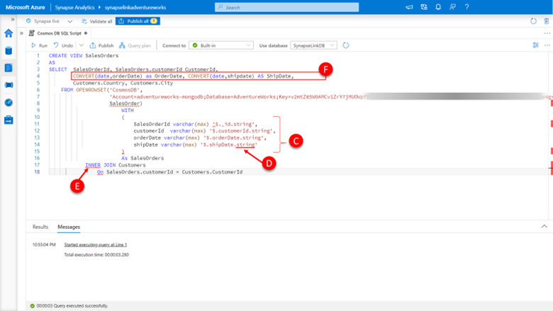
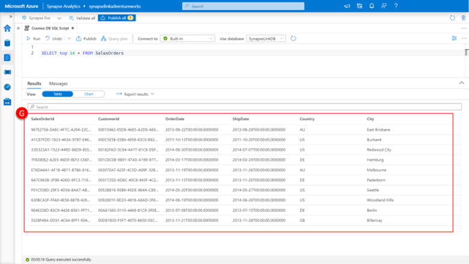

Let's explore the second of our two containers; the SalesOrder container. This container hosts the AdventureWorks database within the Azure Cosmos DB API for MongoDB and contains sales order information. 

For reference here is a sample of a sales order JSON document from the SalesOrder container:

```json
{
    "_id" : "F0FF0BA8-CEF4-454C-9173-FA7C546F7179",
    "customerId" : "A852CB99-DAA1-4348-A86F-622D4478A7D0",
    "orderDate" : "2013-07-11T00:00:00",
    "shipDate" : "2013-07-18T00:00:00",
    "details" : [
        {
            "sku" : "LJ-0192-M",
            "name" : "Long-Sleeve Logo Jersey, M",
            "price" : 49.99,
            "quantity" : 1
        },
        {
            "sku" : "SH-W890-M",
            "name" : "Women's Mountain Shorts, M",
            "price" : 69.99,
            "quantity" : 1
        }
    ]
}
```

Paste the following SQL into the query pane.

```sql
SELECT top 10 *
    FROM OPENROWSET('CosmosDB',
                    'Account=adventureworks-mongodb;Database=AdventureWorks;Key=v2mtZ85W0AMCv1ZrY7j…4g==',
                    SalesOrder) As SalesOrders
```

[](../media/execute-cross-container-query-synapse-studio.png#lightbox)

Click **run**.

You are presented with a result set of the first 10 rows. It is a row-based representation of the documents contained within the SalesOrder container’s analytical store using Azure Cosmos Core API account for MongoDB. As a result, the data is represented using the full fidelity schema representation by default. 

All top-level properties of the document are represented as columns with the associated property values. All properties are **represented as a structure of the type of values assigned to the properties; and the values themselves, (A) and (B)**. For complex types such as objects and arrays, they will remain embedded within the structure, and expanded to include type encapsulation of each of their property values. 

In this example, ignoring the system document properties for now, the _id, customerId, orderDate, and shipDate are all strings and have a **type encapsulation of string (A)**. The **details property is an embedded array (B)**, in turn with embedded properties sku, name, price, and quantity of each array element object.

Let’s use what we observed here, and what we learned earlier about using OPENROWSET to combine this data with our Customers view we created previously to create a new SalesOrders view by creating the following script

```sql
CREATE VIEW SalesOrders
AS
SELECT  SalesOrderId, SalesOrders.customerId CustomerId, 
        CONVERT(date,orderDate) as OrderDate, CONVERT(date,shipdate) AS ShipDate,
        Customers.Country, Customers.City
    FROM OPENROWSET('CosmosDB',
                    'Account=adventureworks-mongodb;Database=AdventureWorks;Key=v2mtZ85W0AMCv1Zr…D3v4g==',
                    SalesOrder)
                        WITH 
                        (
                            SalesOrderId varchar(max) '$._id.string', 
                            customerId  varchar(max) '$.customerId.string',
                            orderDate varchar(max) '$.orderDate.string',
                            shipDate varchar(max) '$.shipDate.string'
                        )                  
                        As SalesOrders
            INNER JOIN Customers
                On SalesOrders.customerId = Customers.CustomerId
```

[](../media/create-cross-container-view-synapse-studio.png#lightbox)

Here you can see we are using the **WITH clause (C)** again to specify the path to our property values, notably **including the data type suffix (D)** of the property as part of the path to the property in order to access the values when using the full fidelity schema. In this example, we need to specify “$.shipDate.string” rather than just “$.shipDate”.

We are joining it back to our Customers view using the **CustomerId key present in both (E)**, and doing some explicit type conversion for our date values using the CONVERT function to project them as SQL date data types.

Let see what this view returns by: 

```sql
SELECT top 10 * FROM SalesOrders
```

[](../media/query-view.png#lightbox)

Here you can see the results from our SalesOrders view, returning a flattened columnar view of the JSON documents that reside in the SalesOrder container within the Azure Cosmos DB API for MongoDB account.
