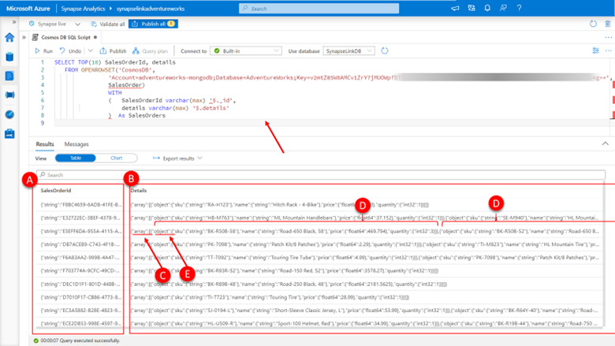
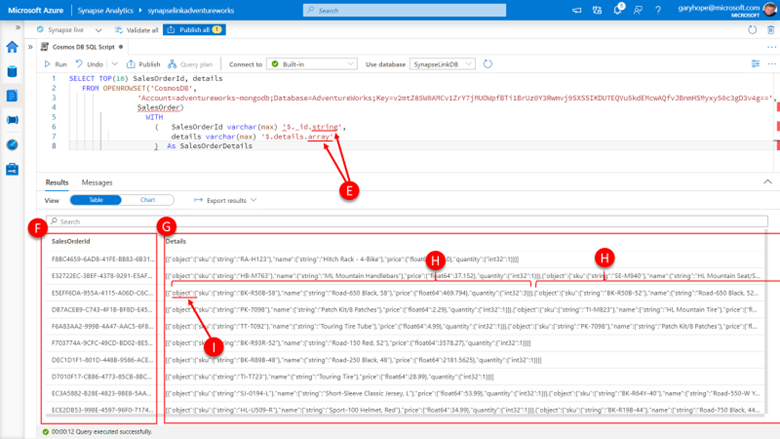
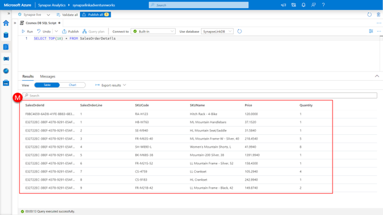

Let us focus on extracting the data from sales order details for now. To do that we are going to want to look at the SalesOrderId (contained within the _id property of the document) and the details property that contains the array of sales order details.

Paste the following SQL into the query pane.

```sql
SELECT TOP(10) SalesOrderId, details
   FROM OPENROWSET('CosmosDB',
                'Account=adventureworks-mongodb;Database=AdventureWorks;Key=v2mtZ85W0AMCv1ZrY7jMUOWpfBTi1BrUz0Y3Rwmvj9SXSSIKDU7EQVu5kdEMcwAQfvJBnmHSMyxy50c3gD3v4g==',
                SalesOrder)
                WITH 
                (   SalesOrderId varchar(max) '$._id', 
                    details varchar(max) '$.details'
                )  As SalesOrders 

```



Click **run**.

Here we can see the **SalesOrderId column (A)** is retuning a JSON fragment including the data type of the document _id property, in this case string along with the property values. The **details column (B)** is also retuning a JSON fragment in this case indicating that the data type is an **array (C)** and that it contains **multiple array elements (D)**.

Let us now access these properties by correctly specifying the path including the type suffix for each property (in this case “string” for _id and “array” for the details attributes) by:

Paste the following SQL into the query pane.

```sql
SELECT TOP(10) SalesOrderId, details
   FROM OPENROWSET('CosmosDB',
                'Account=adventureworks-mongodb;Database=AdventureWorks;Key=v2mtZ85W0AMCv1ZrY7jMUOWpfBTi1BrUz0Y3Rwmvj9SXSSIKDU7EQVu5kdEMcwAQfvJBnmHSMyxy50c3gD3v4g==',
                SalesOrder)
                  WITH 
                    (   SalesOrderId varchar(max) '$._id.string', 
                        details varchar(max) '$.details.array'
                    )  As SalesOrderDetails
```

[](../media/access-json-properties-synapse-studio.png#lightbox)

Click **run**.

Now we can see that the SalesOrderId column contains just the appropriate value and the details column now just contains the JSON array itself starting with the array designator “[“ and ending with “]” and can contain **multiple array elements (H)** of object type as indicated in the JSON with **object type suffix (I)**. 

Let now create a SalesOrderDetails view by:

Paste the following SQL into the query pane.

```sql
CREATE VIEW SalesOrderDetails
AS
SELECT SalesOrderId, SalesOrderArray.[key]+1 as SalesOrderLine, SKUCode, SKUName,Price, Quantity
   FROM OPENROWSET('CosmosDB',
                'Account=adventureworks-mongodb;Database=AdventureWorks;Key=v2mtZ85W0AMCv1ZrY7jMUOWpfBTi1BrUz0Y3Rwmvj9SXSSIKDU7EQVu5kdEMcwAQfvJBnmHSMyxy50c3gD3v4g==',
                SalesOrder) 
                    WITH 
                    (   SalesOrderId varchar(max) '$._id.string', 
                        details varchar(max) '$.details.array'
                    )  As SalesOrders 
        CROSS APPLY OPENJSON(SalesOrders.details) AS SalesOrderArray
            CROSS APPLY OPENJSON(SalesOrderArray.[value]) 
            WITH
                (SKUCode varchar(max) '$.object.sku.string',
                SKUName varchar(max)    '$.object.name.string',
                Price decimal(10,4) '$.object.price.float64' ,
                Quantity int    '$.object.quantity.int32'
            ) As SalesOrderDetails
```

The first OPENJSON clause provides the SalesOrders.details value we extracted in using the WITH clause of the OPENROWSET. When you call OPENJSON without a WITH clause and provide it with a JSON fragment that represents an array (as is the case in our example) the function returns a table with the following columns:

-	Key- A value that contains the zero-based index of the element in the specified array. 
-	Value - An nvarchar(max) value that contains the value of the property itself. This will be the object value for each of the array elements in our example.
-	Type -An int value that contains the type of the value, which we don’t use in our example.

The second OPENJSON clause is provided with an input value of the value returned by the first OPENJSON clause, in our example the JSON fragment that represents the object of each element within the array. In this case, we use the WITH clause to further specify the column alias, and the column data type and the element path we want to access (remembering to include the type suffix).

Lastly, we will project all the needed columns including key value returned by the first OPENJSON function (L) which will provide us with the SalesOrderLine, which by convention starts at 1 for each order at AdventureWorks, so needs to be adjusted from its zero-based value. 

Let’s see the result of all this transformation work that the view now contains by:

Paste the following SQL into the query pane.

```sql
SELECT TOP(10) * FROM SalesOrderDetails
```

[](../media/view-results-from-query-synapse-studio.png#lightbox)

Click **run**.

As you can see, we have now extracted the order details information from within the sales order details array including its crucial revenue and unit sales data.

We are now able to create the statistical information needed to answer the questions we set to resolve.	

