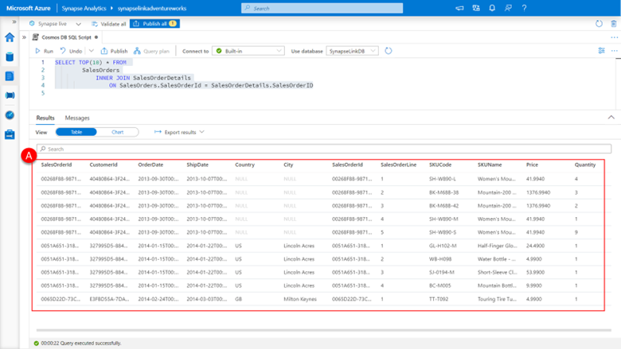
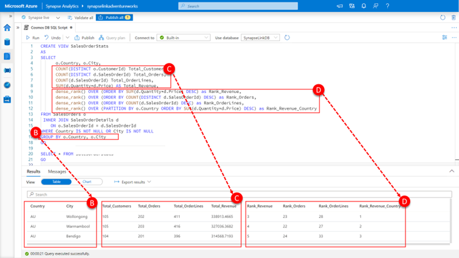

Adventure Works wanted to be able to understand how the sales order volume and revenue is distributed by city for those customers where they have address details. In the previous units, we prepared a SalesOrderView that contains a row for every customer sales order with the country and city information for that customer where that information was available and a SalesOrderDetailsView that contains a row for every sale order line with information on the price and quantity and details of the product sold

If we join the SalesOrders and SalesOrderDetails views, we have created in the previous units using the SalesOrderId of both we will get a **result set (A)** where single row has both the dimensions across which we want to summarize this data along with the values that we wish to measure.

Paste the following SQL into the query pane.

```sql
SELECT TOP(10) * FROM 
        SalesOrders
            INNER JOIN SalesOrderDetails
                ON SalesOrders.SalesOrderId = SalesOrderDetails.SalesOrderID
```

[](../media/query-joined-views-synapse-studio.png#lightbox)

Click **run**.

We can now create a single view that will provide us with Country and City level statistics we are after by:

Paste the following SQL into the query pane.

```sql
CREATE VIEW SalesOrderStats
AS
SELECT
      o.Country, o.City,
      COUNT(DISTINCT o.CustomerId) Total_Customers,
      COUNT(DISTINCT d.SalesOrderId) Total_Orders,
      COUNT(d.SalesOrderId) Total_OrderLines,
      SUM(d.Quantity*d.Price) AS Total_Revenue,
      dense_rank() OVER (ORDER BY SUM(d.Quantity*d.Price) DESC) as Rank_Revenue,
      dense_rank() OVER (ORDER BY COUNT(DISTINCT d.SalesOrderId) DESC) as Rank_Orders,
      dense_rank() OVER (ORDER BY COUNT(d.SalesOrderId) DESC) as Rank_OrderLines,
      dense_rank() OVER (PARTITION BY o.Country ORDER BY SUM(d.Quantity*d.Price) DESC) as Rank_Revenue_Country
FROM SalesOrders o
 INNER JOIN SalesOrderDetails d
    ON o.SalesOrderId = d.SalesOrderId
WHERE Country IS NOT NULL OR City IS NOT NULL
GROUP BY o.Country, o.City
GO

SELECT * FROM SalesOrderStats
GO
```
The query above will create the SalesOrderStats view and output the results of the view created 

[](../media/create-query-views-synapse-studio.png#lightbox)

Click **run**.

The query captured in this view answers the many parts of the questions being asked through traditional aggregation, because we are mostly interested in understanding the number (COUNT) or total (SUM) of values a GROUP BY clause that covers both **Country and City (B)** can answer most of the questions with absolute values for the **total number of customers, orders and order lines and the sum of revenue by City (C)**.

To answer the ranking part of the question, we use window functions. In essence, a window function calculates a result for every row of a table based on a group of rows, called the frame. Every row can have a unique frame associated with it for that window function allowing you to concisely express and solve ranking, analytic, and aggregation problems in powerful yet simple a manner no other approach does. 

Here we **use the dense_rank() function to calculate the rank of each city by revenue, number of orders and total order lines (D)**.

As well as the rank of each city within each country, by partitioning the dense_rank() window function by the country.
