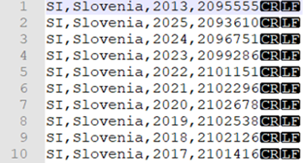
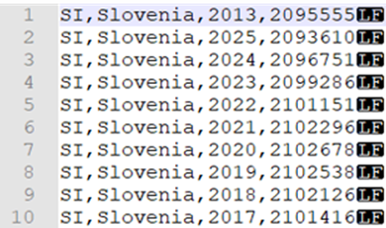
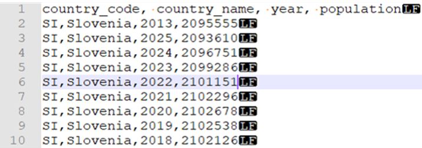
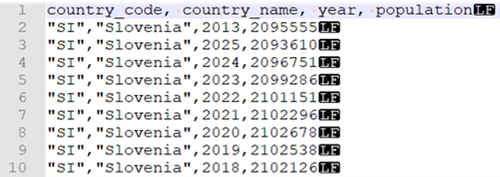
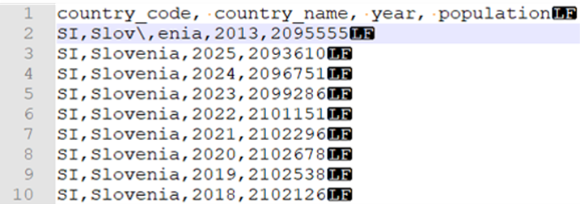
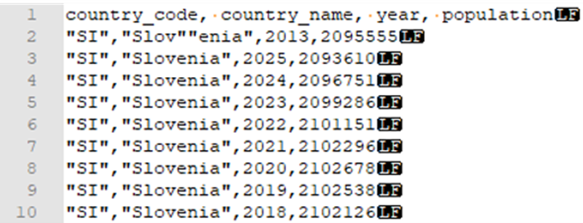
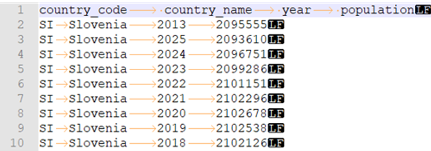

CSV files are a common file format within many businesses, and you can query a single CSV file using serverless SQL pool. CSV files may have different formats: 
-	With and without a header row 
-	Comma and tab-delimited values 
-	Windows and Unix style line endings 
-	Non-quoted and quoted values, and escaping characters 

All above variations will be covered below.

The **OPENROWSET** function enables you to read the content of CSV file by providing the URL to your file.

## Read a csv file

The easiest way to see to the content of your **CSV** file is to provide the **file URL** to the **OPENROWSET** function. You then include the csv **FORMAT**, and **2.0 PARSER_VERSION**. If the file is publicly available or if your Azure AD identity can access this file, you should be able to see the content of the file using the query like the one shown in the following example:

```sql
select top 10 *
from openrowset(
    bulk 'https://pandemicdatalake.blob.core.windows.net/public/curated/covid-19/ecdc_cases/latest/ecdc_cases.csv',
    format = 'csv',
    parser_version = '2.0',
    firstrow = 2 ) as rows
```

The option **firstrow** is used to skip the first row in the CSV file that represents the header in this case. Make sure that you can access this file. If your file is protected with SAS key or custom identity, you would need to [setup server level credential for sql login]( https://docs.microsoft.com/azure/synapse-analytics/sql/develop-storage-files-storage-access-control?tabs=shared-access-signature#server-scoped-credential).

## Data source usage

The previous example uses a full path to the file. As an alternative, you can create an external data source with the location that points to the root folder of the storage:

```sql
create external data source covid
with ( location = 'https://pandemicdatalake.blob.core.windows.net/public/curated/covid-19/ecdc_cases' );
```

Once you create a data source, you can use that data source and the relative path to the file in OPENROWSET function:

```sql
select top 10 *
from openrowset(
        bulk 'latest/ecdc_cases.csv',
        data_source = 'covid',
        format = 'csv',
        parser_version ='2.0',
        firstrow = 2
    ) as rows
```

If a data source is protected with SAS key or custom identity, you can configure [data source with database scoped credential]( https://docs.microsoft.com/azure/synapse-analytics/sql/develop-storage-files-storage-access-control?tabs=shared-access-signature#database-scoped-credential).

## Explicitly specify a schema

The **OPENROWSET** function enables you to explicitly specify what columns you want to read from the file using WITH clause:

```sql
select top 10 *
from openrowset(
        bulk 'latest/ecdc_cases.csv',
        data_source = 'covid',
        format = 'csv',
        parser_version = '2.0',
        firstrow = 2
    ) with (
        date_rep date 1,
        cases int 5,
        geo_id varchar(6) 8
    ) as rows
```

The numbers after a data type in the WITH clause represent column location, known as a column index in the CSV file. 

In the following sections, you can see how to query various types of CSV files. All the following examples require files that have specific row delimiter, column delimiter, escape character, etc. To be able to execute the upcoming examples, your first step is to create a database where the objects will be created. Then initialize the objects by executing the following [setup script]( https://github.com/Azure-Samples/Synapse/blob/master/SQL/Samples/LdwSample/SampleDB.sql) on that database. This setup script will create the data sources, database scoped credentials, and external file formats that are used in these samples.

## Read windows style new line files

The following query shows how to read a CSV file without a header row, with a Windows-style new line, and comma-delimited columns, as shown in the following file preview example:
 
> [!div class="mx-imgBorder"]
> 

The code to achieve this is:

```sql
SELECT *
FROM OPENROWSET(
        BULK 'csv/population/population.csv',
        DATA_SOURCE = 'SqlOnDemandDemo',
        FORMAT = 'CSV', PARSER_VERSION = '2.0',
        FIELDTERMINATOR =',',
        ROWTERMINATOR = '\n'
    )
WITH (
    [country_code] VARCHAR (5) COLLATE Latin1_General_BIN2,
    [country_name] VARCHAR (100) COLLATE Latin1_General_BIN2,
    [year] smallint,
    [population] bigint
) AS [r]
WHERE
    country_name = 'Luxembourg'
    AND year = 2017;
```

## Read Unix-style new line files

The following query shows how to read a file without a header row, with a Unix-style new line, and comma-delimited columns as shown in the following file preview. 
 
> [!div class="mx-imgBorder"]
> 

The code to achieve this is as follows. You can see in this example the different location of the file as compared to the other examples.

```sql
SELECT * 
FROM OPENROWSET( 
    BULK 'csv/population-unix/population.csv', 
    DATA_SOURCE = 'SqlOnDemandDemo', 
    FORMAT = 'CSV', PARSER_VERSION = '2.0', 
    FIELDTERMINATOR =',', 
    ROWTERMINATOR = '0x0a' ) 
WITH ( 
    [country_code] VARCHAR (5) COLLATE Latin1_General_BIN2, 
    [country_name] VARCHAR (100) COLLATE Latin1_General_BIN2, 
    [year] smallint, [population] bigint 
) AS [r] 
WHERE 
    country_name = 'Luxembourg' 
    AND year = 2017;
```

## Work with header rows in a file

The following query shows how to read a file with a header row, with a Unix-style new line, and comma-delimited columns, as shown in the following file preview.
 
> [!div class="mx-imgBorder"]
> 

The code to achieve this is as follows where you use the **firstrow** variable to omit the header row.

```sql
SELECT * 
FROM OPENROWSET( 
    BULK 'csv/population-unix-hdr/population.csv', 
    DATA_SOURCE = 'SqlOnDemandDemo', 
    FORMAT = 'CSV', PARSER_VERSION = '2.0', 
    FIELDTERMINATOR =',', 
    FIRSTROW = 2 ) 
WITH ( 
    [country_code] VARCHAR (5) COLLATE Latin1_General_BIN2, 
    [country_name] VARCHAR (100) COLLATE Latin1_General_BIN2, 
    [year] smallint, [population] bigint 
) AS [r] 
WHERE 
    country_name = 'Luxembourg' 
    AND year = 2017;
```

## Work with custom quote character

The following query shows how to read a file with a header row, with a Unix-style new line, comma-delimited columns, and quoted value as shown in the following file preview.
 
> [!div class="mx-imgBorder"]
> 

The code to achieve this is as follows.

```sql
SELECT * 
FROM OPENROWSET( 
    BULK 'csv/population-unix-hdr-quoted/population.csv', 
    DATA_SOURCE = 'SqlOnDemandDemo', 
    FORMAT = 'CSV', PARSER_VERSION = '2.0', 
    FIELDTERMINATOR =',', 
    ROWTERMINATOR = '0x0a',
    FIRSTROW = 2,
    FIELDQUOTE = ' ” '
) 
WITH ( 
    [country_code] VARCHAR (5) COLLATE Latin1_General_BIN2, 
    [country_name] VARCHAR (100) COLLATE Latin1_General_BIN2, 
    [year] smallint, [population] bigint 
) AS [r] 
WHERE 
    country_name = 'Luxembourg' 
    AND year = 2017;
```

> [!NOTE]
> This query would return the same results if you omitted the FIELDQUOTE parameter since the default value for FIELDQUOTE is a double-quote.

## Work with escape characters

The following query shows how to read a file with a header row, with a Unix-style new line, comma-delimited columns, and an escape char used for the field delimiter (comma) within values, as shown in the following	file preview.
 
> [!div class="mx-imgBorder"]
> 

The code to achieve this is as follows.

```sql
SELECT * 
FROM OPENROWSET( 
    BULK 'csv/population-unix-hdr-escape/population.csv', 
    DATA_SOURCE = 'SqlOnDemandDemo', 
    FORMAT = 'CSV', PARSER_VERSION = '2.0', 
    FIELDTERMINATOR =',', 
    ROWTERMINATOR = '0x0a',
    FIRSTROW = 2,
    ESCAPECHAR = ' \\ '
) 
WITH ( 
    [country_code] VARCHAR (5) COLLATE Latin1_General_BIN2, 
    [country_name] VARCHAR (100) COLLATE Latin1_General_BIN2, 
    [year] smallint, 
    [population] bigint 
) AS [r] 
WHERE 
    country_name = 'Slovenia';
```

> [!NOTE]
> This query would fail if ESCAPECHAR is not specified since the comma in "Slov,enia" would be treated as field delimiter instead of part of the country/region name. "Slov,enia" would be treated as two columns. Therefore, the row would have one column more than the other rows, and one column more than you defined in the WITH clause.

## Work with escape quoting characters

The following query shows how to read a file with a header row, with a Unix-style new line, comma-delimited columns, and an escaped double quote char within values as shown in the following file preview.
 
> [!div class="mx-imgBorder"]
> 

The code to achieve this is as follows.

```sql
SELECT * 
FROM OPENROWSET( 
    BULK 'csv/population-unix-hdr-escape-quoted/population.csv', 
    DATA_SOURCE = 'SqlOnDemandDemo', 
    FORMAT = 'CSV', PARSER_VERSION = '2.0', 
    FIELDTERMINATOR =',', 
    ROWTERMINATOR = '0x0a',
    FIRSTROW = 2
) 
WITH ( 
    [country_code] VARCHAR (5) COLLATE Latin1_General_BIN2, 
    [country_name] VARCHAR (100) COLLATE Latin1_General_BIN2, 
    [year] smallint, 
    [population] bigint 
) AS [r] 
WHERE 
    country_name = 'Slovenia';
```

> [!NOTE]
> The quoting character must be escaped with another quoting character. Quoting character can appear within column value only if value is encapsulated with quoting characters.

## Work with tab-delimited files

The following query shows how to read a file with a header row, with a Unix-style new line, and tab-delimited columns, as shown in the following file preview.
 
> [!div class="mx-imgBorder"]
> 

The code to achieve this is as follows.

```sql
SELECT * 
FROM OPENROWSET( 
    BULK 'csv/population-unix-hdr-tsv/population.csv', 
    DATA_SOURCE = 'SqlOnDemandDemo', 
    FORMAT = 'CSV', PARSER_VERSION = '2.0', 
    FIELDTERMINATOR ='\t', 
    ROWTERMINATOR = '0x0a',
    FIRSTROW = 2
) 
WITH ( 
    [country_code] VARCHAR (5) COLLATE Latin1_General_BIN2, 
    [country_name] VARCHAR (100) COLLATE Latin1_General_BIN2, 
    [year] smallint, 
    [population] bigint 
) AS [r] 
WHERE 
    country_name = 'Slovenia'
    AND year = 2017
```

## Return a subset of columns from a file

So far, you've specified the CSV file schema using WITH and listing all columns. You can only specify columns you need in your query by using an ordinal number for each column needed. You'll also omit columns of no interest.
The following query returns the number of distinct country/region names in a file, specifying only the columns that are needed.
```sql
SELECT 
    COUNT(DISTINCT country_name) AS countries 
FROM OPENROWSET(
    BULK 'csv/population/population.csv', 
    DATA_SOURCE = 'SqlOnDemandDemo', 
    FORMAT = 'CSV', PARSER_VERSION = '2.0', 
    FIELDTERMINATOR =',', 
    ROWTERMINATOR = '\n' ) 
WITH ( 
    --[country_code] VARCHAR (5), 
    [country_name] VARCHAR (100) 2 
    --[year] smallint, 
    --[population] bigint 
) AS [r]
```

> [!NOTE]
> Look at the WITH clause in the query below and note that there is "2" (without quotes) at the end of row where you define the [country_name] column. It means that the [country_name] column is the second column in the file. The query will ignore all columns in the file except the second one.
