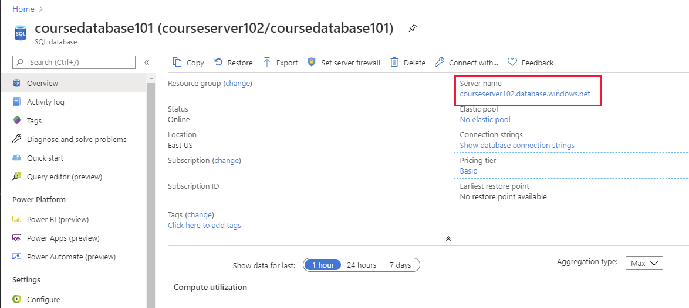
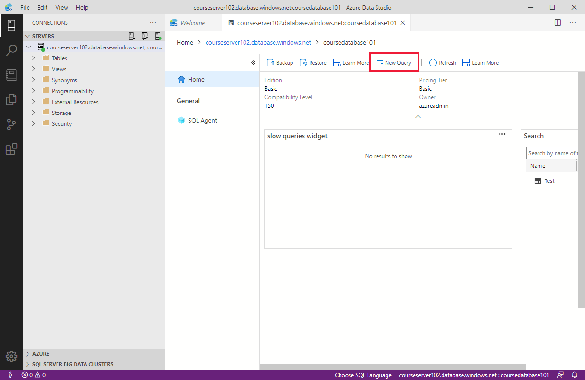
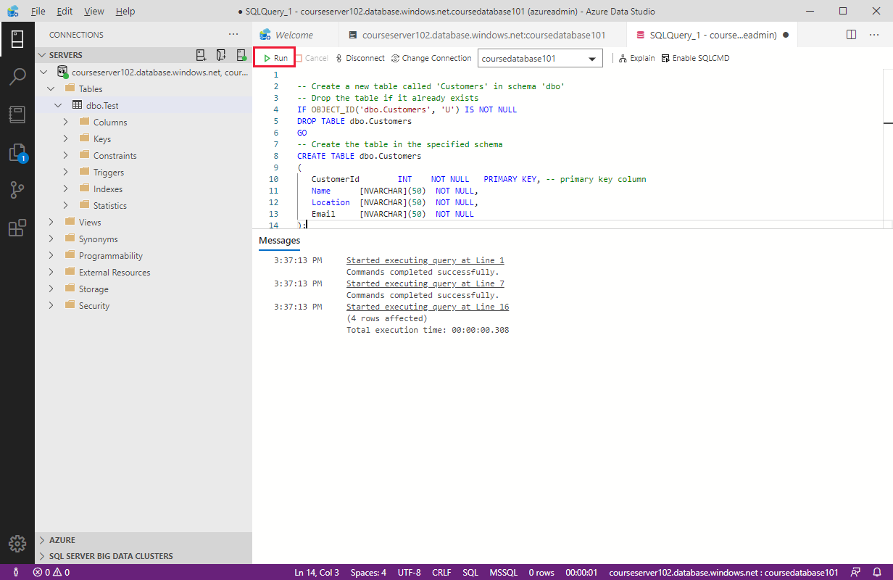
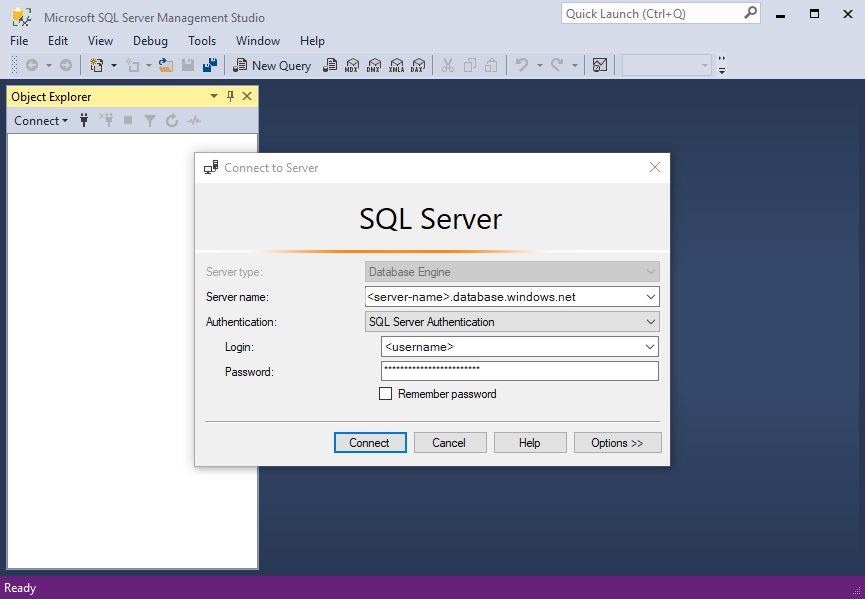
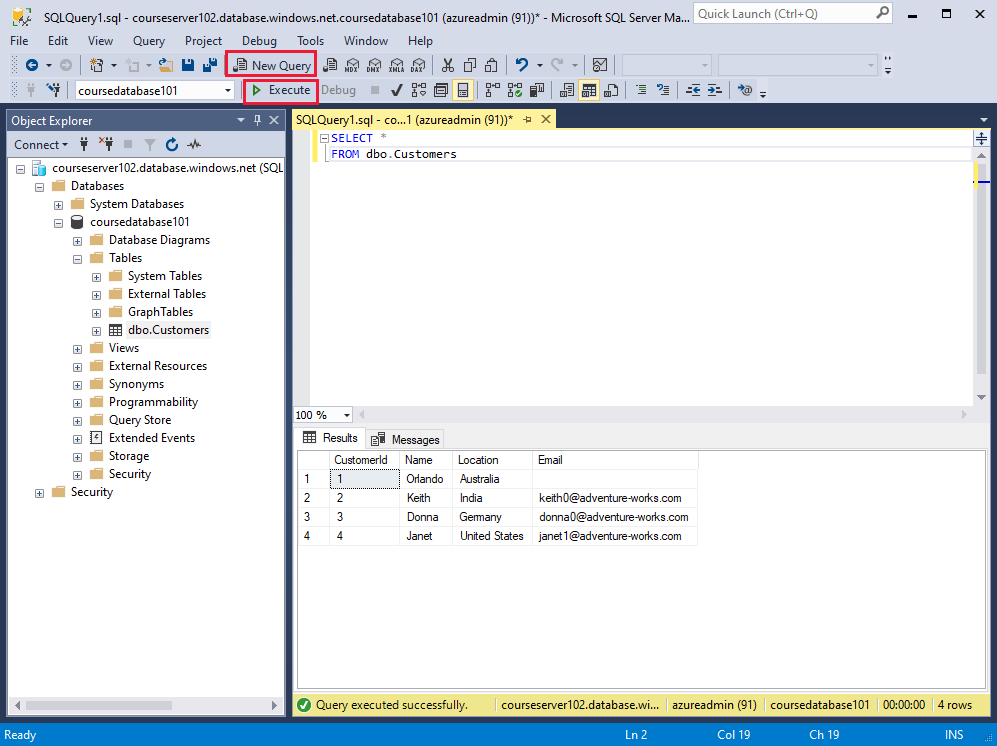
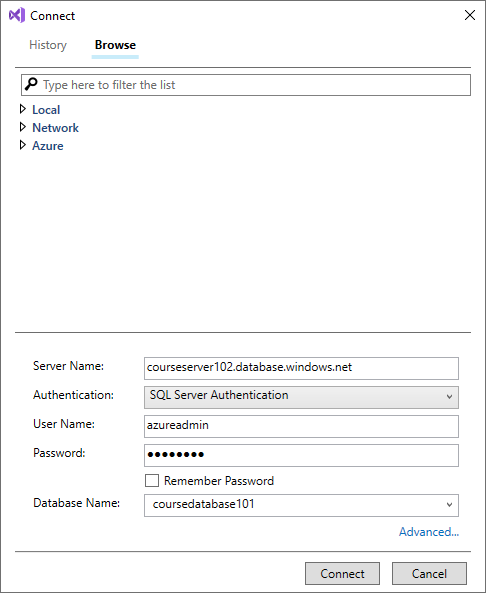
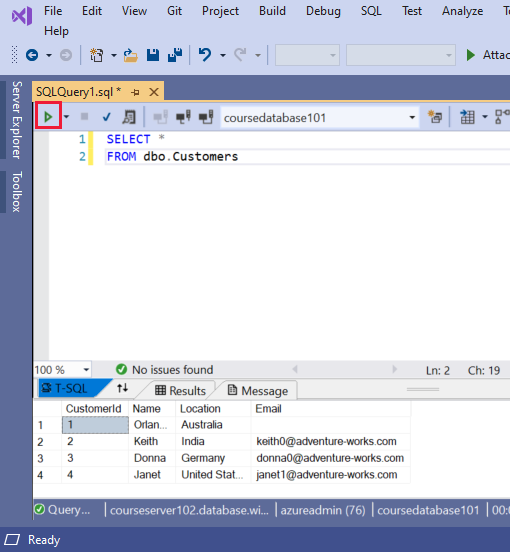

You run SQL commands from tools and utilities that connect to the appropriate database. The tooling available depends on the database management system you're using. In this unit, you'll learn about the tools you can use to connect to Azure SQL Database.

## Retrieve connection information for Azure SQL Database

You can use any of these tools to query data held in Azure SQL Database:

- The query editor in the Azure portal
- The `sqlcmd` utility from the command line or the Azure Cloud Shell
- SQL Server Management Studio
- Azure Data Studio
- SQL Server Data Tools

To use these tools, you first need to establish a connection to the database. You'll require the details of the server to connect to, an Azure SQL Database account (a username and password) that has access to this server, and the name of the database to use on this server. You can find the server name for a database using the Azure portal: go to the page for your database, and on the **Overview** page note the fully qualified server name in the **Server name** field.

> [!div class="mx-imgBorder"]
> 

Some tools and applications require a connection string that identifies the server, database, account name, and password. You can find this information from the **Overview** page for a database in the Azure portal: select **Show database connection strings**.

> [!NOTE]
> The database connection string shown in the Azure portal does not include the password for the account. You must contact your database administrator for this information.

## Use the Azure portal to query a database

To access the query editor in the Azure portal, go to the page for your database and select **Query editor**. You'll be prompted for credentials. You can set the **Authorization type** to **SQL Server authentication** and enter the user name and password that you set up when you created the database. Or you can select **Active Directory password authentication** and provide the credentials of an authorized user in Azure Active Directory. If Active Directory single sign-on is enabled, you can connect by using your Azure identity.

 > [!div class="mx-imgBorder"]
 > 

You enter your SQL query in the query pane and then click **Run** to execute it. Any rows that are returned appear in the **Results** pane. The **Messages** pane displays information such as the number of rows returned, or any errors that occurred:

 > [!div class="mx-imgBorder"]
 > 

You can also enter INSERT, UPDATE, DELETE, CREATE, and DROP statements in the query pane.

## Use SQLCMD to query a database

The `sqlcmd` utility runs from the command line and is also available in the  Cloud Shell. You specify parameters that identify the server, database, and your credentials. The code below shows an example. Replace `<server>` with the name of the database server that you created, `<database>` with the name of your database, and `<user name>` and `<password>` with your credentials.

> [!NOTE]
> To use the sqlcmd utility from the command line, you must install the Microsoft command line utilities on your computer. You can find download instructions, and more details on running the sqlcmd utility on the [sqlcmd Utility](https://docs.microsoft.com/sql/tools/sqlcmd-utility) web page.

```bash
sqlcmd -S <server>.database.windows.net -d <database> -U <username> -P <password>
```

If the sign-in command succeeds, you'll see a `1>` prompt. You can enter SQL commands, then type **GO** on a line by itself to run them.

## Use Azure Data Studio

Azure Data Studio is a graphical utility for creating and running SQL queries from your desktop. For download and installation instructions, visit the [Download and install Azure Data Studio](https://docs.microsoft.com/sql/azure-data-studio/download-azure-data-studio) page on the Microsoft website.

The first time you run Azure Data Studio the **Welcome** page should open. If you don't see the **Welcome** page, select **Help**, and then select **Welcome**. Select **Create a connection** to open the **Connection** pane:

1. Fill in the following fields using the server name, user name, and password for your Azure SQL Server:

    |Setting  |Description  |
    |---------|---------|
    |Server name	     | The fully qualified server name. You can find the server name in the Azure portal, as described earlier. |
    |Authentication    | SQL Login or Windows Authentication. Unless you're using Azure Active Directory, select SQL Login. |
    |User name   | The server admin account user name. Specify the user name from the account used to create the server.        |
    |Password    | The password you specified when you provisioned the server.  |
    |Database name   | The name of the database to which you wish to connect. |
    |Server Group  | If you have many servers, you can create groups to help categorize them. These groups are for convenience in Azure Data Studio, and don't affect the database or server in Azure. |
    
    > [!div class="mx-imgBorder"]
    > 

1. Select **Connect**.

    If your server doesn't have a firewall rule allowing Azure Data Studio to connect, the Create new firewall rule form opens. Complete the form to create a new firewall rule. For details, see [Create a server-level firewall rule using the Azure portal](https://docs.microsoft.com/azure/azure-sql/database/firewall-create-server-level-portal-quickstart).

1. After successfully connecting, your server is available in the **SERVERS** sidebar on the **Connections** page. You can now use the **New Query** command to create and run scripts of SQL commands.

    > [!div class="mx-imgBorder"]
    > 

The example below uses Transact-SQL commands to create a new database (CREATE DATABASE and ALTER DATABASE commands are part of the Transact-SQL dialect, and aren't part of standard SQL). The script then creates a new table named Customers, and inserts four rows into this table. Again, the version of the INSERT statement, with four VALUES clauses, is part of the Transact-SQL dialect. The `--` characters start a comment in Transact-SQL. The `[` and `]` characters surround identifiers, such as the name of a table, database, column, or data type. The `N` character in front of a string indicates that the string uses the Unicode character set.

> [!NOTE]
> You can't create new SQL databases from a connection in Azure Data Studio if you're running SQL Database single database or elastic pools. You can only create new databases in this way if you're using SQL Database managed instance.

```SQL
IF NOT EXISTS (
   SELECT name
   FROM sys.databases
   WHERE name = N'TutorialDB'
)
CREATE DATABASE [TutorialDB];
GO
    
ALTER DATABASE [TutorialDB] SET QUERY_STORE=ON;
GO

-- Switch to the TutorialDB database
USE [TutorialDB]
GO

-- Create a new table called 'Customers' in schema 'dbo'
-- Drop the table if it already exists
IF OBJECT_ID('dbo.Customers', 'U') IS NOT NULL
DROP TABLE dbo.Customers;
GO

-- Create the table in the specified schema
CREATE TABLE dbo.Customers
(
   CustomerId        INT    NOT NULL   PRIMARY KEY, -- primary key column
   Name      [NVARCHAR](50)  NOT NULL,
   Location  [NVARCHAR](50)  NOT NULL,
   Email     [NVARCHAR](50)  NOT NULL
);
GO
    
-- Insert rows into table 'Customers'
INSERT INTO dbo.Customers
   ([CustomerId],[Name],[Location],[Email])
VALUES
   ( 1, N'Orlando', N'Australia', N''),
   ( 2, N'Keith', N'India', N'keith0@adventure-works.com'),
   ( 3, N'Donna', N'Germany', N'donna0@adventure-works.com'),
   ( 4, N'Janet', N'United States', N'janet1@adventure-works.com');
GO
```

To execute the script, select **Run** on the toolbar. Notifications appear in the MESSAGES pane showing query progress.

> [!div class="mx-imgBorder"]
> 

## Use SQL Server Management Studio

SQL Server Management Studio is another tool that you can download and run on your desktop. See [Download SQL Server Management Studio (SSMS)](https://docs.microsoft.com/sql/ssms/download-sql-server-management-studio-ssms) for details.

To connect to a server and database, perform the following steps:

1. Open SQL Server Management Studio.

1. When the **Connect to Server** dialog box appears, enter the following information:

    |Setting | Value  |
    |---------|---------|---------|
    |Server type   | **Database engine**        |
    |Server name	   | The fully qualified server name, from the **Overview** page in the Azure portal        |
    |Authentication     |SQL Server Authentication | 
    |Login     |  The user ID of the server admin account used to create the server.        |
    |Password    |  Server admin account password       |
      
    > [!div class="mx-imgBorder"]
    > 

1. Select **Connect**. The Object Explorer window opens.

1. To view the database's objects, expand **Databases** and then expand your database node.

1. On the toolbar, select **New Query** to open a query window. 

1. Enter your SQL statements, and then select **Execute** to run queries and retrieve data from the database tables.

    > [!div class="mx-imgBorder"]
    > 

## Use SQL Server Data Tools in Visual Studio

Visual Studio is a popular development tool for building applications. It's available in several editions. You can download the free community edition from the [Visual Studio Downloads](https://visualstudio.microsoft.com/downloads/) page on the Microsoft website.

SQL Server Data Tools are available from the **Tools** menu in Visual Studio. To connect to an existing Azure SQL Database instance:

1. In Visual Studio, on the **Tools** menu, select **SQL Server**, and then select **New Query**. 

1. In the **Connect** dialog box, enter the following information, and then select **Connect**:

    |Setting | Value  |
    |---------|---------|---------|
    |Server name	   | The fully qualified server name, from the **Overview** page in the Azure portal        |
    |Authentication     |SQL Server Authentication | 
    |Login     |  The user ID of the server admin account used to create the server        |
    |Password    |  Server admin account password       |
    |Database Name | Your database name |


    > [!div class="mx-imgBorder"]
    > 

1. In the **Query** window, enter your SQL query, and then select the **Execute** button in the toolbar. The results appear in the **Results** pane.

    > [!div class="mx-imgBorder"]
    > 