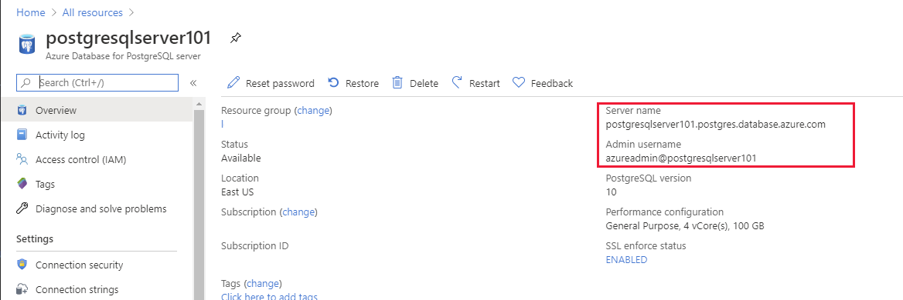
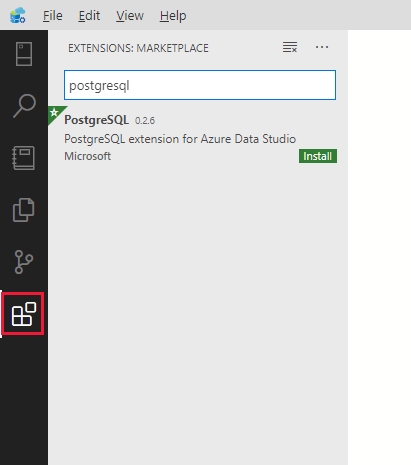
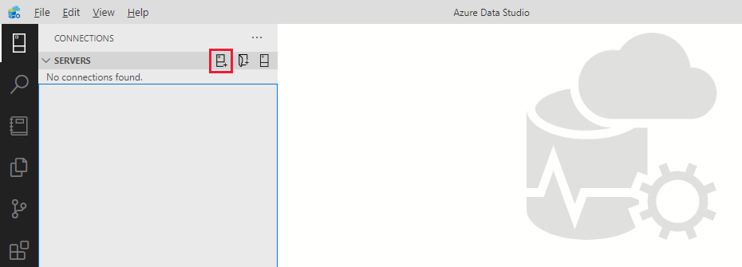
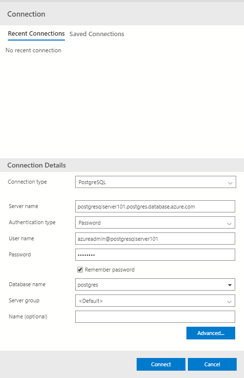
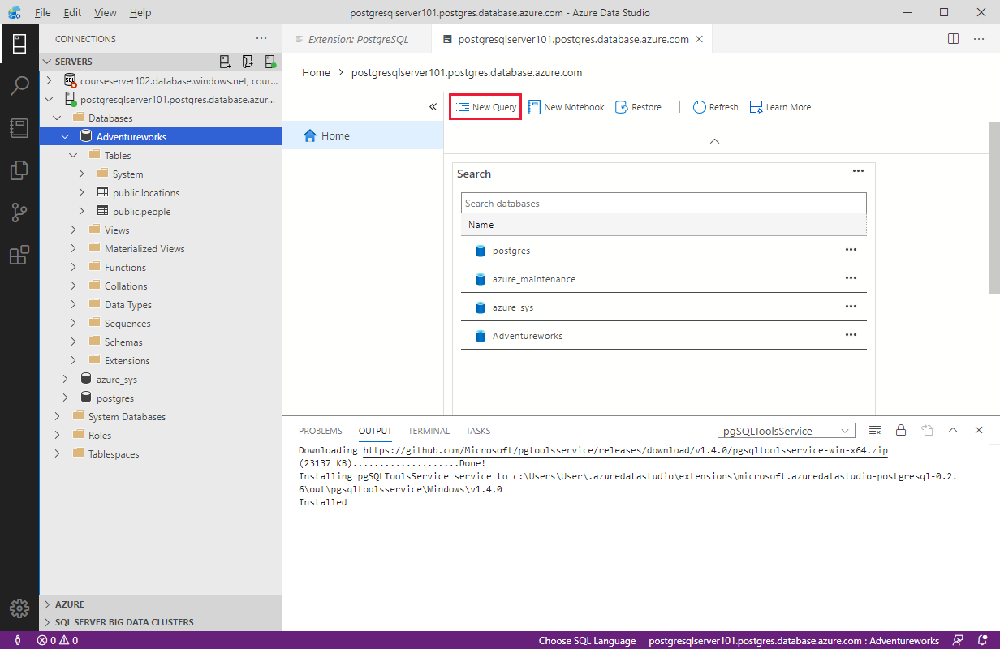

PostgreSQL provides many tools you can use to connect to a PostgreSQL database and run queries. These tools include the **pgAdmin** graphical user interface, and the **psql** command-line utility. There are a large number of third-party utilities you can use as well. 

In this unit, you'll see how to connect to a PostgreSQL database running in Azure Database for PostgreSQL from the command line using **psql**, and from Azure Data Studio. 

## Retrieve connection information for Azure Database for PostgreSQL

To connect to a PostgreSQL database, you require the name of the server, and the credentials for an account that has access rights to connect to the server. You can find the server name and the name of the default administrator account on the **Overview** page for the Azure Database for PostgreSQL instance in the Azure portal. Contact your administrator for the password.

> [!div class="mx-imgBorder"]
> 

As with Azure SQL Database, you must open the PostgreSQL firewall to enable client applications to connect to the service. For detailed information, see [Firewall rules in Azure Database for PostgreSQL - Single Server](https://docs.microsoft.com/azure/postgresql/concepts-firewall-rules)

## Use psql to query a database

The **psql** utility is available in the Azure Cloud Shell. You can also run it from a command prompt on your desktop computer, but you must download and install the psql client. You can find the psql client on the [postgresql.org](http://postgresql.org) website.

To connect to Azure Database for PostgreSQL using **psql**, perform the following operations:

1. Run the following command. Make sure to replace the server name and admin name with the values from the Azure portal.

    ```bash
    psql --host=<server-name>.postgres.database.azure.com --username=<admin-user>@<server-name> --dbname=postgres
    ```

    Enter your password when prompted.

    > [!NOTE]
    > **postgres** is the default management database created with Azure Database for PostgreSQL. You can create additional databases using the **CREATE DATABASE** command from psql.

1. If your connection is successful, you'll see the prompt `postgres=>`.

1. You can create a new database with the following SQL command:

    ```sql
    CREATE DATABASE "Adventureworks";
    ```

    > [!NOTE]
    > You can enter commands across several lines. The semi-colon character acts as the command terminator.

1. Inside psql, you can run the command `\c Adventureworks` to connect to the database.

1. You can create tables and insert data using CREATE and INSERT commands, as shown in the following examples::

    ```sql
    CREATE TABLE PEOPLE(NAME TEXT NOT NULL, AGE INT NOT NULL);
    INSERT INTO PEOPLE(NAME, AGE) VALUES ('Bob', 35);
    INSERT INTO PEOPLE(NAME, AGE) VALUES ('Sarah', 28);
    CREATE TABLE LOCATIONS(CITY TEXT NOT NULL, STATE TEXT NOT NULL);
    INSERT INTO LOCATIONS(CITY, STATE) VALUES ('New York', 'NY');
    INSERT INTO LOCATIONS(CITY, STATE) VALUES ('Flint', 'MI');
    ```

1. You can retrieve the data you just added using the following SQL commands:

    ```sql
    SELECT * FROM PEOPLE;
    SELECT * FROM LOCATIONS;
    ```

1. Other psql commands include:
    - `\l` to list databases.
    - `\dt` to list the tables in the current database.

1. You can use the `\q` command to quit psql.

## Connect to PostgreSQL database using Azure Data Studio

To connect to Azure Database for PostgreSQL from Azure Data Studio, you must first install the PostgreSQL extension.

1. On the **Extensions** page, search for **postgresql**.

    > [!div class="mx-imgBorder"]
    > 

2. Select the **PostgreSQL** extension, and then select **Install**.


You can then use the extension to connect to PostgreSQL:

1. In Azure Data Studio, go to the **SERVERS** sidebar, and select **New Connection**.

    > [!div class="mx-imgBorder"]
    > 

1. In the **Connection** dialog box, in the **Connection type** drop-down list box, select **PostgreSQL**.

1. Fill in the remaining fields using the server name, user name, and password for your PostgreSQL server.

    > [!div class="mx-imgBorder"]
    > 
    
    | Setting  | Description  |
    |---------|---------|
    | Server Name  | The fully qualified server name from the Azure portal. |
    | User name  | The user name you want to sign in with. This must be in the format shown in the Azure portal, \<username\>@\<hostname\>. |
    | Password  | The password for the account you're logging in with. |
    | Database name  | Fill this if you want the connection to specify a database. |
    | Server Group | This option lets you assign this connection to a specific server group you create. |
    | Name (optional) | This option lets you specify a friendly name for your server. |

1. Select **Connect** to establish the connection. After successfully connecting, your server opens in the **SERVERS** sidebar. You can expand the **Databases** node to connect to databases on the server and view their contents. Use the **New Query** command in the toolbar to create and run queries.

    > [!div class="mx-imgBorder"]
    > 

    The following example adds a new table to the database and inserts four rows.

    ```SQL
    -- Create a new table called 'customers'
    CREATE TABLE customers(
        customer_id SERIAL PRIMARY KEY,
        name VARCHAR (50) NOT NULL,
        location VARCHAR (50) NOT NULL,
        email VARCHAR (50) NOT NULL
    );

    -- Insert rows into table 'customers'
    INSERT INTO customers
        (customer_id, name, location, email)
    VALUES
        ( 1, 'Orlando', 'Australia', ''),
        ( 2, 'Keith', 'India', 'keith0@adventure-works.com'),
        ( 3, 'Donna', 'Germany', 'donna0@adventure-works.com'),
        ( 4, 'Janet', 'United States','janet1@adventure-works.com');
    ```

1. From the toolbar, select **Run** to execute the query. As with Azure SQL, notifications appear in the **MESSAGES** pane to show query progress.

1. To query the data, enter a SELECT statement, and then click **Run**:
    
    ```SQL
    -- Select rows from table 'customers'
    SELECT * FROM customers; 
    ```

1. The results of the query should appear in the results pane.