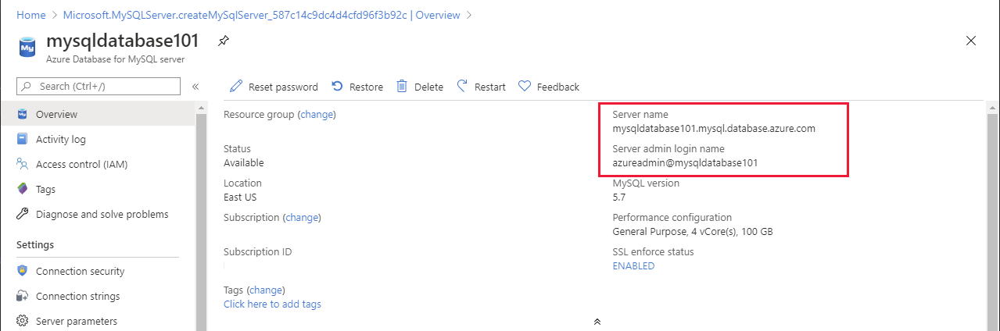
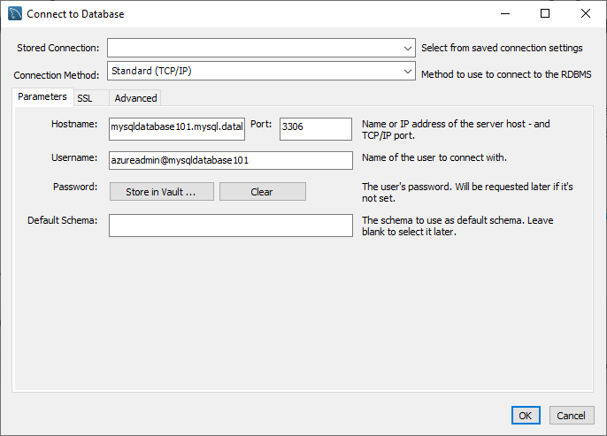
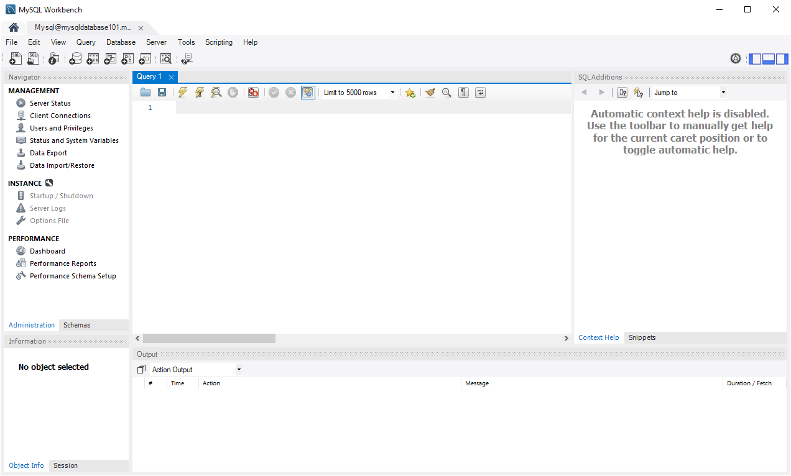
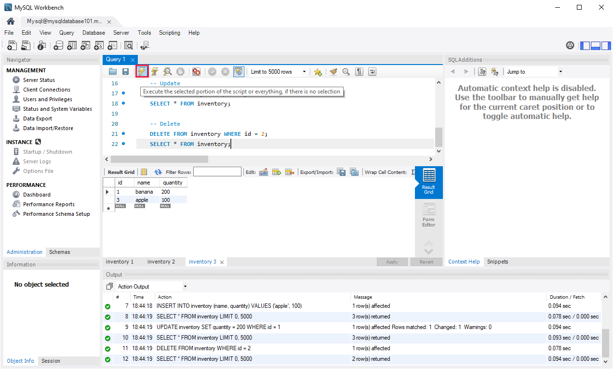

As with PostgreSQL, there are many tools available to connect to MySQL that enable you to create and run scripts of SQL commands. You can use the **mysql** command-line utility, which is also available in the Azure Cloud Shell, or you can use graphical tools from the desktop such as MySQL Workbench. 

In this unit, you'll see how to connect to Azure Database for MySQL using MySQL Workbench. 

> [!NOTE]
> Currently there are no extensions available for connecting to MySQL from Azure Data Studio.

## Retrieve connection information for Azure Database for MySQL

Like SQL Database and PostgreSQL, you require the name of the server, and the credentials for an account that has access rights to connect to the server. You can find the server name and the name of the default administrator account on the **Overview** page for the Azure Database for MySQL instance in the Azure portal. Contact your administrator for the password.

> [!div class="mx-imgBorder"]
> 

You must also open the MySQL firewall to enable client applications to connect to the service. For detailed information, see [Azure Database for MySQL server firewall rules](https://docs.microsoft.com/azure/mysql/concepts-firewall-rules).

## Use MySQL Workbench to query a database

You can download and install MySQL Workbench from the [MySQL Community Downloads](https://dev.mysql.com/downloads/workbench) page.

To connect to Azure MySQL Server by using MySQL Workbench, perform the following steps:

1. Start MySQL Workbench on your computer.

1. On the **Welcome** page, select **Connect to Database**.

    > [!div class="mx-imgBorder"]
    >

1. In the **Connect to Database** dialog box, enter the following information on the **Parameters** tab:

    > [!div class="mx-imgBorder"]
    >
    
    |Setting |Description  |
    |---------|---------|
    |Stored connection  | Leave blank  |
    |Connection Method  | Standard (TCP/IP)       |
    |Hostname     | Specify the fully qualified server name from the Azure portal |
    |Port     | 3306   |
    |Username     | Enter the server admin login username from the Azure portal, in the format *\<username>*\<databasename>     |
    |Password    | Select **Store in Vault**, and enter the administrator password specified when the server was created  |


1. Select **OK** to create the connection. If the connection is successful, the query editor will open.


    > [!div class="mx-imgBorder"]
    >

1. You can use this editor to create and run scripts of SQL commands. The following example creates a database named *quickstartdb*, and then adds a table named *inventory*. It inserts some rows, then reads the rows. It changes the data with an update statement, and reads the rows again. Finally it deletes a row, and then reads the rows again.

    ```sql
    -- Create a database
    -- DROP DATABASE IF EXISTS quickstartdb;
    CREATE DATABASE quickstartdb;
    USE quickstartdb;
    
    -- Create a table and insert rows
    DROP TABLE IF EXISTS inventory;
    CREATE TABLE inventory (id serial PRIMARY KEY, name VARCHAR(50), quantity INTEGER);
    INSERT INTO inventory (name, quantity) VALUES ('banana', 150);
    INSERT INTO inventory (name, quantity) VALUES ('orange', 154);
    INSERT INTO inventory (name, quantity) VALUES ('apple', 100);
    
    -- Read
    SELECT * FROM inventory;
    
    -- Update
    UPDATE inventory SET quantity = 200 WHERE id = 1;
    SELECT * FROM inventory;
    
    -- Delete
    DELETE FROM inventory WHERE id = 2;
    SELECT * FROM inventory;
    ```

    
1. To run the sample SQL Code, select the lightning bolt icon in the toolbar

    > [!div class="mx-imgBorder"]
    >

    The query results appear in the **Result Grid** section in the middle of the page. The **Output** list at the bottom of the page shows the status of each command as it is run.
