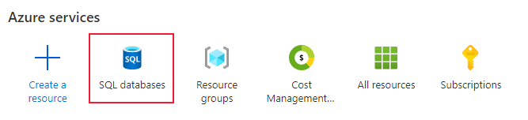
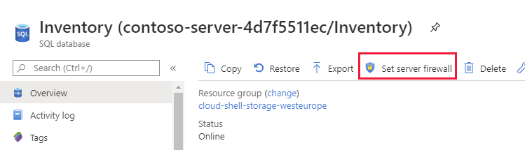
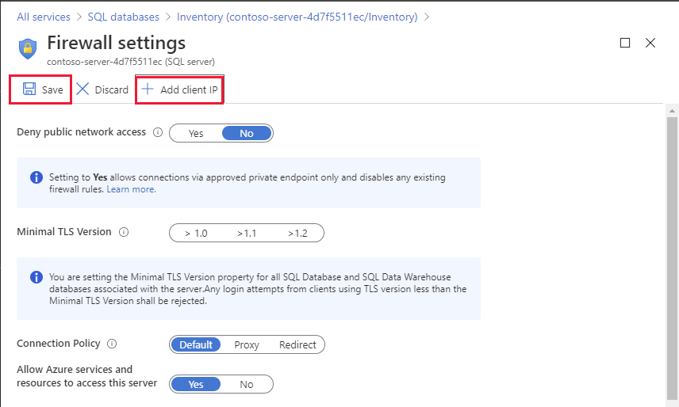
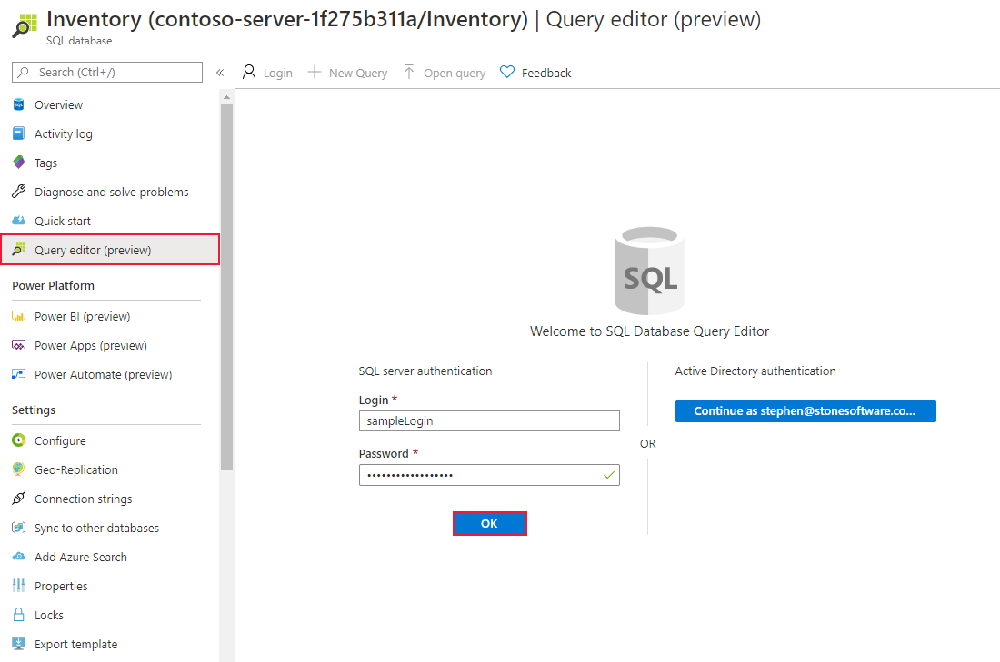
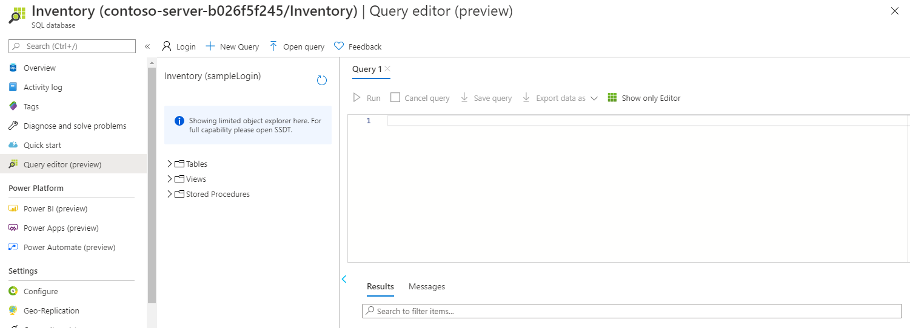
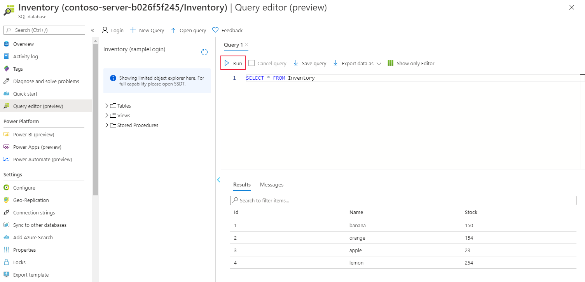
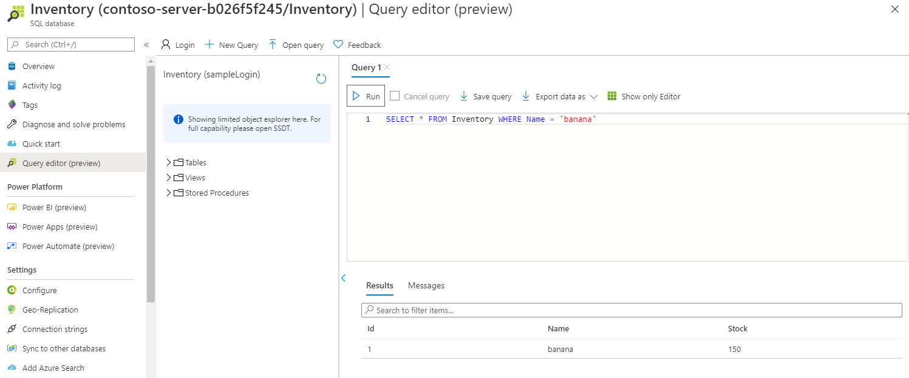
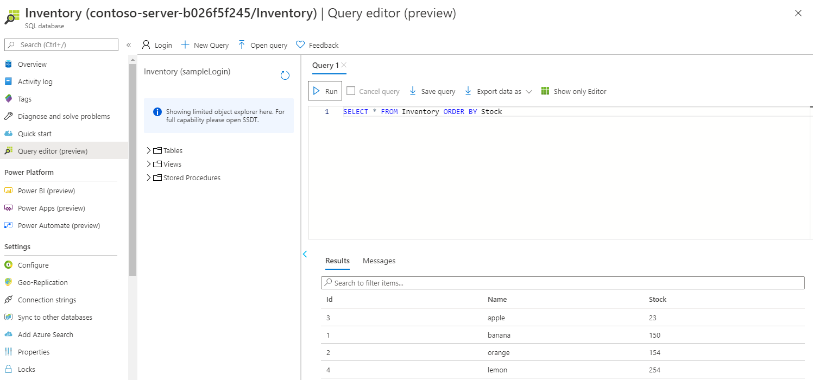
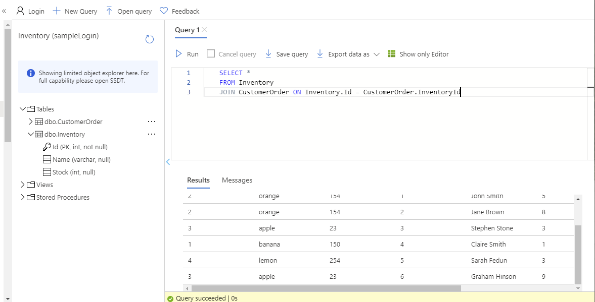

Contoso has provisioned the SQL database and has imported all the inventory data into the data store. As lead developer, you've been asked to run some queries over the data.

In this exercise, you'll query the database to find how many products are in the database, and the number of items in stock for a particular product.

## Setup

To save time, the database is provisioned and populated running a script. You'll download the script from a GitHub repository. The script performs the following operations:

- Creates an Azure SQL Database server.
- Creates an Azure SQL database attached to the server.
- Opens the firewall to allow SQL traffic from the internet.
- Connects to the database and run a SQL script to create a table and insert data.

1. Run the following *git clone* command in the Cloud Shell to clone the repository that contains the data and setup script in GitHub. The repository is copied to a local folder named *dp-900/sql*.

    ```bash
    git clone https://github.com/MicrosoftLearning/DP-900T00A-Azure-Data-Fundamentals dp-900
    ```

2. Run the following command to move to the *dp-900/sql* folder.

    ```bash
    cd dp-900/sql
    ```

3. Run the **setup.sh** to create the Azure SQL database and server, as follows:

    ```bash
    bash setup.sh
    ```

The script takes a few minutes to run. When the script finishes, it will display the connection details for the database. Write down the username and password.

## Connect to the query editor

You'll use the built-in Query editor in the Azure portal to connect to the database and query the data.

1. Sign into the [Azure portal](https://portal.azure.com/learn.docs.microsoft.com?azure-portal=true) using the same account you activated the sandbox with.

1. In the portal, on the home page select **SQL databases**, and then select *Inventory* database located on the server you have just created.

    > [!div class="mx-imgBorder"]
    >

1. On the **Overview** page for your database, select **Set server firewall**.

    > [!div class="mx-imgBorder"]
    >

1. On the **Firewall settings** page, select **Add client IP**, and then select **Save**.

    > [!div class="mx-imgBorder"]
    >

1. Close the **Firewall settings** page, and return to the **Overview** page for your database.

1. On the **Overview** page, select **Query editor (preview)** in the left menu.

1. Enter the username and password you recorded earlier when the setup script ran, and then select **OK**.

    > [!div class="mx-imgBorder"]
    >

    You'll be presented with a screen similar to this example:

    > [!div class="mx-imgBorder"]
    >

> [!TIP]
> Adding your client IP in this step will not account for any existing VPN connections. If you can't complete step 7,  disable any VPN connections or add the additional IP address manually from any errors displayed.

## Run queries against the database

1. Copy the following SQL statement into the editor. Select **Run**, to check everything is working. You should see a list of four inventory items

    ```SQL
    SELECT * 
    FROM Inventory
    ```

    > [!div class="mx-imgBorder"]
    >

1. Replace the current SQL statement with the following statement to only show the number of bananas in stock:

    ```sql
    SELECT * 
    FROM Inventory 
    WHERE Name = 'banana'
    ```

    There should be 150 bananas.
    
    > [!div class="mx-imgBorder"]
    >

1. Replace the SQL statement with the following statement to retrieve the inventory items in order of the quantity in stock:

    ```sql
    SELECT * 
    FROM Inventory 
    ORDER BY Stock
    ```
    
    > [!div class="mx-imgBorder"]
    >

1. Replace the SQL statement with the statement shown below. This statement is a query that uses the  **JOIN** operator to combine data from the *CustomerOrder* table and the *Inventory* table. It lists the details of orders placed by customers together with the inventory information for each item ordered:
    
    ```sql
    SELECT * 
    FROM Inventory 
    JOIN CustomerOrder ON Inventory.Id = CustomerOrder.InventoryId
    ```
    
    > [!div class="mx-imgBorder"]
    >

1. Change the query to find the names of all customers who have ordered oranges.

    ```sql
    SELECT CustomerOrder.CustomerName 
    FROM CustomerOrder
    JOIN Inventory ON CustomerOrder.InventoryId = Inventory.ID
    AND Inventory.Name = 'orange'
    ```

    This query should return two customers: John Smith and Jane Brown 

1. Find out how many customers have ordered lemons. This query uses the **COUNT(*)** function, which returns the number of rows that match the query criteria.

    ```sql
    SELECT COUNT(*) 
    FROM CustomerOrder
    JOIN Inventory ON CustomerOrder.InventoryId = Inventory.ID
    AND Inventory.Name = 'lemon'
    ```

    The results of this query should indicate that only one customer has ordered lemons.

1. Which fruits has John Smith ordered?

    ```sql
    SELECT Inventory.Name 
    FROM CustomerOrder
    JOIN Inventory ON CustomerOrder.InventoryId = Inventory.ID
    AND CustomerOrder.CustomerName = 'John Smith'
    ```

    The results of this query should show that John Smith has only ordered oranges.

1. What is the total quantity of items ordered by all customers? The *Quantity* column in the *CustomerOrder* table contains the quantity for each order. This query uses the **SUM** aggregate function to add the quantities together to product a grand total:

    ```sql
    SELECT SUM(CustomerOrder.Quantity) 
    FROM CustomerOrder
    ```

    The answer should be 29.

You've now seen how to run SQL queries against a SQL database. If you have time, try to add some more rows into both tables using **INSERT** statements, modify the rows using **UPDATE** statements, and remove rows using **DELETE** statements.

