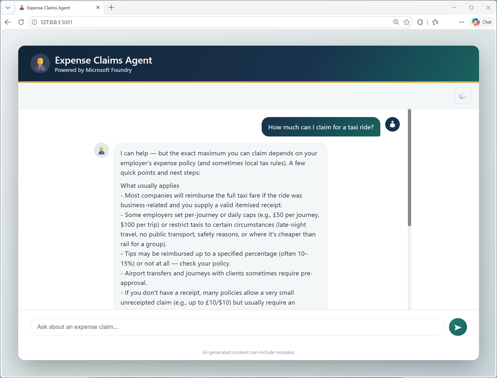

::: zone pivot="video"

> [!VIDEO https://learn-video.azurefd.net/vod/player?id=57032ece-7a75-4dd8-a61d-cf3b6175b1f2]

> [!TIP]
> See the **Text and images** tab for more details!

::: zone-end

::: zone pivot="text"

A language model generates responses from patterns learned during training and the context supplied in its prompt. The model's training gives it broad language and reasoning capabilities, but it has some important limitations:

- **Knowledge boundaries**: The model doesn't automatically know private information, such as an organization's product catalog, support articles, or policies.
- **Knowledge freshness**: Information learned during training can become outdated.
- **Verifiability**: A model can generate a confident response that isn't supported by a reliable source.

For example, suppose a company wants to use an AI agent to help employees with expense claims policies and procedures. The model used by the agent might have some inherent semantic understanding of  expense-related terminology and concepts from its training data; but when asked for company-specific information, such as "*How much can I claim for a taxi ride?*", the model can only provide a general response.

To generate responses that are specific to the company's expenses policies, the agent needs access to specialized knowledge to provide context to the user's question.

## Using RAG to provide context

RAG solves the context problem by combining two capabilities:

- **Retrieval**: Searching selected data sources for information relevant to a user's question.
- **Augmented generation**: Adding the retrieved information to the prompt as context and asking a language model to generate an answer based on that context.

To answer the question "*How much can I claim for a taxi ride?*", A RAG application can search the organization's expense policy documentation, retrieve the section about limits for taxi and rideshare expenses, and include that section in the prompt. The model can then answer using the organization's information rather than relying only on its training.

The result is described as a *grounded response* because the answer is based on supplied source content. A RAG application can also return citations or links so the user can inspect that content.

> [!NOTE]
> RAG doesn't change the language model's learned parameters. Instead, it supplies relevant knowledge at run time, when the user makes a request. Over time, if the organization's expense policies change, the documentation (and the index used to search it) can be updated; so the agent continues to provide up-to-date and relevant information without any need to retrain the model.

::: zone-end
