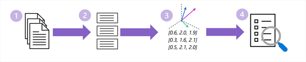

::: zone pivot="video"

> [!VIDEO https://learn-video.azurefd.net/vod/player?id=d27285c5-a58a-4c32-9795-2a9ef2598900]

> [!TIP]
> See the **Text and images** tab for more details!

::: zone-end

::: zone pivot="text"

Retrieval can only find information that has been made searchable. Before a RAG application can answer questions, it needs an *indexing pipeline* that prepares source data.

The indexing pipeline typically performs the following tasks:

1. Extracts the source text.
1. Chunks the text into focused passages.
1. Encodes the text tokens as embedding vectors that encapsulate semantic attributes.
1. Creates an index that can be used to search the embeddings.

Let's explore each of these tasks in more depth.

## Select and process source data

A RAG knowledge source might include product manuals, policies, webpages, database records, support tickets, or other approved content. The preparation process commonly includes these steps:

1. **Load** content from each source.
2. **Extract** useful text and structure from formats such as PDF files, presentations, webpages, or tables.
3. **Clean** content by removing repeated headers, navigation text, or other elements that aren't useful for answering questions.
4. **Add metadata** such as a title, source URL, category, access permissions, and last-updated date.

Source quality matters. Duplicate, outdated, or contradictory documents can lead to poor retrieval and unreliable answers. Access controls are also essential: users should only retrieve content they're authorized to view.

## Divide content into chunks

Documents are often too large to send to a model in full. They're divided into smaller passages called *chunks*. Each chunk should contain enough context to be meaningful while remaining focused on a specific topic.

For example, a travel policy could be split by section into separate chunks for flights, hotels, meals, and ground transportation. A question about hotel limits can then retrieve the hotel section without adding the entire policy to the prompt.

Chunking involves a tradeoff:

- Chunks that are too large can contain irrelevant information and consume more of the model's context window.
- Chunks that are too small can separate a statement from headings, definitions, or other information needed to understand it.

Chunks often overlap slightly so that important context isn't lost at a boundary.

## Create embeddings

RAG solutions commonly use an *embedding model* to convert each chunk into an *embedding*: a numerical vector that represents semantic characteristics of the content. Chunks with similar meanings have embeddings that are close to one another in vector space, even when they use different words.

## Index the data

The solution stores the chunks, their embeddings, and useful metadata in a search index or vector-enabled data store. The index might support:

- **Keyword search**, which is effective when exact words, identifiers, or product codes matter.
- **Vector search**, which finds semantically similar content.
- **Hybrid search**, which combines keyword and vector search.

Preparing data isn't a one-time task. The indexing pipeline should add new content, update changed content, and remove content that is no longer valid so retrieval reflects the current source of truth.

::: zone-end
