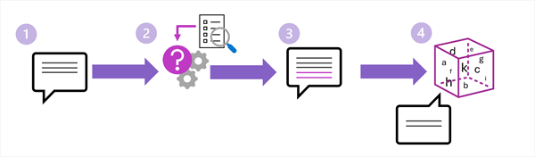

::: zone pivot="video"

> [!VIDEO https://learn-video.azurefd.net/vod/player?id=b8c9c8c3-42d0-44c5-97df-b128b4b32e9d]

> [!TIP]
> See the **Text and images** tab for more details!

::: zone-end

::: zone pivot="text"

After content has been indexed, a RAG application can use it to answer a user's question. This phase happens at run time and usually follows a sequence of steps.

1. A user submits a prompt.
1. A search of the index retrieves relevant contextual text.
1. The context is added to the prompt.
1. The augmented prompt is submitted to the model, which returns a grounded response.

## Retrieve relevant information

First, the application prepares the user's input as a search query. For vector search, it uses the same kind of embedding model used during indexing to convert the query into a vector. The search system compares the query vector with stored chunk vectors and returns the closest matches.

For the question "What is the hotel allowance for an overseas conference?", semantic search might retrieve a policy section titled "International lodging expenses" even though the wording isn't identical.

Retrieval can be refined in several ways:

- Apply metadata filters, such as a region, product, date, document type, or user permission.
- Combine keyword and vector results with hybrid search.
- Rank candidate results to place the most relevant passages first.
- Limit the number of results to avoid filling the prompt with weak or repetitive context.

The aim isn't to retrieve the most content. It's to retrieve the smallest set of content that provides sufficient, relevant evidence for the answer.

## Augment the prompt

The application constructs a prompt that typically contains:

- System instructions that define the assistant's behavior.
- The user's question.
- The retrieved chunks as grounding context.
- Instructions to answer from the supplied context, acknowledge when the context is insufficient, and include citations when available.

For example, the application might instruct the model: "Answer the question using only the provided policy excerpts. If the excerpts don't contain the answer, say that you couldn't find it. Cite the source title."

The prompt must distinguish trusted application instructions from retrieved content. Retrieved documents should be treated as data, not as instructions, because source content could contain text that attempts to redirect the model.

## Generate a grounded response

The language model uses the augmented prompt to generate the response. A well-designed application returns the answer together with links or citations to the retrieved sources. Citations help users verify the response and recognize when a source might be outdated or inappropriate.

RAG reduces the likelihood of unsupported answers, but it doesn't eliminate them. The model might misinterpret good context, or the retriever might supply incomplete information. Applications should therefore be designed to say when the available evidence is insufficient and to support human review in high-impact scenarios.

::: zone-end
