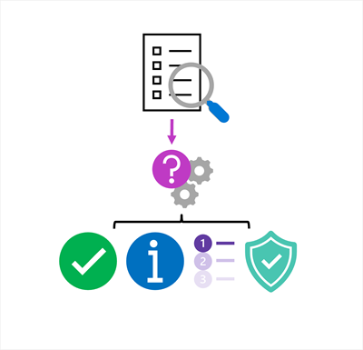
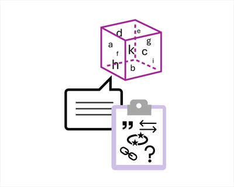
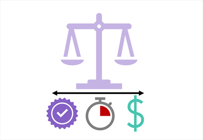

::: zone pivot="video"

> [!VIDEO https://learn-video.azurefd.net/vod/player?id=29af3397-2478-4de8-a49a-9ede695d80ae]

> [!TIP]
> See the **Text and images** tab for more details!

::: zone-end

::: zone pivot="text"

A RAG application is a pipeline, so a good-sounding answer alone doesn't prove that the whole solution works well. Evaluation should examine both the information retrieved and the response generated from it.

## Evaluate retrieval

Retrieval evaluation asks whether the search system returns useful source content.

For a set of representative questions, consider:

- **Relevance**: Do the retrieved chunks address the question?
- **Coverage**: Is all the information needed for a complete answer present?
- **Ranking**: Are the strongest results placed ahead of weaker ones?
- **Security and freshness**: Is the content authorized for the user and still current?

If the correct information isn't retrieved, changing the generation prompt alone won't solve the problem. You might need to improve source content, chunk boundaries, metadata, query processing, search strategy, or ranking.

## Evaluate generation

Generation evaluation considers how the model uses retrieved context.

Considerations for evaluating generated content include:

- **Groundedness**: Is each claim supported by the retrieved content?
- **Relevance**: Does the response directly answer the user's question?
- **Completeness**: Does the answer include the important information in the context?
- **Citation quality**: Do citations point to sources that support the associated claims?
- **Appropriate uncertainty**: Does the application avoid guessing when the context is insufficient?

A useful test set contains realistic questions, expected source passages, and criteria for acceptable answers. It should also include difficult cases, such as ambiguous questions, questions with no answer in the data, outdated documents, and attempts to retrieve unauthorized information.

## Balance quality, latency, and cost

Retrieving and processing more chunks can improve coverage, but it also increases prompt size, response time, and cost. Too much context can even make it harder for the model to focus on the most relevant evidence. RAG design therefore involves balancing answer quality with latency and cost.

Monitoring real usage can reveal unanswered questions, weak citations, slow searches, and changes in content quality. Use these observations to improve the pipeline, and reevaluate it whenever data, models, prompts, or retrieval settings change.

::: zone-end
