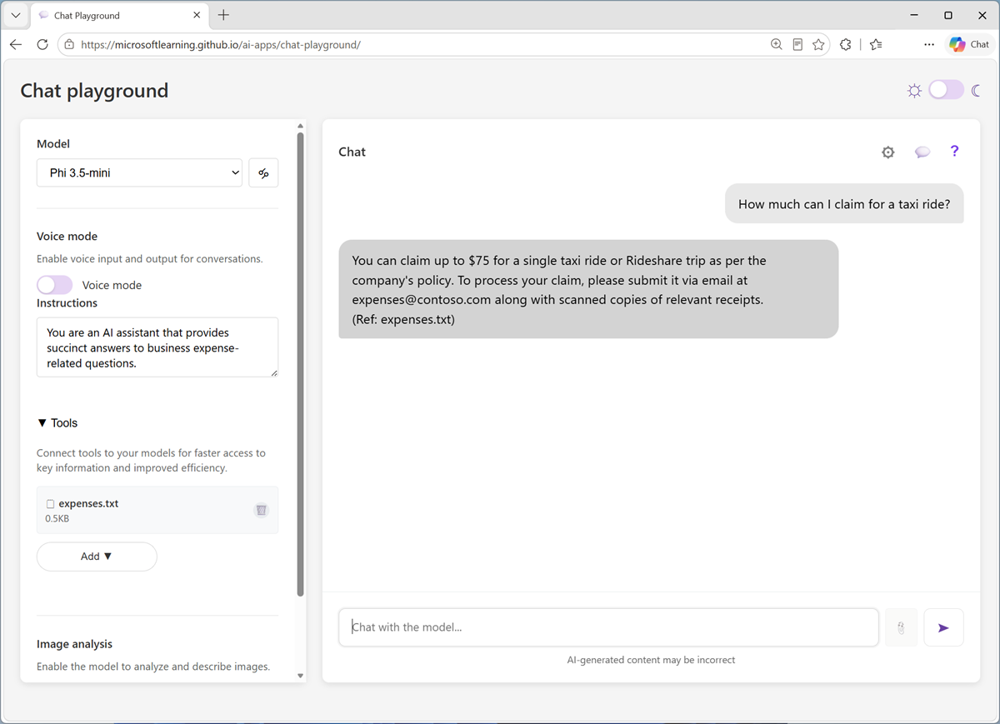

Now it's your chance to explore RAG in a simple chat agent.

In this exercise, you'll examine how providing a knowledge source to contextualize prompts improves the agent's responses.

*Use the following button to start the exercise*

