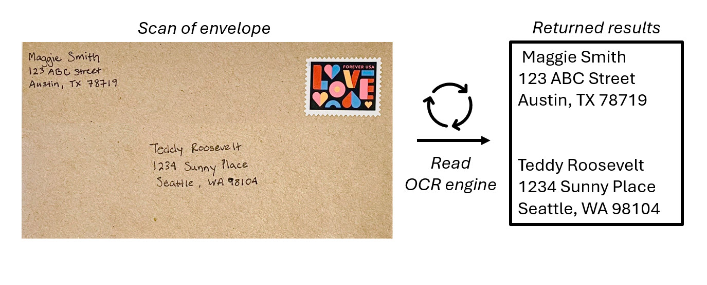
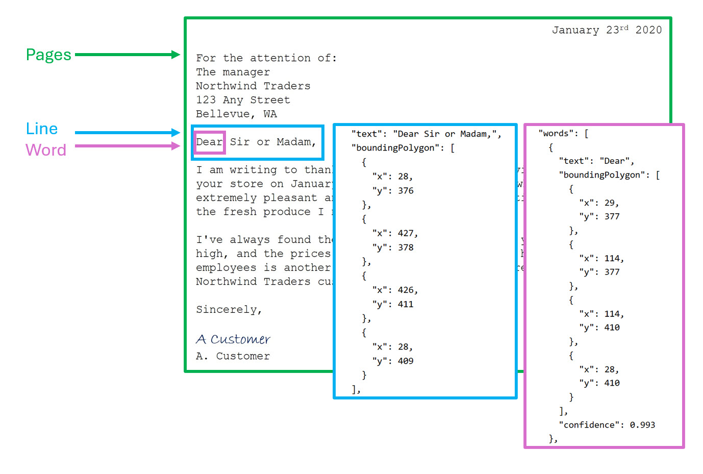

The ability for computer systems to process written and printed text is an area of AI where *computer vision* intersects with *natural language processing*. Vision capabilities are needed to "read" the text, and then natural language processing capabilities make sense of it.

OCR is the foundation of processing text in images and uses machine learning models that are trained to recognize individual shapes as letters, numerals, punctuation, or other elements of text. Much of the early work on implementing this kind of capability was performed by postal services to support automatic sorting of mail based on postal codes. Since then, the state-of-the-art for reading text has moved on, and we have models that detect printed or handwritten text in an image and read it line-by-line and word-by-word.

## Azure AI Vision's OCR Engine
Azure AI Vision service has the ability to extract machine-readable text from images. Azure AI Vision's *Read API* is the OCR engine that powers text extraction from images, PDFs, and TIFF files. OCR for images is optimized for general, non-document images that makes it easier to embed OCR in your user experience scenarios.

The Read API, otherwise known as *Read OCR engine*, uses the latest recognition models and is optimized for images that have a significant amount of text or have considerable visual noise. It can automatically determine the proper recognition model to use taking into consideration the number of lines of text, images that include text, and handwriting.

The OCR engine takes in an image file and identifies bounding boxes, or coordinates, where items are located within an image. In OCR, the model identifies bounding boxes around anything that appears to be text in the image. 

Calling the Read API returns results arranged into the following hierarchy:

- **Pages** - One for each page of text, including information about the page size and orientation.
- **Lines** - The lines of text on a page.
- **Words** - The words in a line of text, including the bounding box coordinates and text itself.

Each line and word includes bounding box coordinates indicating its position on the page.

