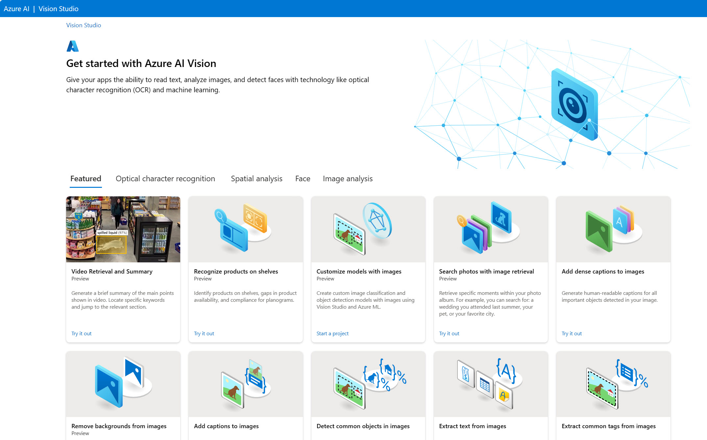
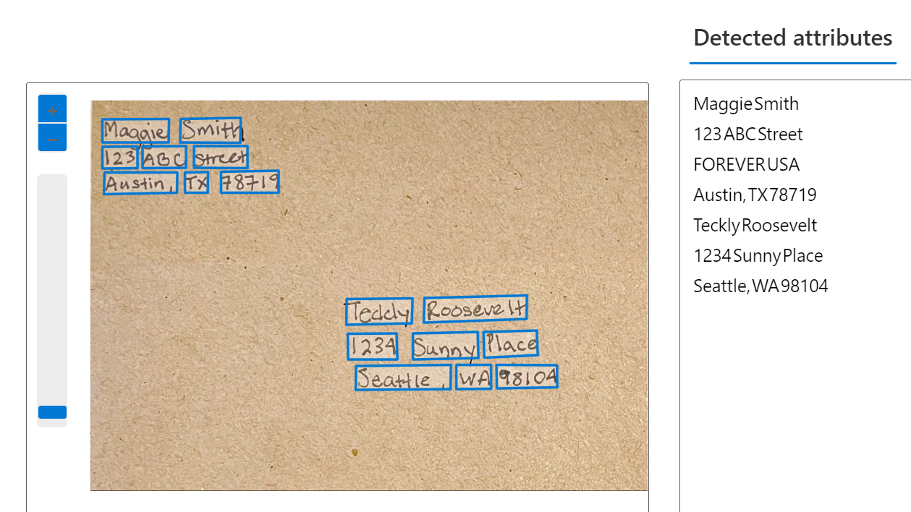
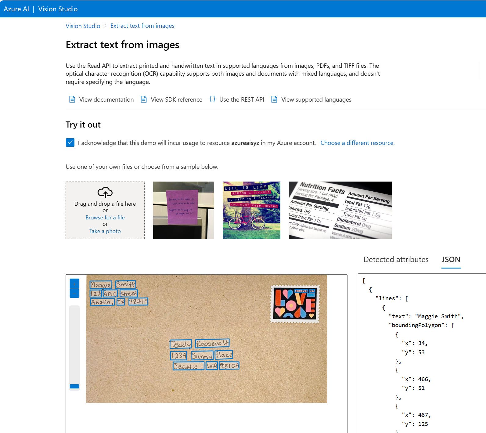

To use the Azure AI Vision service you must first create a resource for it in your Azure subscription. You can use either of the following resource types:

- **Azure AI Vision**: A specific resource for vision services. Use this resource type if you don't intend to use any other AI services, or if you want to track utilization and costs for your AI Vision resource separately.
- **Azure AI services**: A general resource that includes Azure AI Vision along with many other Azure AI services such as Azure AI Language, Azure AI Speech, and others. Use this resource type if you plan to use multiple Azure AI services and want to simplify administration and development.

Once you've created a resource, there are several ways to use Azure AI Vision's Read API: 
- Vision Studio
- REST API 
- Software Development Kits (SDKs): Python, C#, JavaScript

Below we will focus on the Vision Studio.

## Azure AI Vision Studio

Azure AI Vision Studio gives you access to Azure AI Vision APIs through a graphical user interface that does not require coding to get started.  

When you open [Vision Studio](https://portal.vision.cognitive.azure.com/), you need to select your default resource. Your default resource in Vision Studio must be an **Azure AI services** resource, rather than Azure AI Vision resource.

From the Vision Studio home page, you can select Optical Character Recognition and the *Extract text from images* tile to try out the Read OCR engine. Your resource begins to incur usage costs when it is used to return results. Using one of your own files or a sample file, you can see how the Read OCR engine returns **detected attributes**. These attributes correspond with what the machine detects in the bounding boxes. 

Behind the scenes, the image is analyzed for features including people, text, and objects, and marked by bounding boxes. The detected information is processed and the results are returned to the user. The raw results are returned in JSON and include information about the bounding box locations on the page, and the detected text. Keep in mind that Vision Studio can return examples of OCR, but to build your own OCR application, you need to work with an SDK or REST API.   

