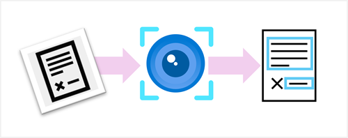

We live in a digital world, in which data is increasingly captured as images. Often, those images contain text, which you need to be able to extract from their pixelated format in the image for processing, indexing, and other tasks. Everyday examples include:

- Meeting a new business associate and taking a photograph of their business card to store their contact details digitally.
- Scanning a document or ID card to include in an application for a government or commercial service.
- Taking a photo of a menu or recipe to store it in a digital notebook.
- Photographing street signs or store fronts so you can submit the text they contain to a translation app.
- Digitizing handwritten notes using a cellphone camera.

In this module, we'll explore the *optical character recognition* (OCR) capabilities of the Azure AI Vision *Image Analysis* API, which makes these scenarios, and more, possible.
