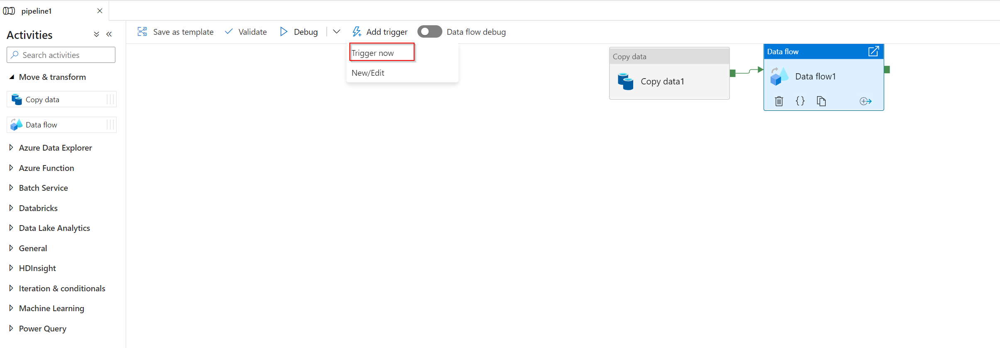

Once you have verified that an Azure Data Factory pipeline run works through the debug feature in Azure Data Factory, you are able to publish it in the Azure Data Factory service. If you publish all, you publish all the changes and updates you have made in the pipeline itself. 

Azure Data factory first runs a validation check to validate that all the resources (the data flow mapping, the storages settings, and so forth) meet the requirements. If the requirements are not met you’ll see a side panel explaining, in detail, what the error is and how to fix it. 

If the validation check succeeds, you can trigger the pipeline. **Trigger now** will start one manual pipeline run, however it is also possible to create a schedule or event-based trigger to operationalize the pipeline in Azure Data Factory.  

If you triggered the data flow, data flow will start a just-in-time Apache Spark cluster, which terminates once the pipeline is finished and the job is concluded. 
However, since it’s a just-in-time Apache Spark cluster, the data flow activity might take 5-7 minutes since the Apache Spark cluster has to be activated.  

Once you start developing more pipelines, it is important to keep track of the pipelines you created. To do so, there is a Monitor tab in Azure Data Factory, which by default will store all the run information for 45 days. If you want to keep the metrics longer than the default time, you can configure Azure Data Factory with Azure Monitor. 

In the activity runs view, you are able to check the details of the pipeline run just like the debug run. 

Now that you have learned to publish and monitor a pipeline in Azure Data Factory, in the next unit you will monitor the pipeline. 
