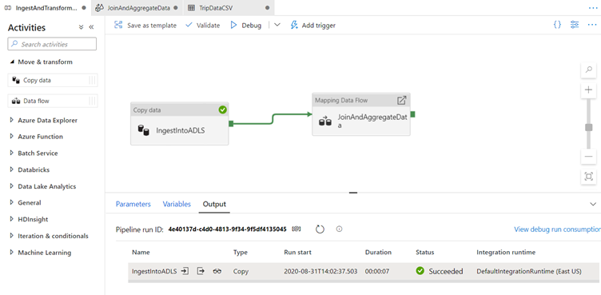
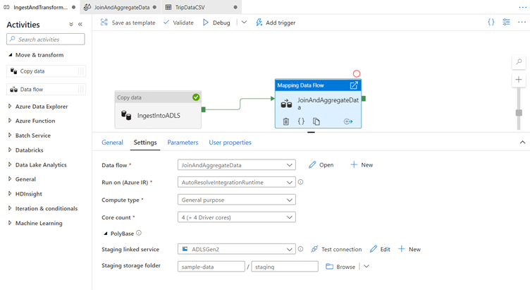
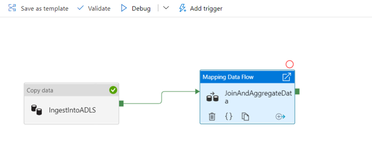
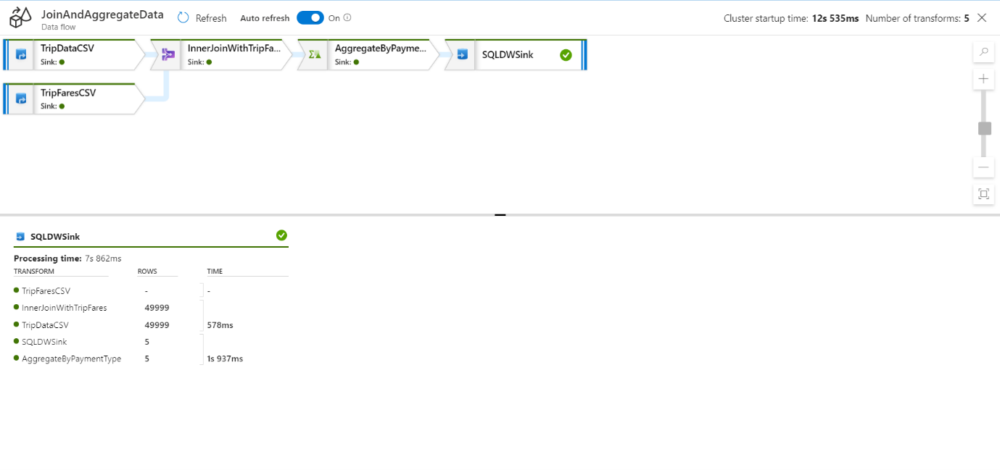
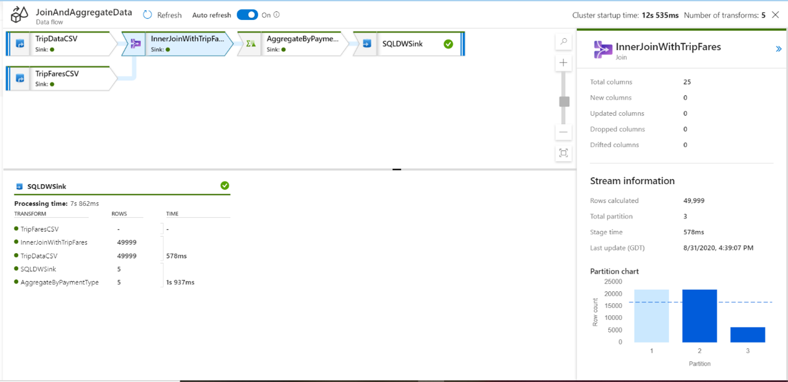
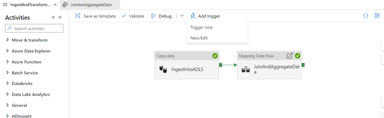
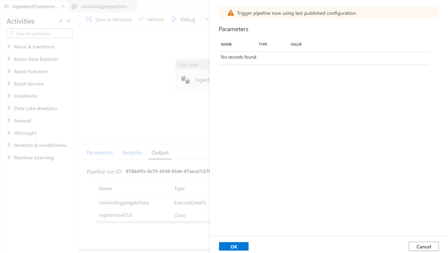
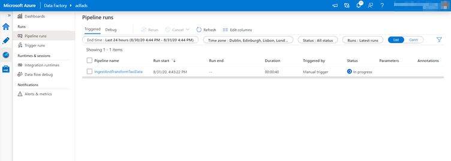
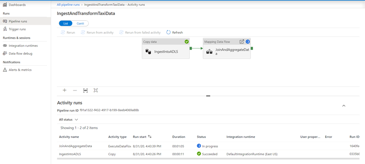

## Debug your pipeline end-to-end

Go to the tab for the IngestAndTransformData pipeline. 

Notice the green box on the 'IngestIntoADLS' copy activity.

Drag it over to the 'JoinAndAggregateData' data flow activity. 

This creates an 'on success' which causes the data flow activity to only run if the copy is successful.

   > [!div class="mx-imgBorder"]
   > 

Since we are using PolyBase to write to data warehouse, we need to specify a staging location in data lake storage. 

In the Settings tab of the mapping data flow activity, expand the PolyBase accordion. 

Select 'ADLSGen2' for the staging linked service.

Choose 'sample-data' for your staging container and 'staging' for your staging directory. 

By default, the data flow runs on an 8 core general purpose Integration runtime.

   > [!div class="mx-imgBorder"]
   > 

Click Debug to execute a debug run. 

For debug runs, the data flow activity will use the active debug cluster instead of spinning up a new cluster. A debug pipeline run including a data flow will re-use the existing debug cluster. It will not use your integration runtime configuration to spin up a new cluster.

   > [!div class="mx-imgBorder"]
   > 

Like the copy activity, the data flow has a special monitoring view accessed by the eyeglasses icon on completion of the activity.

   > [!div class="mx-imgBorder"]
   > 

When you select the eyeglass you will be redirected to the following screen:

   > [!div class="mx-imgBorder"]
   > 

You can click a transformation to get additional details on its execution such as partitioning information and new/updated/dropped columns.

   > [!div class="mx-imgBorder"]
   > 

Publish your changes to the data factory service and run a trigger run

Now that you verified your pipeline run works end-to-end in a debug environment, you are ready to publish it against the data factory service. 

Click Publish all to publish your changes. 

ADF will first run a validation check to make sure all of your resources meet our service requirements. 

If you receive a failure, a side panel will appear to detail the error. 

Once you have successfully published your pipeline, you can trigger a pipeline run against the data factory service by clicking Add trigger.

   > [!div class="mx-imgBorder"]
   > 

When the trigger menu appears, select Trigger now. 

This will kick off a manual one-time pipeline run. 

This menu is also where you set up recurring schedule and event-based triggers operationalize your pipeline.

   > [!div class="mx-imgBorder"]
   > 

You can monitor a trigger run by selecting the monitoring icon in left side-bar. 

By default, Azure Data Factory keeps pipeline run information for 45 days. To persist these metrics for longer, configure your data factory with Azure Monitor.

   > [!div class="mx-imgBorder"]
   > 

Click on the name of the pipeline you triggered to open up more details on individual activity runs. 

In the activity runs view, you can see details of the pipeline run as you did with the debug run. Triggered data flows spin up a just-in-time Spark cluster which is terminated once the job is concluded. As a result, each data flow activity run will endure 5-7 minutes of cluster start-up time.

   > [!div class="mx-imgBorder"]
   > 

