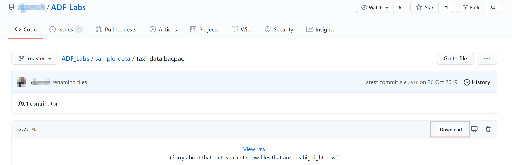

A common use of Azure Data Share is to take shared data and connect it to Azure Data Factory pipelines to use with your own internal data.

Let's learn how to receive data with Azure Data Share and transform this data with Azure Data Factory. 

It’s important to understand both Azure Data Share and Azure Data Factory for transforming data because it can be a useful component to a modern data warehouse and analytics project. A common requirement is access to external data to gain insights and extra visibility of the data across your whole data landscape. You can improve and perform data integration and management in Azure when using Azure Data Factory as well as Azure Data Share. 

Azure Data Factory will give you the opportunity to perform code-free Extract Transform Load (ETL) and Extract Load Transform (ELT), which will result in a comprehensive overview of your data pipelines. As a data engineer, this gives you the confidence to work with more data. 

When you are a data provider, you are enabled to share datasets with third parties or between departments within your organization. You can share data from multiple resources like an Azure SQL Database. You can also configure a snapshot schedule, so that your data consumers (the party that you want to share the data with) have an option to automatically get refreshed data.

If you are a data consumer, you will get sent a dataset. On receiving a dataset, you need to accept an invitation that will be sent out by the data provider. To receive the data, you can configure the storage account where you’re going to land the data that is shared with you. You can map the datasets to, for example, an Azure Data Lake Store Gen2 (ADLS Gen 2) account. It is also possible to trigger a snapshot to get a copy of the latest refresh of the data that was shared with you in the set-up of the ADLS Gen 2 account. 

To complete the following exercises, you must import the NYC Taxi Data dataset into a SQL Database. Download the taxi data bacpac file here: https://github.com/djpmsft/ADF_Labs/blob/master/sample-data/taxi-data.bacpac.

A pop-up will appear and click **Save as**, and save the file to a folder on your machine.